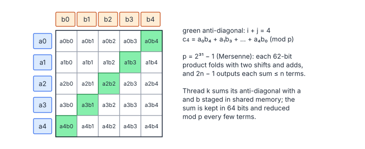

# Polynomial Multiplication over Finite Field 

**Platform:** Tensara · **Difficulty:** medium · [Problem statement](https://tensara.org/problems/poly-multiply-ff)

## Problem

Multiply two polynomials of degree $n - 1$ with coefficients in the prime
field $\mathbb{F}_p$, $p = 2^{31} - 1$, returning the $2n - 1$ coefficients
of the product. Coefficients are `uint32` in $[0, p)$, $n$ is a power of
two (up to 1024 in the tests), and the output must match exactly.

## Visual Overview

Every cell is one product aᵢbⱼ. Coefficient c₄ is the sum of the green
anti-diagonal; each output thread sums one anti-diagonal and reduces it modulo
p.

## Formulation

$$
a(x) = \sum_{i=0}^{n-1} a_i x^i, \quad b(x) = \sum_{j=0}^{n-1} b_j x^j, \qquad
c_k = \Bigl(\sum_{\substack{i + j = k \\ 0 \le i, j < n}} a_i\,b_j\Bigr) \bmod p, \qquad 0 \le k \le 2n - 2
$$

| Symbol | Meaning |
|---|---|
| $p$ | The Mersenne prime $2^{31} - 1 = 2147483647$ |
| $a_i, b_j$ | Input coefficients in $[0, p)$ |
| $c_k$ | Output coefficient $k$ (a linear convolution of $a$ and $b$, reduced mod $p$) |
| $i, j$ | Indices with $i + j = k$, i.e. $i \in [\max(0, k-n+1), \min(k, n-1)]$ |

### Mersenne Reduction

Because $2^{31} \equiv 1 \pmod p$, a number
$x = h\cdot 2^{31} + \ell$ satisfies $x \equiv h + \ell$:

$$
\operatorname{fold}(x) = (x \mathbin{\&} p) + (x \gg 31) \equiv x \pmod p
$$

| Symbol | Meaning |
|---|---|
| $x \mathbin{\&} p$ | The low 31 bits $\ell$ |
| $x \gg 31$ | The high part $h$ |
| Fold | One reduction step with no division; two folds plus one conditional subtraction reduce any 64-bit value to $[0, p)$ |

### Why Not an NTT?

A number-theoretic transform of length $L$ needs an
$L$-th root of unity, which exists in $\mathbb{F}_p$ only if $L$ divides
$p - 1$:

$$
p - 1 = 2^{31} - 2 = 2 \cdot 3^2 \cdot 7 \cdot 11 \cdot 31 \cdot 151 \cdot 331
$$

| Symbol | Meaning |
|---|---|
| $p - 1$ | Order of the multiplicative group of $\mathbb{F}_p$ |

It contains only one factor of 2, so no power-of-two NTT exists
(one would need CRT over NTT-friendly primes, or $\mathbb{F}_{p^2}$).

## Approach

1. **One thread per output coefficient $k$**, 256 threads per block.
2. **Shared-memory tiles**: for each pair of 1024-element tiles
   $(i_0, j_0)$, the block stages $a[i_0 .. i_0+1023]$ and
   $b[j_0 .. j_0+1023]$; each thread walks its valid $i$ range
   $[\max(i_0, k - j_0 - 1023),\ \min(i_0 + 1023, k - j_0)]$.
3. **Lazy reduction**: each product ($< 2^{62}$) is folded to below
   $2^{32}$ and added to a 64-bit accumulator; the accumulator is folded
   again only if it approaches $2^{62}$. At the end one full reduction gives
   $c_k$. For $n \le 1024$ the sum stays below $2^{42}$, so the guard never
   fires.

## Cost Analysis

$$
W = n^2\ \text{modular multiply-adds}, \qquad Q = 8n + 4(2n - 1)\ \text{bytes}
$$

| Symbol | Meaning |
|---|---|
| $W$ | multiply-and-fold operations |
| $Q$ | DRAM bytes (inputs are re-read from shared memory, not DRAM) |

At $n = 1024$: about $10^6$ operations, a few µs; the kernel is dominated by
launch latency. The 64-bit multiply (`mul.wide.u32`) plus two folds is
about 6 integer instructions per term. For $n \gtrsim 10^5$ a
Karatsuba or CRT-NTT approach would win.

## Pitfalls

- **Overflow**: $a_ib_j$ is up to $2^{62}$; summing even four unreduced
  products overflows 64 bits. Fold each product first.
- **Output length** $2n - 1$, not $2n$.
- **Final reduction** must map $p$ itself to 0.

## Verification

All test cases (scaled-down variants of the official sizes) pass on
[cuemu](../../tools/cuemu/README.md) against the PyTorch reference.

## Related

- [Vector Multiply over F_p](../vector-multiply-ff/), [ECC Point Negation](../ecc-point-negation/),
  [Conv 1D](../conv-1d/).
