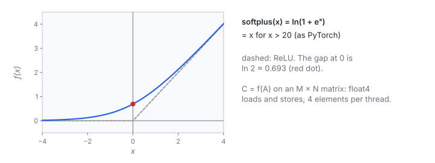

# Softplus

**Platform:** Tensara · **Difficulty:** easy · [Problem statement](https://tensara.org/problems/soft-plus)

## Problem

Apply Softplus elementwise to an $M\times N$ float32 matrix, matching
`F.softplus` (with $\beta = 1$ and PyTorch's threshold 20). Test matrices go from $4096\times4096$ to $8192\times8192$ (up to 67 M elements). The
check is `rtol = 1e-4`, `atol = 9e-5`.

## Visual Overview

Each element of the M × N matrix is mapped independently, so the kernel is a
pure stream of float4 loads and stores. The dashed line is ReLU; at x = 0
softplus is ln 2 (red dot).

## Formulation

$$
C_{ij} = \operatorname{softplus}(A_{ij}), \qquad
\operatorname{softplus}(x) = \begin{cases} \ln\bigl(1 + e^{x}\bigr), & x \le \tau \\ x, & x > \tau \end{cases}
$$

| Symbol | Meaning |
|---|---|
| $A$ | Input matrix, $M\times N$ float32, row-major |
| $C$ | Output matrix, same shape |
| $x$ | One input element $A_{ij}$ |
| $\ln(1 + e^x)$ | Smooth approximation of $\max(x, 0)$, computed as `log1pf(expf(x))` |
| $\tau$ | Threshold 20: above it, $\ln(1 + e^x) = x$ to float precision |

Why the threshold: $e^x$ overflows for $x > 88.7$, and already at $x = 20$

$$
\ln(1 + e^{x}) - x = \ln(1 + e^{-x}) \approx e^{-20} \approx 2\times10^{-9} \ll 2^{-24}\cdot 20
$$

| Symbol | Meaning |
|---|---|
| $2^{-24}\cdot 20$ | Half an ulp of $x$ at $x = 20$, about $1.2\times10^{-6}$ |

## Approach

All Tensara elementwise problems share one kernel shape:

1. **`float4` grid-stride loop.** The buffer is viewed as $\lfloor n/4 \rfloor$
   16-byte vectors; each iteration loads one `float4`, applies the scalar
   function to the four lanes, and stores one `float4`. `cudaMalloc`
   returns 256-byte-aligned pointers, so the reinterpretation is safe.
2. **Scalar tail** for the last $n \bmod 4$ elements.
3. **Launch** 256-thread blocks, capped at 4096 blocks; the grid-stride
   loop covers any size, and 4096 × 256 threads are enough to saturate DRAM.
4. The function is a `__forceinline__` device function, so the loop body is
   branch-free apart from the select in the function itself.

`log1pf` keeps accuracy when $e^x$ is tiny (large negative $x$), where `logf(1 + e^x)` would round $1 + e^x$ to 1 and return 0 instead of $\approx e^x$.

## Cost Analysis

$$
n = MN, \qquad Q = 8\,n\ \text{bytes}, \qquad T_{\min} = \frac{Q}{\beta}
$$

| Symbol | Meaning |
|---|---|
| $n$ | Number of elements |
| $Q$ | Compulsory DRAM traffic: read the input(s) once, write the output once |
| $\beta$ | DRAM bandwidth (about 2–3 TB/s on current data-centre GPUs) |
| $T_{\min}$ | Bandwidth lower bound on the kernel time |

For $8192\times8192$: $Q = 537$ MB, about 0.27 ms at 2 TB/s.

## Pitfalls

- **Overflow**: without the threshold, $x > 88.7$ gives $\ln(\infty) = \infty$.
- **Underflow side**: `log1pf(expf(x))` returns $\approx e^x$ for very
  negative $x$; `logf(1.0f + expf(x))` returns 0. Both pass `atol`, but the
  first is correct.

## Verification

All test cases (scaled-down variants of the official sizes) pass on
[cuemu](../../tools/cuemu/README.md) against the PyTorch reference.

## Related

- [ReLU](../relu/), [Sigmoid](../sigmoid/) (the derivative of softplus), [ELU](../elu/).
