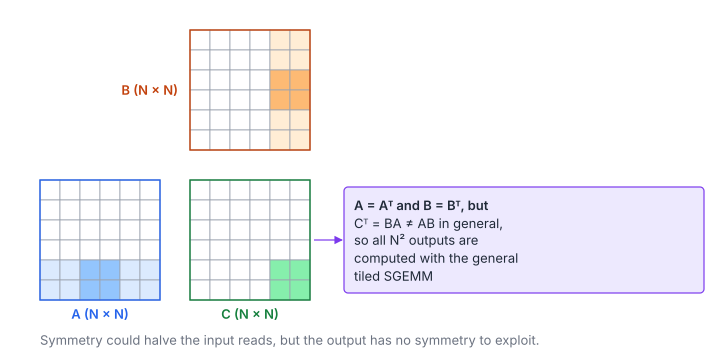

# Symmetric Matrix Multiplication

**Platform:** Tensara · **Difficulty:** medium · [Problem statement](https://tensara.org/problems/symmetric-matmul)

## Problem

Multiply two symmetric $N\times N$ FP32 matrices ($N$ = 4096 … 9216).
The check is `rtol = 1e-6`, `atol = 5e-3`, so effectively an absolute
tolerance. The interesting question is whether symmetry helps.

## Visual Overview

Even though A and B are symmetric, their product usually is not, so all N²
outputs are computed with the general tiled SGEMM.

## Formulation

$$
A = A^{\mathsf T},\quad B = B^{\mathsf T}, \qquad C_{ij} = \sum_{k=0}^{N-1} A_{ik}B_{kj}
$$

| Symbol | Meaning |
|---|---|
| $A, B$ | Symmetric inputs, $N\times N$ |
| $C$ | Product, $N\times N$ (in general **not** symmetric) |
| $^{\mathsf T}$ | Transpose |

The product of two symmetric matrices is symmetric only if they commute:

$$
C^{\mathsf T} = (AB)^{\mathsf T} = B^{\mathsf T}A^{\mathsf T} = BA \ne AB \ \text{in general}
$$

| Symbol | Meaning |
|---|---|
| $BA$ | The reversed product |

So all $N^2$ outputs must be computed, and symmetry cannot halve the work
(BLAS `SSYMM` saves storage, not flops). Symmetry only allows reading
$B$ as $B^{\mathsf T}$, i.e. either the "NN" or the "NT" staging path.

## Approach

The shared kernel is used unchanged (`NoEpi`, NN layout).

### The Shared SGEMM Kernel

All matmul pages on Tensara use the same register-blocked FP32 kernel
(`gemmKernel<kTransB, Epi>`):

1. **Block tile $64\times64$**, 256 threads; each thread owns a $4\times4$
   patch of outputs at rows `ty + 16i`, columns `tx + 16j`. The stride-16
   layout makes every store instruction of a warp hit 16 consecutive
   columns (coalesced), and makes shared-memory reads conflict-free.
2. **K-slices of 16.** Per slice the block copies a $64\times16$ panel of
   $A$ (stored transposed as `a_tile[k][m]`) and a $16\times64$ panel of
   $B$ into shared memory (rows padded by 4 floats), then synchronizes.
3. **Inner product in registers.** For each of the 16 values of $k$, a
   thread loads 4 values of $A$ and 4 of $B$ from shared memory and does
   $4\times4 = 16$ FMAs (an outer product).
4. **Epilogue functor.** The accumulator goes through `epi(v, row, col)`
   before the single store. This is where bias, activations, scaling or
   elementwise multiplies are fused, so the product never makes a round
   trip through DRAM.
5. `kTransB = true` reads $B$ as $N\times K$ ("NT", the `nn.Linear`
   weight layout) and transposes it while staging.

#### Data Reuse

Data reuse at each level of the hierarchy:

$$
I_{\text{L2}} = \frac{2\,T_M T_N T_K}{4\,T_K\,(T_M + T_N)} = \frac{T_M T_N}{2\,(T_M + T_N)} = 16\ \tfrac{\text{flop}}{\text{byte}}, \qquad
I_{\text{smem}} = \frac{2 \cdot r_M r_N}{4\,(r_M + r_N)} = 1\ \tfrac{\text{flop}}{\text{byte}}
$$

| Symbol | Meaning |
|---|---|
| $T_M, T_N, T_K$ | Block tile: 64, 64, 16 |
| $r_M, r_N$ | per-thread register tile: 4 × 4 |
| $I_{\text{L2}}$ | Flops per byte loaded from L2/DRAM into shared memory |
| $I_{\text{smem}}$ | Flops per byte read from shared memory (16 FMAs per 8 loads) |

#### How Far It Gets

This reaches roughly 40–60 % of FP32 peak. The next steps are the ones
covered in the [SGEMM tutorial](../../tutorials/04-tiled-matmul.md):
$128\times128$ tiles with $8\times8$ per thread, `float4` shared loads,
double-buffered `cp.async` staging, and finally tensor cores (TF32) where
the tolerance allows.

## Cost Analysis

$$
W = 2N^3, \qquad Q_{\min} = 4\,(3N^2)\ \text{bytes}, \qquad T_{\min} = \max\left(\frac{W}{F},\ \frac{Q_{\min}}{\beta}\right)
$$

| Symbol | Meaning |
|---|---|
| $W$ | floating-point operations (one FMA = 2 flops) |
| $Q_{\min}$ | Compulsory DRAM bytes (each operand read once, output written once) |
| $F$ | FP32 peak (tens of TFLOP/s on current GPUs) |
| $\beta$ | DRAM bandwidth |
| $T_{\min}$ | Roofline lower bound |

Same as [Square Matmul](../square-matmul/).

## Pitfalls

- **Do not compute half of $C$ and mirror it**: $C$ is not symmetric.
- **`rtol = 1e-6`** looks strict, but `atol = 5e-3` dominates for entries of
  size $O(\sqrt{N})$.

## Verification

All test cases (scaled-down variants of the official sizes) pass on
[cuemu](../../tools/cuemu/README.md) against the PyTorch reference.

## Related

- [Square Matmul](../square-matmul/), [Lower Triangular Matmul](../lower-trig-matmul/),
  [Upper Triangular Matmul](../upper-trig-matmul/).
