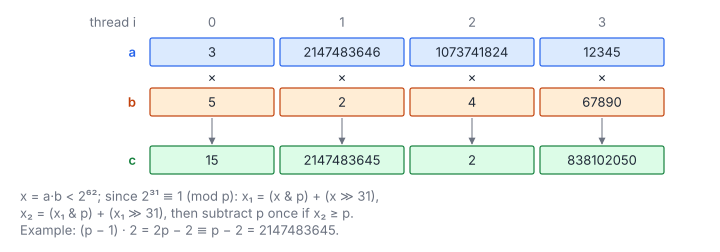

# Vector Multiplication over Finite Field

**Platform:** Tensara · **Difficulty:** medium · [Problem statement](https://tensara.org/problems/vector-multiply-ff)

## Problem

Elementwise product of two `uint32` vectors in $\mathbb{F}_p$,
$p = 2^{31} - 1$, for $n = 2^{20} \dots 2^{25}$. The output must be exact.

## Visual Overview

Each thread multiplies one pair into a 62-bit product and folds it twice using
2³¹ ≡ 1 (mod p), followed by at most one subtraction of p.

## Formulation

$$
c_i = a_i\,b_i \bmod p, \qquad 0 \le a_i, b_i < p
$$

| Symbol | Meaning |
|---|---|
| $p$ | Mersenne prime $2^{31} - 1$ |
| $a_i, b_i$ | Inputs |
| $c_i$ | Output in $[0, p)$ |

Division-free reduction of the 62-bit product $x = a_ib_i$:

$$
x_1 = (x \mathbin{\&} p) + (x \gg 31) < 2^{32}, \qquad
x_2 = (x_1 \mathbin{\&} p) + (x_1 \gg 31) \le p + 1, \qquad
c_i = \begin{cases} x_2 - p, & x_2 \ge p \\ x_2, & \text{otherwise}\end{cases}
$$

| Symbol | Meaning |
|---|---|
| $x$ | 64-bit product, $< 2^{62}$ |
| $x_1, x_2$ | Values after the first and second fold (each congruent to $x$) |

It works because $2^{31} \equiv 1 \pmod p$, so the high part can simply be
added to the low part.

## Approach

A grid-stride loop (256 threads, up to 4096 blocks); each thread computes
`mulModMersenne31(a[i], b[i])`. The compiler emits one `mul.wide.u32`
and a handful of shifts, ANDs, adds and a select, versus a slow 64-bit
`%` (a software division routine on NVIDIA GPUs).

## Cost Analysis

$$
Q = 12n\ \text{bytes}, \qquad T_{\min} = \frac{12n}{\beta}
$$

| Symbol | Meaning |
|---|---|
| $Q$ | DRAM bytes: two inputs and one output, 4 bytes each |
| $\beta$ | DRAM bandwidth |

At $n = 2^{25}$: 403 MB, about 0.2 ms at 2 TB/s. With the folds the kernel
is bandwidth-bound; with `%` it can become ALU-bound.

## Pitfalls

- **32-bit multiply overflows**: cast to `uint64_t` before multiplying.
- **One fold is not enough**: after the first fold the value can still be
  up to $2^{32} - 1 > p$.
- **$x_2 = p$** must become 0.

## Verification

All test cases (scaled-down variants of the official sizes) pass on
[cuemu](../../tools/cuemu/README.md) against the PyTorch reference.

## Related

- [Poly Multiply over F_p](../poly-multiply-ff/), [ECC Point Negation](../ecc-point-negation/),
  [Vector Addition](../vector-addition/).
