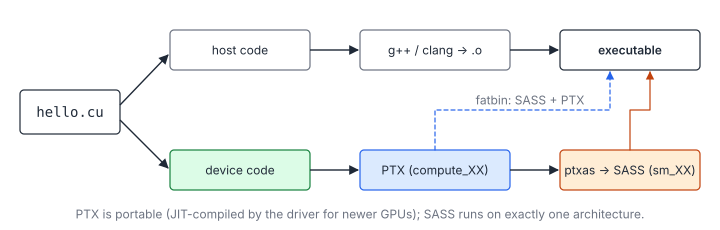
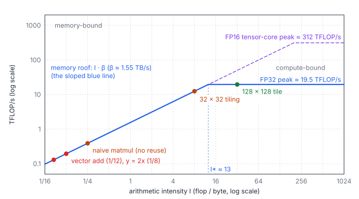

# 00 – Getting Started

> **Part I · CUDA Foundations** · Prerequisites: C++ (pointers, templates) ·
> Next: [01 – Execution Model](01-execution-model.md)

This chapter sets up everything the later chapters and the practice pages
assume. By the end you can compile, run, check, time and judge a CUDA
kernel, even without a GPU of your own.

**You will learn**

- where to run CUDA code, and how to test it on a CPU;
- what `nvcc` produces from a `.cu` file (PTX, SASS, fatbins) and why it
  matters for compatibility;
- the full life cycle of a GPU program: allocate, copy, launch, synchronize,
  copy back, free;
- the shape of a LeetGPU or Tensara submission;
- how errors surface in an asynchronous API, and how to catch them;
- how to time a kernel correctly and turn the time into bandwidth and
  FLOP/s;
- the roofline model, the yardstick every later chapter uses.

## 1. Where to Run Code

### 1.1 Options

| Option | Notes |
|--------|-------|
| [LeetGPU](https://leetgpu.com) playground | Free. Runs CUDA, Triton and PyTorch in the browser, and has a GPU emulator mode. |
| [Tensara](https://tensara.org) | Submissions are benchmarked on real GPUs (T4, A100, H100, …). |
| Google Colab / Kaggle | Free T4 GPU; use `!nvcc` in a notebook cell. |
| Cloud VM (Lambda, RunPod, …) | Needed for Nsight profiling at full fidelity. |
| This repo's [cuemu](../tools/cuemu/README.md) | Runs any solution on your **CPU** against the official reference tests. It checks correctness only, not speed. |

### 1.2 A Sensible Development Loop

1. Write the kernel locally, in an editor with C++ support.
2. Check correctness with cuemu (seconds, no GPU needed).
3. Submit, or run it on Colab, for timing.
4. Only when the time is far from the bound of section 7, profile (Nsight
   Compute on NVIDIA, `rocprofv3` on AMD) to find out why.

Correctness first, then speed: an optimization that you cannot test is an
optimization you cannot trust.

## 2. The Toolchain

```bash
nvcc --version                         # CUDA toolkit
nvidia-smi                             # driver and GPU
nvcc -O3 -arch=native -o hello hello.cu && ./hello
```

### 2.1 What `nvcc` Produces

A `.cu` file mixes code for two processors. `nvcc` splits it:



- **Host code** (everything not marked `__global__` or `__device__`) goes to
  the ordinary C++ compiler (`g++`, `clang` or MSVC).
- **Device code** is compiled to **PTX**, a virtual instruction set for an
  idealized GPU, and then by `ptxas` to **SASS**, the machine code of one
  real architecture.
- Both are embedded in a **fatbin** inside the executable. At run time the
  driver picks the SASS that matches the GPU, or JIT-compiles the PTX if
  there is none.

### 2.2 Architectures and Compatibility

Every NVIDIA GPU has a *compute capability* `X.Y`, written `sm_XY`:

| GPU | Compute capability | Notable features |
|---|---|---|
| T4 | sm_75 (Turing) | FP16 tensor cores (`mma.m16n8k8`) |
| A100 | sm_80 (Ampere) | `cp.async`, BF16/TF32 tensor cores, 164 KB shared memory per SM |
| RTX 30xx / 40xx | sm_86 / sm_89 | Consumer Ampere / Ada |
| H100 | sm_90 (Hopper) | TMA, `wgmma`, thread block clusters |
| B200 | sm_100 (Blackwell) | Tensor memory, `tcgen05` instructions |

The rules that follow from the PTX/SASS split:

- **SASS is exact.** SASS for `sm_80` runs on compute capability 8.x with
  x ≥ 0 (binary compatibility within a major version), not on 7.5 and not
  on 9.0.
- **PTX is forward compatible.** PTX for `compute_80` can be JIT-compiled
  for any later GPU, at the cost of a compile delay at first launch and
  without the newer features.
- `-arch=sm_80` is shorthand for SASS for `sm_80` plus PTX for
  `compute_80`. `-gencode arch=compute_90,code=sm_90` spells out both parts;
  repeat it to build a fatbin for several GPUs.
- Features such as `wgmma` exist only on the "architecture-specific" target
  `sm_90a`, whose code does not run on any other GPU.

### 2.3 Useful Flags

| Flag | Effect |
|------|--------|
| `-O3` | Host optimisation. Device code is optimised by default. |
| `-lineinfo` | Source lines in profilers, with no slowdown. |
| `-G` | Device debug build. Very slow; use only with `cuda-gdb`. |
| `--use_fast_math` | Approximate `expf`, `sinf`, division, flush denormals. Often fails tight tolerances. |
| `-Xptxas -v` | Prints registers, shared memory and spills per kernel. |
| `-std=c++17` | Modern C++ in device code (templates, `constexpr`, lambdas). |
| `-keep` | Keeps the intermediate files, including the `.ptx`. |

### 2.4 Reading What the Compiler Did

The compiler's output is the ground truth for questions like "was this loop
unrolled?" or "did this load become 128 bits wide?":

```bash
nvcc -O3 -arch=sm_80 -Xptxas -v -c kernel.cu      # registers, spills ("bytes stack frame")
cuobjdump -ptx kernel.o | less                    # the PTX
cuobjdump -sass kernel.o | grep -E "LDG|STG|FFMA" # the machine instructions
```

Things worth recognising in SASS: `LDG.E.128` / `STG.E.128` (16-byte global
accesses), `LDS` / `STS` (shared memory), `FFMA` (FP32 fused multiply-add),
`HMMA` (tensor cores), `BAR.SYNC` (`__syncthreads()`), and `LDL` / `STL`
(local memory: usually register spills, which you want to avoid).

## 3. Your First Complete Program

### 3.1 Two Memories

The CPU (host) and the GPU (device) have separate memories. A pointer
returned by `cudaMalloc` is a device address: the host must not dereference
it, and data moves between the two only through explicit copies (or managed
memory, section 3.4).

### 3.2 The Life Cycle

#### A Complete Program

```cpp
#include <cstdio>
#include <vector>
#include <cuda_runtime.h>

__global__ void scaleKernel(const float* in, float* out, int n) {
    const int idx = blockIdx.x * blockDim.x + threadIdx.x;   // one element per thread
    if (idx < n) out[idx] = 2.0f * in[idx];                  // the last block is partial
}

int main() {
    const int n = 1 << 20;
    std::vector<float> h_in(n, 1.0f), h_out(n);

    float *d_in = nullptr, *d_out = nullptr;                 // 1. allocate on the device
    cudaMalloc(&d_in, n * sizeof(float));
    cudaMalloc(&d_out, n * sizeof(float));
    cudaMemcpy(d_in, h_in.data(), n * sizeof(float), cudaMemcpyHostToDevice);   // 2. copy in

    constexpr int kBlockSize = 256;                          // 3. launch
    const int num_blocks = (n + kBlockSize - 1) / kBlockSize;
    scaleKernel<<<num_blocks, kBlockSize>>>(d_in, d_out, n);

    cudaMemcpy(h_out.data(), d_out, n * sizeof(float), cudaMemcpyDeviceToHost);  // 4. copy out (waits)
    std::printf("out[0] = %f\n", h_out[0]);

    cudaFree(d_in);                                          // 5. free
    cudaFree(d_out);
}
```

#### What Each Step Does

Each step, and what actually happens:

1. **`cudaMalloc`** reserves device memory. Allocation is slow (it can take
   milliseconds), so real programs allocate once and reuse buffers.
2. **`cudaMemcpy` host → device** crosses PCIe or NVLink, far slower than
   the GPU's own memory: a PCIe 4.0 x16 link moves ~25 GB/s, an A100's HBM
   ~1500 GB/s. Moving data is often the real cost of a small GPU task.
3. **The launch** `kernel<<<grid, block>>>(args)` only *enqueues* work and
   returns immediately. The general form is
   `<<<grid, block, dynamic_shared_bytes, stream>>>`.
4. **`cudaMemcpy` device → host** waits for all earlier work on the default
   stream, so the kernel is guaranteed to have finished when it returns.
5. **`cudaFree`** releases the memory (and also synchronizes).

### 3.3 Launch Configuration

`grid` and `block` are `dim3` values (1-, 2- or 3-D). The total number of
threads is the product of their components:

$$
N_{\text{threads}} = (G_x G_y G_z)\,(B_x B_y B_z), \qquad
B_x B_y B_z \le 1024, \qquad
G_x \le 2^{31} - 1, \quad G_y, G_z \le 65535
$$

| Symbol | Meaning |
|---|---|
| $G_x, G_y, G_z$ | Grid dimensions: number of blocks along each axis |
| $B_x, B_y, B_z$ | Block dimensions: threads per block along each axis |
| $N_{\text{threads}}$ | Threads launched in total |

Chapter 01 explains how to choose these numbers.

### 3.4 Managed Memory

`cudaMallocManaged` returns a pointer valid on both sides; pages migrate on
demand. It is convenient for prototypes, but page faults make first-touch
timings misleading. The practice platforms give you device pointers, so the
rest of these notes use explicit device memory.

## 4. Anatomy of a Submission

Both platforms give you **device pointers** and call a C-linkage entry
point. You write the kernel and launch it.

```cpp
#include <cuda_runtime.h>

__global__ void scaleKernel(const float* in, float* out, int n) {
    const int idx = blockIdx.x * blockDim.x + threadIdx.x;
    if (idx < n) out[idx] = 2.0f * in[idx];
}

// LeetGPU entry point
extern "C" void solve(const float* in, float* out, int n) {
    constexpr int kBlockSize = 256;
    scaleKernel<<<(n + kBlockSize - 1) / kBlockSize, kBlockSize>>>(in, out, n);
    cudaDeviceSynchronize();
}

// Tensara entry point
extern "C" void solution(const float* in, float* out, size_t n) { /* ... */ }
```

| | LeetGPU | Tensara |
|---|---|---|
| Entry point | `solve(...)` | `solution(...)` |
| Sizes | Usually `int` | Usually `size_t` |
| Timing | Wall time of `solve` | GPU time of `solution`, averaged over runs |
| Tolerance | Per problem | Per problem (`rtol`, `atol`), often looser for big reductions |
| Hardware | Selectable GPU, or emulator | T4, A100, H100, L40S, … |

Always copy the exact signature from the starter code: the parameter order
and the integer types differ from problem to problem.

The pointers are device pointers. Dereferencing one on the host crashes.
Some Tensara problems pass a `shape` array that may live on either side;
`cudaMemcpy(..., cudaMemcpyDefault)` copies it correctly in both cases
(see [Tensara – Argmax](../tensara/argmax/)).

## 5. Error Checking While Developing

### 5.1 Two Kinds of Errors

Because launches are asynchronous, errors come in two kinds, reported at
different times:

| Kind | Examples | Reported by |
|---|---|---|
| Launch errors | Too many threads per block, too much shared memory, invalid grid | `cudaGetLastError()` right after the launch |
| Execution errors | Out-of-bounds access, misaligned address, `__trap()` | The *next synchronizing call* (`cudaDeviceSynchronize`, `cudaMemcpy`, …) |

An execution error is **sticky**: it corrupts the CUDA context, and every
later API call in the process returns the same error. The only recovery is
to restart the process. This is why a bug can appear to be in a
`cudaMemcpy` far away from the kernel that caused it.

### 5.2 A Checking Macro

```cpp
#define CUDA_CHECK(call)                                                     \
    do {                                                                     \
        cudaError_t err = (call);                                            \
        if (err != cudaSuccess) {                                            \
            fprintf(stderr, "%s:%d %s\n", __FILE__, __LINE__,                \
                    cudaGetErrorString(err));                                \
            exit(1);                                                         \
        }                                                                    \
    } while (0)

myKernel<<<grid, block>>>(...);
CUDA_CHECK(cudaGetLastError());        // launch configuration errors
CUDA_CHECK(cudaDeviceSynchronize());   // errors raised while running
```

The `cudaDeviceSynchronize()` after every launch serializes the program, so
use it while developing and remove it (or put it behind a debug flag) when
timing.

### 5.3 compute-sanitizer

`compute-sanitizer ./app` runs the program under instrumentation and
reports the first bad access with its thread, block and source line (build
with `-lineinfo`):

| Tool | Finds |
|---|---|
| `--tool memcheck` (default) | Out-of-bounds and misaligned global/shared accesses, leaks |
| `--tool racecheck` | Shared-memory data races (a missing `__syncthreads()`) |
| `--tool initcheck` | Reads of uninitialised global memory |
| `--tool synccheck` | Barriers that not all threads of a block reach |

It slows the program by 10–100×, so run it on small inputs.

## 6. Timing a Kernel

### 6.1 CUDA Events

Use CUDA events. They are recorded on the GPU's stream, so they measure
GPU time, not launch overhead:

```cpp
cudaEvent_t start_event, stop_event;
cudaEventCreate(&start_event);
cudaEventCreate(&stop_event);

scaleKernel<<<grid, block>>>(d_in, d_out, n);          // warm-up
cudaEventRecord(start_event);
for (int rep = 0; rep < kReps; ++rep) scaleKernel<<<grid, block>>>(d_in, d_out, n);
cudaEventRecord(stop_event);
cudaEventSynchronize(stop_event);

float elapsed_ms = 0.0f;
cudaEventElapsedTime(&elapsed_ms, start_event, stop_event);
const double seconds_per_call = elapsed_ms * 1e-3 / kReps;
```

### 6.2 Pitfalls

- **No warm-up.** The first launch includes module loading and possibly PTX
  JIT compilation. Always discard it.
- **Host timers without synchronization.** `std::chrono` around a launch
  measures only the enqueue (a few microseconds). With a host timer you
  must synchronize before stopping the clock.
- **Too few repetitions.** A kernel of 10 µs is dominated by launch overhead
  and timer resolution; average over many calls.
- **Warm caches.** Repeating a kernel on the same small input leaves it in
  L2 (40–50 MB on data-centre GPUs), so a "DRAM-bound" kernel appears faster
  than it would be in a real pipeline. Use inputs larger than L2, or flush it
  between runs, when you want DRAM numbers.
- **Clock boost and throttling.** GPUs change clocks with temperature and
  power. Benchmark platforms lock clocks; on your own machine, compare runs
  made under the same conditions.

### 6.3 From Time to Rates

A time alone says little. Turn it into rates and compare them with the
hardware limits:

$$
\beta_{\text{eff}} = \frac{Q}{t}, \qquad F_{\text{eff}} = \frac{W}{t}, \qquad
I = \frac{W}{Q}
$$

| Symbol | Meaning |
|---|---|
| $t$ | Measured time per call (seconds) |
| $Q$ | Bytes the kernel *must* move to and from DRAM (inputs read once, outputs written once) |
| $W$ | Useful floating-point operations (an FMA counts as 2) |
| $\beta_{\text{eff}}$ | Effective bandwidth, bytes/s |
| $F_{\text{eff}}$ | Achieved throughput, flop/s |
| $I$ | Arithmetic intensity, flops per byte |

## 7. The Roofline Model

### 7.1 The Bound

A kernel cannot finish faster than the time to do its arithmetic at peak
rate, nor faster than the time to move its compulsory bytes at peak
bandwidth. The larger of the two is the **roofline bound**:

$$
t \ \ge\ T_{\min} = \max\left(\frac{W}{F},\ \frac{Q}{\beta}\right), \qquad
F_{\text{eff}} \le \min(F,\ I\beta), \qquad
I^{\star} = \frac{F}{\beta}
$$

| Symbol | Meaning |
|---|---|
| $F$ | Peak compute throughput of the GPU for the data type used |
| $\beta$ | Peak DRAM bandwidth |
| $T_{\min}$ | Lower bound on the kernel time |
| $I^{\star}$ | Ridge point: kernels with $I < I^{\star}$ are memory-bound, those with $I > I^{\star}$ compute-bound |

Plotted on log-log axes, the attainable FLOP/s form a roof: a slope of
$\beta$ for low intensity, flat at $F$ above the ridge point.



### 7.2 Numbers for Common GPUs

| GPU | FP32 $F$ | $\beta$ | $I^{\star}$ (FP32) |
|---|---|---|---|
| T4 | ~8 TFLOP/s | ~320 GB/s | ~25 flop/B |
| A100 40 GB | ~19.5 TFLOP/s | ~1.55 TB/s | ~13 flop/B |
| H100 SXM | ~67 TFLOP/s | ~3.35 TB/s | ~20 flop/B |

With tensor cores the compute roof rises by 8–16× (A100: 312 TFLOP/s for
dense FP16), so the ridge point moves to ~200 flop/B: almost everything
except large matrix multiplications is memory-bound.

### 7.3 Worked Examples

| Kernel | $W$ | $Q$ | $I$ (flop/B) | Bound on an A100 |
|---|---|---|---|---|
| $y = 2x$, $n$ floats | $n$ | $8n$ | 1/8 | Memory: $8n / \beta$ |
| $c = a + b$ | $n$ | $12n$ | 1/12 | Memory: $12n / \beta$ |
| Sum of $n$ floats | $n$ | $4n$ | 1/4 | Memory: $4n / \beta$ |
| $C = AB$, $n\times n$ | $2n^3$ | $\ge 12n^2$ | up to $n/6$ | Compute, for large $n$ |

$y = 2x$ with $n = 2^{26}$: $Q = 537$ MB, so $T_{\min} = 0.35$ ms. Measuring
0.40 ms means 87 % of peak bandwidth: done. Every problem page on this site
has a *Cost analysis* section that does this calculation.

### 7.4 What the Roofline Does Not Tell You

- **It counts compulsory traffic.** A kernel whose accesses are
  uncoalesced (chapter 02) moves more bytes than $Q$ and sits below its
  roof for that reason.
- **It ignores latency.** A kernel with too little parallelism cannot keep
  enough requests in flight to reach $\beta$ (chapter 01, section 5).
- **There are more roofs.** L2 and shared memory have their own
  bandwidths; a kernel can be bound by one of them (Matrix Multiplication 1
  is largely about the shared-memory roof).
- **Peak numbers are peaks.** Practical ceilings are ~90 % of datasheet
  bandwidth and less for FLOP/s with non-FMA instruction mixes.

## 8. Testing on the CPU with cuemu

[cuemu](../tools/cuemu/README.md) translates a solution into ordinary C++,
builds it with `clang++`, and runs every CUDA thread as a user-space fiber,
one thread block at a time. `__syncthreads()` is a real barrier and warp
shuffles really exchange values between the 32 lanes. The output is then
compared with the platform's own PyTorch reference, with the platform's
tolerances, on small versions of the official test cases:

```bash
scripts/fetch_upstream.sh                              # problem definitions -> .upstream/
python3 tools/cuemu/run_tests.py leetgpu/001-vector-add
python3 tools/cuemu/run_tests.py tensara/softmax
python3 tools/cuemu/run_tests.py --reverse leetgpu/004-reduction   # reversed thread order
python3 tools/cuemu/cuemu.py run tutorials/gemm/01-vectorized.cu -- --test   # a program with main()
```

It catches indexing bugs, missing bounds checks, out-of-bounds writes
(guard pages after every buffer), wrong layouts and numerical mistakes.
`--reverse` schedules threads in reverse order, which exposes many missing
barriers. It says nothing about speed, and since blocks run one at a time
it cannot find races *between* blocks; use `compute-sanitizer` on a real
GPU for those.

## 9. Checklist Before Submitting

- [ ] Signature copied exactly (order, `int` vs `size_t`, `const`).
- [ ] Every thread guards its index (`if (idx < n)`), including the last
      partial block.
- [ ] 64-bit indices when $n$ or byte offsets can exceed $2^{31}$.
- [ ] Buffers that are accumulated into (atomics) are zeroed first.
- [ ] Temporary `cudaMalloc`s are freed; `cudaDeviceSynchronize()` before
      `cudaFree` if kernels may still be using them.
- [ ] The cost analysis says what the bound is, and the measured time is
      close to it.

## Key Takeaways

1. `nvcc` produces PTX (portable) and SASS (exact); ship SASS for the GPUs
   you target and PTX for the future.
2. Launches are asynchronous: errors and timings must be read after a
   synchronization point, and execution errors are sticky.
3. Time with events, after a warm-up, over many repetitions.
4. Always compare a time with the roofline bound
   $\max(W/F,\ Q/\beta)$: it tells you whether a kernel is done and which
   resource to attack if it is not.

## Exercises

1. Compile the program of section 3.2 with `-arch=sm_80` and list the
   embedded images with `cuobjdump --list-elf --list-ptx`. Then build a
   fatbin for sm_75 and sm_90 as well.

    <details markdown="1"><summary>Hint</summary>

    `nvcc -gencode arch=compute_75,code=sm_75 -gencode arch=compute_80,code=sm_80 -gencode arch=compute_90,code=[sm_90,compute_90]`
    embeds three SASS images and the `compute_90` PTX.

    </details>

2. Launch `scaleKernel` with 2048 threads per block and print what
   `cudaGetLastError()` and `cudaDeviceSynchronize()` return.

    <details markdown="1"><summary>Answer</summary>

    The launch fails with `cudaErrorInvalidConfiguration` ("invalid
    configuration argument"), reported by `cudaGetLastError()`. The kernel
    never runs, so the synchronization returns `cudaSuccess`; launch errors
    are not sticky.

    </details>

3. What is $T_{\min}$ for adding two vectors of $10^8$ floats on an H100
   SXM? What bandwidth do you measure if it takes 0.45 ms?

    <details markdown="1"><summary>Answer</summary>

    $Q = 12 \cdot 10^8$ B = 1.2 GB, so $T_{\min} = 1.2 / 3350$ s ≈ 0.36 ms.
    0.45 ms is $1.2\text{ GB} / 0.45\text{ ms} \approx 2.7$ TB/s, 80 % of
    peak.

    </details>

4. Time a kernel with `std::chrono` without a synchronization and explain
   the result.

## Practice

- [LeetGPU – Vector Addition](../leetgpu/001-vector-add/),
  [Tensara – Vector Addition](../tensara/vector-addition/)
- [LeetGPU – Color Inversion](../leetgpu/007-color-inversion/),
  [Tensara – ReLU](../tensara/relu/)
