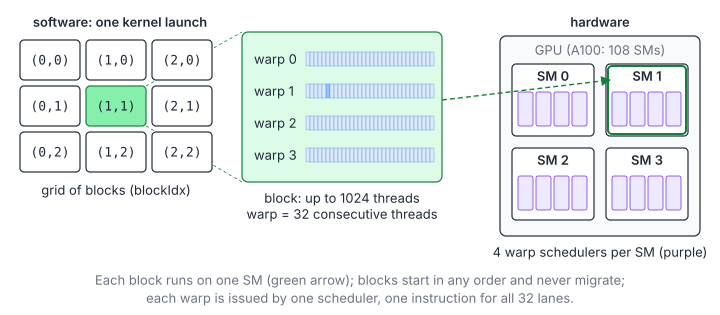
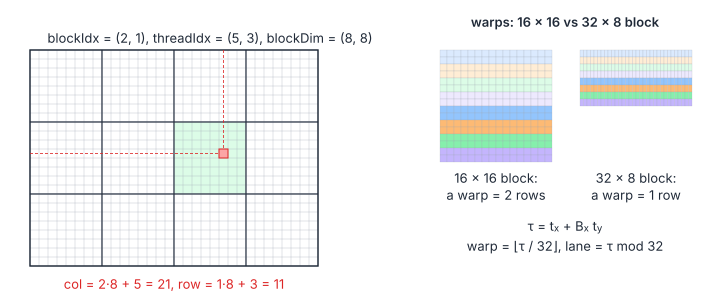
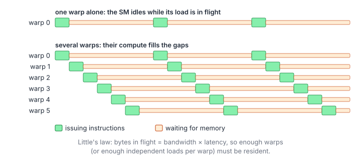
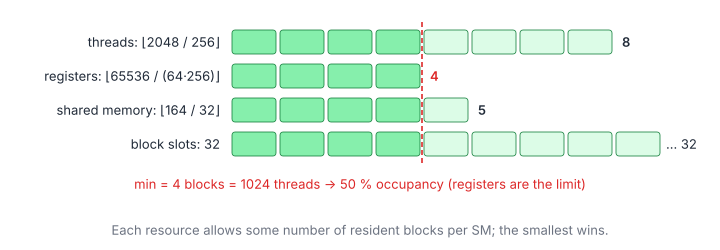

# 01 – CUDA Execution Model

> **Part I · CUDA Foundations** · Prerequisites: [00 – Getting Started](00-getting-started.md) ·
> Next: [02 – Memory Hierarchy](02-memory-hierarchy.md)

A CUDA kernel is written as the program of *one* thread, and launched for
millions of them. This chapter explains how those threads are organised,
how the hardware runs them, and what that implies for the code you write.

**You will learn**

- the software hierarchy (grid, block, warp, thread) and the hardware it
  maps onto (GPU, SM, warp scheduler, lane);
- index arithmetic in 1-D, 2-D and 3-D, and grid-stride loops;
- what SIMT execution and warp divergence cost;
- why a GPU needs tens of thousands of threads (latency hiding and
  Little's law), and the alternative (instruction-level parallelism);
- how to compute occupancy, and why it is a means rather than a goal;
- how to choose block and grid sizes;
- the synchronization and communication mechanisms at each scope, including
  streams.

## 1. The Hierarchy

### 1.1 Software: Grid, Block, Warp, Thread

```
Grid  ── many Blocks  (scheduled independently onto SMs, in any order)
Block ── up to 1024 Threads (share shared memory, can __syncthreads())
Warp  ── 32 consecutive threads of a block, issued together (SIMT)
```

- A **kernel** is a function run by every thread of a grid.
- `blockIdx`, `blockDim`, `threadIdx` and `gridDim` are built-in `dim3`
  variables that tell each thread where it is.
- Blocks cannot synchronize with each other inside a kernel (short of a
  cooperative launch). If you need a global barrier, end the kernel and
  launch another; kernels on the same stream run in order.



### 1.2 Hardware: The Streaming Multiprocessor

A GPU is an array of **streaming multiprocessors** (SMs): 108 on an A100,
132 on an H100 SXM. Each SM is split into 4 **processing blocks** (SM
sub-partitions), and each processing block has:

- a **warp scheduler** that can issue one instruction per clock from one of
  its resident warps;
- its share of the **register file** (64 K 32-bit registers per SM in total);
- execution units: FP32/INT32 lanes, special-function units, load/store
  units, and a tensor core.

The SM also holds the **L1 cache / shared memory** (192 KB on A100, 256 KB on
H100, split between the two by configuration) used by all its blocks.

### 1.3 How the Two Map

| Software | Hardware | Notes |
|---|---|---|
| Grid | The whole GPU | One kernel launch |
| Block (CTA) | One SM | A block never migrates; an SM can host several blocks at once |
| Warp | A warp scheduler slot | 32 threads that share one instruction stream |
| Thread | A lane of the SIMD units | Has its own registers and predicate |

When a kernel is launched, the block scheduler hands blocks to SMs until
each SM is full (section 6); whenever a block finishes, the next waiting
block takes its place. The order is unspecified, so **correct code never
depends on the order in which blocks run**.

### 1.4 SIMT and Independent Thread Scheduling

NVIDIA calls the model *single instruction, multiple threads* (SIMT): each
thread has its own registers and (since Volta) its own program counter, but
a warp *issues* one instruction at a time for all lanes that are at that
instruction. Two consequences:

- Code is written per thread, with ordinary branches and loops; the
  hardware handles lanes that go different ways (section 4).
- Lanes of a warp are not guaranteed to run in lock-step. Code that
  exchanges data between lanes must use the `*_sync` warp primitives or
  `__syncwarp()`, with an explicit lane mask (`0xffffffff` for the whole
  warp), never rely on implicit lock-step execution.

## 2. Index Arithmetic

### 2.1 One Dimension

A thread finds its element from its coordinates:

$$
i = b_x\,B_x + t_x, \qquad
G_x = \left\lceil \frac{n}{B_x} \right\rceil = \left\lfloor \frac{n + B_x - 1}{B_x} \right\rfloor
$$

| Symbol | Meaning |
|---|---|
| $t_x$ | `threadIdx.x`: position inside the block |
| $b_x$ | `blockIdx.x`: position of the block in the grid |
| $B_x$ | `blockDim.x`: block size |
| $G_x$ | `gridDim.x`: number of blocks needed to cover $n$ elements |
| $i$ | Global 1-D index |

The last block is usually partial, so every thread must check its index:

```cpp
__global__ void vectorAdd(const float* a, const float* b, float* c, int n) {
    const int idx = blockIdx.x * blockDim.x + threadIdx.x;
    if (idx < n) c[idx] = a[idx] + b[idx];
}

constexpr int kBlockSize = 256;
const int num_blocks = (n + kBlockSize - 1) / kBlockSize;
vectorAdd<<<num_blocks, kBlockSize>>>(d_a, d_b, d_c, n);
```

### 2.2 Two and Three Dimensions

For matrices and images, 2-D blocks and grids map naturally onto rows and
columns:

$$
\text{row} = b_y\,B_y + t_y, \qquad \text{col} = b_x\,B_x + t_x, \qquad
\text{offset} = \text{row}\cdot\text{ld} + \text{col}
$$

| Symbol | Meaning |
|---|---|
| $t_y, b_y, B_y$ | `threadIdx.y`, `blockIdx.y`, `blockDim.y` |
| Row, col | Global 2-D coordinates |
| ld | Leading dimension: the distance in elements between two rows (the width, for a dense row-major matrix) |

`col` uses $x$ so that consecutive threads touch consecutive columns: the
memory accesses of a warp are then contiguous (coalescing, chapter 02).

```cpp
__global__ void matrixAdd(const float* a, const float* b, float* c, int rows, int cols) {
    const int row = blockIdx.y * blockDim.y + threadIdx.y;
    const int col = blockIdx.x * blockDim.x + threadIdx.x;
    if (row < rows && col < cols) c[row * cols + col] = a[row * cols + col] + b[row * cols + col];
}

const dim3 block(32, 8);                                      // 256 threads
const dim3 grid((cols + 31) / 32, (rows + 7) / 8);
matrixAdd<<<grid, block>>>(d_a, d_b, d_c, rows, cols);
```

### 2.3 From Thread Coordinates to Warps

Inside a block, threads are numbered $x$-fastest, and warps are formed from
consecutive numbers:

$$
\tau = t_x + B_x\,(t_y + B_y\,t_z), \qquad w = \left\lfloor \frac{\tau}{32} \right\rfloor, \qquad \ell = \tau \bmod 32
$$

| Symbol | Meaning |
|---|---|
| $\tau$ | Linear thread index inside the block |
| $w$ | Warp index inside the block (`warp_id`) |
| $\ell$ | Lane index inside the warp (`lane`) |

So a $32\times8$ block has 8 warps, each one a full row of $t_x$ values.
A $16\times16$ block also has 8 warps, but each warp covers *two* rows.



### 2.4 Index Width

`int` holds indices up to $2^{31} - 1$. A $50\,000\times50\,000$ matrix has
$2.5\cdot10^9$ elements, and `row * cols` overflows silently. Compute
offsets in 64 bits as soon as a product can exceed that:

```cpp
const size_t offset = static_cast<size_t>(row) * cols + col;
```

64-bit arithmetic costs extra instructions, so kernels that know their
sizes are small keep `int` for the per-thread arithmetic.

## 3. Grid-Stride Loops

Decouple the grid size from the problem size:

```cpp
__global__ void relu(const float* in, float* out, size_t n) {
    const size_t stride = static_cast<size_t>(gridDim.x) * blockDim.x;
    for (size_t i = static_cast<size_t>(blockIdx.x) * blockDim.x + threadIdx.x; i < n; i += stride) {
        out[i] = fmaxf(in[i], 0.0f);
    }
}
```

Each thread handles

$$
k = \left\lceil \frac{n - i_0}{G_x B_x} \right\rceil \quad \text{elements}, \qquad i_0 = b_x B_x + t_x
$$

| Symbol | Meaning |
|---|---|
| $k$ | Iterations done by the thread whose first index is $i_0$ |
| $G_x B_x$ | Total number of threads, the loop stride |

Benefits:

- any $n$ works, including $n > 2^{31}$ (use `size_t`);
- the grid can be sized to the machine (a few waves of blocks per SM)
  rather than to the data;
- per-thread setup cost (loading a constant, initialising an
  accumulator) is amortised over $k$ elements, which is how reductions
  build their per-thread partial sums (chapter 03).

In each iteration the whole grid covers one contiguous chunk of
$G_xB_x$ elements, so the accesses of a warp stay contiguous (coalesced) in
every iteration.

## 4. Warps and Divergence

### 4.1 How a Divergent Branch Executes

All 32 lanes of a warp execute the same instruction. When lanes take
different branches, the warp runs each path in turn with the other lanes
masked off, then continues together:

```cpp
if (threadIdx.x % 2 == 0) a();   // pass 1: even lanes active, odd lanes masked
else                      b();   // pass 2: odd lanes active, even lanes masked
c();                             // all lanes again
```

$$
T_{\text{warp}} \approx \sum_{p \in \text{paths taken}} T_p, \qquad
\eta_{\text{branch}} = \frac{\text{active lanes per issued instruction}}{32}
$$

| Symbol | Meaning |
|---|---|
| $p$ | A distinct control-flow path taken by at least one lane |
| $T_p$ | Time to execute path $p$ |
| $\eta_{\text{branch}}$ | Average fraction of useful lanes (Nsight Compute: "thread instruction executed / warp instruction executed") |

### 4.2 When Divergence Is Free, and When It Is Not

- A branch that is **uniform across the warp** (`if (warp_id == 0)`,
  `if (blockIdx.x < k)`) costs nothing extra: only one path is taken.
- Short branches (`x > 0 ? x : a * x`) compile to predicated selects; no
  real divergence.
- Loops with lane-dependent trip counts run as long as the longest lane.
- The classic mistake is to split work by *thread* parity or modulus
  (`tid % 2`), which diverges in every warp. Splitting by *warp*
  (`tid / 32 % 2`) does the same work without divergence (chapter 03,
  section 4 shows this for reductions).

## 5. Why So Many Threads: Latency Hiding

### 5.1 Latency

Operations take many cycles to complete. Rough numbers for an A100:

| Operation | Latency (cycles) |
|---|---|
| Dependent FP32 FMA | ~4 |
| Shared-memory load | ~20–30 |
| L2 hit | ~200 |
| DRAM (HBM) load | ~400–800 |

A warp that needs the result of a load cannot continue until it arrives.
The GPU does not wait: every cycle, each warp scheduler picks a warp whose
next instruction is ready, and issues it.



### 5.2 Little's Law

To keep the memory system busy, enough requests must be in flight to cover
the latency:

$$
N_{\text{bytes in flight}} = \beta \times L, \qquad
N_{\text{warps}} \gtrsim \frac{\beta\,L}{n_{\text{SM}}\cdot b_{\text{warp}}}
$$

| Symbol | Meaning |
|---|---|
| $\beta$ | DRAM bandwidth (bytes/s) |
| $L$ | Memory latency (s) |
| $N_{\text{bytes in flight}}$ | Bytes that must be requested but not yet returned, at any moment |
| $n_{\text{SM}}$ | Number of SMs |
| $b_{\text{warp}}$ | Bytes in flight per warp (for example 512 for one `float4` load per lane) |
| $N_{\text{warps}}$ | Resident warps needed per SM |

For an A100 ($\beta \approx 1.5$ TB/s, $L \approx 500$ ns, 108 SMs):
$\beta L \approx 750$ KB, i.e. about 7 KB per SM, or ~14 warps per SM each
with one 512-byte load outstanding.

### 5.3 The Other Lever: Instruction-Level Parallelism

Fewer warps are enough if each warp has more independent loads in flight.
Unrolled loops and `float4` loads raise $b_{\text{warp}}$:

```cpp
// Four independent loads are issued back to back; the warp waits once, not four times.
const float4 v0 = in4[i], v1 = in4[i + stride], v2 = in4[i + 2 * stride], v3 = in4[i + 3 * stride];
```

This **instruction-level parallelism** (ILP) is the alternative to
occupancy, and the one fast GEMMs rely on: they run few warps, each with
many independent FMAs and loads, as seen in Matrix Multiplication 1 and
throughout the Matrix Multiplication path.

## 6. Occupancy

### 6.1 The Formula

An SM runs as many blocks as its resources allow:

$$
n_{\text{blocks/SM}} = \min\left(
\left\lfloor \frac{T_{\max}}{B} \right\rfloor,\
\left\lfloor \frac{R_{\text{SM}}}{r\,B} \right\rfloor,\
\left\lfloor \frac{S_{\text{SM}}}{s} \right\rfloor,\
n_{\max}\right), \qquad
\text{occupancy} = \frac{n_{\text{blocks/SM}}\cdot B}{T_{\max}}
$$

| Symbol | Meaning |
|---|---|
| $B$ | Threads per block |
| $T_{\max}$ | Maximum resident threads per SM (2048 on A100/H100) |
| $R_{\text{SM}}$ | Registers per SM (65 536) |
| $r$ | Registers per thread (from `-Xptxas -v`; allocated in chunks) |
| $S_{\text{SM}}$ | Shared memory per SM available to blocks (up to ~164 KB on A100, ~228 KB on H100) |
| $s$ | Shared memory per block (static plus dynamic) |
| $n_{\max}$ | Maximum resident blocks per SM (32) |
| Occupancy | Fraction of the SM's thread slots in use |

### 6.2 A Worked Example

$B = 256$, $r = 64$, $s = 32$ KB on an A100 gives
$\min(8, 4, 5, 32) = 4$ blocks, i.e. 1024 threads and 50 % occupancy:



Registers are the limit; `__launch_bounds__(256, 6)` would ask the
compiler to use at most 40 registers (at the risk of spills).

Two details make real numbers differ slightly from the formula: registers
are allocated per warp in units of 256 (so $r$ is effectively rounded up to
a multiple of 8), and shared memory is allocated in units of a few hundred
bytes with ~1 KB reserved per block.

### 6.3 Asking the Runtime

```cpp
int blocks_per_sm = 0;
cudaOccupancyMaxActiveBlocksPerMultiprocessor(&blocks_per_sm, myKernel, kBlockSize, dynamic_smem_bytes);
```

Nsight Compute's *Occupancy* section shows the same number and which
resource limits it.

### 6.4 Occupancy Is a Means, Not a Goal

Occupancy only matters as a way to hide latency. Register-blocked GEMMs run
very well at 12–25 % occupancy because each thread has many independent
FMAs and loads in flight (ILP, section 5.3). Conversely, a memory-bound
kernel with one dependent load per thread needs high occupancy. Raise
occupancy when the profiler says warps are stalled waiting and there is
nothing else to issue; do not trade registers (and so reuse) for it
blindly.

## 7. Choosing Block and Grid Sizes

### 7.1 Block Size

- A multiple of 32 (a partial warp wastes lanes). 128–512 is typical; 256
  is a safe default.
- For 2-D problems, make the $x$ extent at least 32 so that each warp
  covers one contiguous row segment (a $32\times8$ block).
- For block-wide reductions, larger blocks mean fewer partial results
  but a longer tree; 256–1024 is common.
- Kernels that use a lot of shared memory or registers per thread often
  prefer 128 threads so that more than one block fits per SM.

### 7.2 Grid Size and the Tail Effect

Launch at least a few blocks per SM. With $G$ blocks and $c$ blocks resident
per SM, the work runs in waves:

$$
\text{waves} = \left\lceil \frac{G}{c\,n_{\text{SM}}} \right\rceil, \qquad
\eta_{\text{tail}} = \frac{G}{c\,n_{\text{SM}}\cdot\text{waves}}
$$

| Symbol | Meaning |
|---|---|
| $G$ | Blocks in the grid |
| $c$ | Resident blocks per SM (section 6) |
| $\eta_{\text{tail}}$ | Fraction of SM time used, if all blocks take equally long |

A grid of 1.1 waves wastes almost half of the second wave
($\eta \approx 55\%$); 10.1 waves waste little ($\eta \approx 92\%$). Many
small blocks (or a grid-stride loop with a few waves) keep the tail short;
when blocks must be large, see Stream-K ([Matrix Multiplication 7](gemm/06-split-k-stream-k.md)).

## 8. Synchronization and Communication

### 8.1 Mechanisms by Scope

| Scope | Mechanism |
|---|---|
| Warp | `__shfl_*_sync`, `__ballot_sync`, `__syncwarp()` |
| Block | Shared memory + `__syncthreads()` |
| Grid | Kernel boundary; atomics (`atomicAdd`, `atomicMax`, …); cooperative groups `grid.sync()` with a cooperative launch |
| Host | `cudaDeviceSynchronize()`, events, stream ordering |

### 8.2 Barriers

`__syncthreads()` waits until every thread of the block has reached it, and
makes all shared- and global-memory writes made before it visible to the
block after it. It must be reached by **every** thread of the block: a
barrier inside `if (threadIdx.x < 16)` deadlocks or corrupts data. Early
`return`s before a barrier are the usual way this happens by accident.

### 8.3 Memory Ordering Between Blocks

Writes by one block are not guaranteed to be visible to another block in
any order unless you say so. `__threadfence()` makes a thread's earlier
writes visible device-wide before its later writes. The standard pattern is
"write data, fence, then set a flag (atomically)"; the reader checks the
flag, fences, then reads the data. Chapter 03 (section 5) and the Stream-K
kernel of [Matrix Multiplication 7](gemm/06-split-k-stream-k.md) use it.

### 8.4 Atomics

Global atomics are executed in the L2 cache. They are fast when addresses
differ and serialize when many threads hit the same address. Reduce
contention by combining first (a warp or block reduction, then one atomic
per block), and remember that floating-point atomics make the summation
order, and so the last bits of the result, non-deterministic.

## 9. Streams and Asynchronous Execution

A **stream** is a queue of GPU work that executes in order; work in
different streams may overlap.

- Launches and `cudaMemcpyAsync` return immediately; the host continues.
- The *legacy default stream* (stream 0) synchronizes with all other
  blocking streams, which is why simple programs appear sequential.
- Overlapping transfers with compute needs **pinned** host memory
  (`cudaMallocHost`), `cudaMemcpyAsync`, and non-default streams.
- **Events** (`cudaEventRecord` / `cudaStreamWaitEvent`) express
  dependencies between streams, and time work (chapter 00).

The practice problems run one kernel (or a short sequence) on the default
stream, so streams rarely matter there, but they matter in applications.

## 10. Worked Example: Vectorized Vector Addition

```cpp
constexpr int kBlockSize = 256;
constexpr int kMaxBlocks = 4096;

__global__ void vectorAddVec4(const float* a, const float* b, float* c, size_t n) {
    const size_t num_vec4 = n / 4;
    const size_t stride = static_cast<size_t>(gridDim.x) * blockDim.x;
    const size_t start = static_cast<size_t>(blockIdx.x) * blockDim.x + threadIdx.x;
    const float4* a4 = reinterpret_cast<const float4*>(a);
    const float4* b4 = reinterpret_cast<const float4*>(b);
    float4* c4 = reinterpret_cast<float4*>(c);
    for (size_t i = start; i < num_vec4; i += stride) {
        const float4 x = a4[i], y = b4[i];
        c4[i] = make_float4(x.x + y.x, x.y + y.y, x.z + y.z, x.w + y.w);
    }
    for (size_t i = num_vec4 * 4 + start; i < n; i += stride) c[i] = a[i] + b[i];   // tail
}
```

It combines everything above:

1. a grid-stride loop, so any $n$ works;
2. 16-byte accesses, so more bytes are in flight per warp (section 5.3);
3. a capped grid ($\min(\lceil n/4/256\rceil, 4096)$ blocks), a few waves;
4. 64-bit indices;
5. a scalar tail for $n$ not divisible by 4.

The full solution with its cost analysis is
[Tensara – Vector Addition](../tensara/vector-addition/).

## Key Takeaways

1. Write the program of one thread; the grid, block and warp structure
   decides how it maps onto SMs, schedulers and lanes.
2. Make `threadIdx.x` walk the contiguous dimension, and guard every index.
3. Divergence costs the sum of the paths a warp takes; keep branches
   warp-uniform where you can.
4. Latency is hidden by parallelism: many warps (occupancy) or many
   independent operations per warp (ILP). Little's law says how much.
5. Occupancy is limited by threads, registers, shared memory and block
   slots; compute it, but optimize for the profiler's stall reasons, not for
   the number itself.
6. Barriers must be reached by every thread of the block; ordering across
   blocks needs fences and atomics.

## Exercises

1. A kernel uses 96 registers per thread and 20 KB of shared memory per
   256-thread block on an A100. What is its occupancy, and what limits it?

    <details markdown="1"><summary>Answer</summary>

    Threads: $\lfloor 2048/256 \rfloor = 8$. Registers:
    $\lfloor 65536 / (96\cdot256) \rfloor = 2$. Shared memory:
    $\lfloor 164/20 \rfloor = 8$. So 2 blocks = 512 threads = 25 %,
    limited by registers.

    </details>

2. A grid has 250 blocks, 2 fit per SM, and the GPU has 108 SMs. How many
   waves are there, and what is $\eta_{\text{tail}}$?

    <details markdown="1"><summary>Answer</summary>

    $250 / 216 = 1.16$, so 2 waves; $\eta = 250 / 432 \approx 58\%$. With
    216 or 432 blocks there would be no tail.

    </details>

3. In `if (threadIdx.x % 4 == 0) x = expensive(x);`, what fraction of lanes
   does useful work while `expensive` runs? Rewrite the work split so that
   each warp is uniform.

    <details markdown="1"><summary>Answer</summary>

    8 of 32 lanes (25 %). Assign the expensive work to one quarter of the
    *warps* instead (`(threadIdx.x / 32) % 4 == 0`), each processing four
    times as many elements.

    </details>

4. Use Little's law to estimate how many bytes must be in flight on an H100
   SXM ($\beta = 3.35$ TB/s, $L \approx 600$ ns). How many warps per SM is
   that with one `float4` load per lane?

    <details markdown="1"><summary>Answer</summary>

    $\beta L \approx 2$ MB, about 15 KB per SM over 132 SMs, i.e. ~30 warps
    of 512 bytes each; or ~8 warps with four independent `float4` loads each.

    </details>

## Practice

- [LeetGPU – Vector Addition](../leetgpu/001-vector-add/)
- [Tensara – Vector Addition](../tensara/vector-addition/)
- [LeetGPU – Matrix Addition](../leetgpu/008-matrix-addition/) (2-D indexing)
- [LeetGPU – Reverse Array](../leetgpu/019-reverse-array/) (in-place, half the threads)
