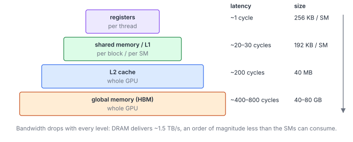
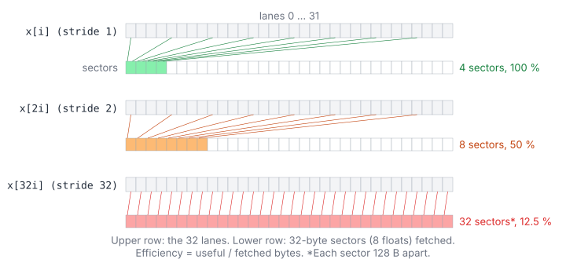
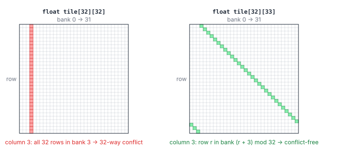
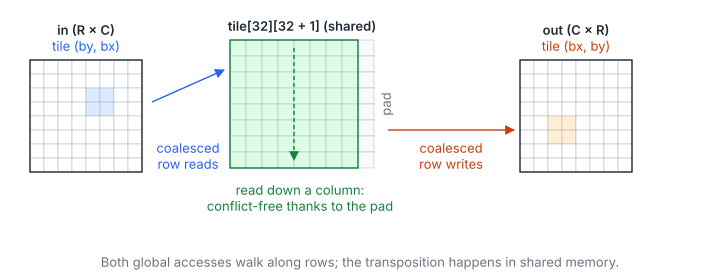

# 02 – Memory Hierarchy and Coalescing

> **Part I · CUDA Foundations** · Prerequisites: [01 – Execution Model](01-execution-model.md) ·
> Next: [03 – Parallel Reduction](03-parallel-reduction.md)

Most kernels in the practice sets are **memory-bound**: their speed is set
by how many bytes they move and how efficiently they move them. A GPU can do
arithmetic 10–20× faster than DRAM can feed it, so the art is to move each
byte once, in the widest and most regular way the hardware allows, and to
reuse it from faster memory whenever possible.

**You will learn**

- the memory spaces (registers, local, shared, L1, L2, global, constant),
  their scope, size and latency;
- coalescing: how the addresses of a warp become DRAM transactions, and how
  to compute the efficiency of an access pattern;
- data layouts (AoS vs SoA) and alignment;
- vectorized (`float4`) accesses;
- shared-memory banks, conflicts, and the two fixes: padding and XOR
  swizzling;
- a complete tiled transpose, analysed line by line;
- which profiler metrics tell you how well a kernel uses memory.

## 1. The Memory Spaces

### 1.1 Overview

| Memory | Scope | Latency (approx.) | Size (A100, approx.) | Notes |
|--------|-------|-------------------|------|-------|
| Registers | Thread | ~1 cycle | 256 KB per SM | Spills go to "local" memory (slow, cached in L1/L2). |
| Shared memory | Block | ~20–30 cycles | Up to 164 KB per SM | Programmer-managed, 32 banks. Shares storage with L1. |
| L1 cache | SM | ~30 cycles | 192 KB per SM (incl. shared) | Automatic; caches global loads. |
| L2 cache | Device | ~200 cycles | 40 MB | Automatic; all SMs share it; atomics resolve here. |
| Global (HBM / GDDR) | Device | ~400–800 cycles | 40–80 GB | Large, high bandwidth, high latency. |
| Constant | Device, read-only | Cached | 64 KB | Fast when all lanes read the same address (broadcast). |



The numbers vary between generations. The ratios are what matters: each
level down is roughly an order of magnitude slower, and DRAM bandwidth is
roughly 10–20× lower than the rate at which the SMs can do arithmetic.

### 1.2 Registers and Local Memory

Registers are the fastest storage and the only one an FMA reads directly.
Each thread can use up to 255; the compiler decides how many. Two things
push data out of registers into **local memory** (per-thread memory that
physically lives in global memory, cached in L1/L2):

- **Spills**, when a kernel needs more live values than registers
  (`-Xptxas -v` reports "bytes spill stores").
- **Dynamically indexed arrays**: `float acc[8]; acc[i] += ...` with an `i`
  the compiler cannot resolve at compile time. Registers cannot be indexed
  at run time, so the array goes to memory. Fully unrolled loops with
  constant indices keep it in registers.

### 1.3 Shared Memory

Shared memory is on-chip SRAM, allocated per block and visible to all of
its threads: a programmer-managed cache.

```cpp
__shared__ float tile[32][33];                    // static size
extern __shared__ float dynamic_smem[];           // size given at launch:
myKernel<<<grid, block, bytes>>>(...);            //   third launch parameter
```

It is used to (1) reuse data loaded once from global memory (tiling in
Matrix Multiplication 1), (2) exchange data between threads of a block
(reductions, chapter 03), and (3) reorder accesses so that global accesses stay
coalesced (the transpose of section 5). Blocks that need more than 48 KB
must use dynamic shared memory and opt in with `cudaFuncSetAttribute`.

### 1.4 L1 and L2

- **L1** is per SM and shares its storage with shared memory. It caches
  global loads (by default on current GPUs) and local memory. It is not
  coherent across SMs: a value cached in one SM's L1 is not updated when
  another SM writes it.
- **L2** is shared by all SMs, and is the point of coherence: all global
  traffic and all atomics go through it. At 40–50 MB it holds entire
  working sets of many problems, so data re-read soon after it was first
  read often comes from L2 at several times DRAM speed.

### 1.5 Global Memory

Global memory (HBM on data-centre GPUs, GDDR on consumer ones) is where
`cudaMalloc` allocates. Its bandwidth is high (1.5–3.35 TB/s) but so is its
latency, and it is accessed in fixed-size chunks, which is what section 2
is about.

### 1.6 Constant Memory

`__constant__` variables (64 KB in total) are read through a small constant
cache. A warp's constant load is fast when all lanes read the **same**
address (it is broadcast) and serialized when they read different ones.
Kernel parameters live in constant memory too. Use it for filter taps,
small lookup tables, or scalars shared by all threads.

## 2. Coalescing

### 2.1 Sectors and Cache Lines

A warp's global load is split into **32-byte sectors** (four sectors form
a 128-byte cache line). The hardware fetches every sector that at least
one lane touches, however few bytes of it are used. For a warp in which
lane $\ell$ reads $e$ bytes at address $a_0 + \ell\,s\,e$:

$$
n_{\text{sectors}} \approx \min\left(32,\ \left\lceil \frac{32\,s\,e}{32} \right\rceil\right) \ \ (\text{aligned } a_0), \qquad
\eta = \frac{32\,e}{32\,n_{\text{sectors}}}
$$

| Symbol | Meaning |
|---|---|
| $\ell$ | Lane index, $0 \dots 31$ |
| $e$ | Bytes per lane (4 for `float`, 16 for `float4`) |
| $s$ | Stride between consecutive lanes, in elements |
| $a_0$ | Address read by lane 0 |
| $n_{\text{sectors}}$ | 32-byte sectors fetched for the whole warp |
| $\eta$ | Efficiency: useful bytes over fetched bytes |

### 2.2 Common Patterns



| Pattern | $s$ | Sectors | $\eta$ |
|---|---|---|---|
| `x[i]`, `float` | 1 | 4 | 100 % |
| `x[i]`, `float4` | 1 | 16 | 100 % (and 4× fewer instructions) |
| `x[2 * i]`, `float` | 2 | 8 | 50 % |
| `x[32 * i]`, `float` (a column of a 32-wide matrix) | 32 | 32 | 12.5 % |
| Misaligned by 4 bytes, `float` | 1 | 5 | 80 % |

**Rule of thumb:** make `threadIdx.x` index the fastest-varying
(contiguous) dimension. When a kernel must read along the slow dimension
(a transpose, a column reduction), either let *neighbouring threads* take
neighbouring columns so that each warp access is still contiguous (see
[Tensara – Argmax](../tensara/argmax/)), or stage the data through shared
memory.

### 2.3 Array of Structures vs Structure of Arrays

The layout of the data often decides the stride. With an *array of
structures* (AoS), a warp reading one field of consecutive elements reads
with a stride of the structure size:

```cpp
struct Particle { float x, y, z, mass; };          // AoS: 16 bytes per particle
__global__ void updateAos(Particle* p, int n) {
    const int i = blockIdx.x * blockDim.x + threadIdx.x;
    if (i < n) p[i].x += 1.0f;                      // stride 16 B: eta = 25 %
}

struct Particles { float *x, *y, *z, *mass; };      // SoA: one array per field
__global__ void updateSoa(Particles p, int n) {
    const int i = blockIdx.x * blockDim.x + threadIdx.x;
    if (i < n) p.x[i] += 1.0f;                      // stride 4 B: eta = 100 %
}
```

A kernel that uses *all* fields of each element is fine with AoS if it
loads the whole structure at once (here one `float4` per particle). A kernel
that uses one field at a time wants SoA.

Interleaved layouts are a special case: 32 lanes reading `rgb[3 * i]`
touch 12 sectors for 128 useful bytes, but the next two instructions
(`rgb[3 * i + 1]`, `rgb[3 * i + 2]`) hit the same lines in L1, so DRAM
traffic is still optimal ([Tensara – Grayscale](../tensara/grayscale/)).

### 2.4 Alignment

Sector boundaries are fixed in the address space. An access pattern that is
contiguous but starts in the middle of a sector touches one more sector
than necessary (the "misaligned" row of the table). `cudaMalloc` returns
256-byte-aligned pointers, so problems arise from offsets: a sub-matrix
that starts at column 1, or rows whose length in bytes is not a multiple of
32. Libraries pad the leading dimension ("pitch") of 2-D arrays to a
multiple of 32–128 bytes for this reason (`cudaMallocPitch`).

## 3. Vectorized Access

`float4` (or `int4`, `uint2`, …) loads move 16 bytes per lane per
instruction:

- fewer load and store instructions per byte;
- more bytes in flight per warp, which helps latency hiding (chapter 01);
- requires 16-byte alignment. `cudaMalloc` returns 256-byte-aligned
  pointers; a row of an $M\times K$ matrix is aligned only if $K$ is a
  multiple of 4.

```cpp
const float4 v = reinterpret_cast<const float4*>(in)[i];   // i indexes float4s
```

The compiler sometimes vectorizes adjacent scalar accesses itself, but only
when it can prove alignment; the explicit cast makes it certain. Always
pair it with a runtime check of the alignment (or of the leading dimension)
and a scalar fallback, as the programs of [Matrix Multiplication 2](gemm/01-vectorized-loads.md)
do: a misaligned vector access is a fault, not a slowdown.

## 4. Shared Memory and Bank Conflicts

### 4.1 Banks

Shared memory is split into 32 **banks** of 4 bytes. Successive 4-byte
words go to successive banks:

$$
\operatorname{bank}(a) = \left\lfloor \frac{a}{4} \right\rfloor \bmod 32, \qquad
\text{degree} = \max_{k}\ \bigl\lvert \{\text{distinct words in bank } k \text{ requested by the warp}\} \bigr\rvert
$$

| Symbol | Meaning |
|---|---|
| $a$ | Byte address in shared memory |
| $\operatorname{bank}(a)$ | Bank that serves the address |
| Degree | Conflict degree: the access is split into this many serial transactions |

Each bank delivers one word per cycle, so a warp's 32 requests complete in
one pass when they hit 32 different banks.

### 4.2 Broadcast

Lanes that read the **same word** do not conflict: the word is read once
and broadcast (multicast) to all of them. Lanes that read **different words
of the same bank** do conflict. So "all lanes read `s[0]`" is free, while
"lane $\ell$ reads `s[32 * ℓ]`" is a 32-way conflict.

### 4.3 The Column Problem and Padding

Reading a column of a `float tile[32][32]` is the worst case: element
$(r, c)$ is at word $32r + c$, so the 32 lanes (different $r$, same $c$) all
hit bank $c$, a 32-way conflict. Padding each row by one word fixes it:

$$
\operatorname{bank}\bigl(\text{tile}[r][c]\bigr) = \bigl(r\,(T + p) + c\bigr) \bmod 32
\ \xrightarrow{\ T = 32,\ p = 1\ }\ (r + c) \bmod 32
$$

| Symbol | Meaning |
|---|---|
| $T$ | Tile width (32) |
| $p$ | Padding words per row |
| $r, c$ | Row and column in the tile |

For fixed $c$ and $r = 0 \dots 31$, $(r + c) \bmod 32$ takes 32 distinct
values: conflict-free.

```cpp
__shared__ float tile[kTile][kTile + 1];   // +1 shifts each row by one bank
```



### 4.4 XOR Swizzling

Padding costs memory and breaks alignment for vector accesses (a row of 33
floats is not 16-byte aligned). The alternative keeps rows unpadded and
permutes the columns of each row with an XOR:

$$
c' = c \oplus (r \bmod 32), \qquad
\operatorname{bank}\bigl(\text{tile}[r][c']\bigr) = (c \oplus r) \bmod 32
$$

| Symbol | Meaning |
|---|---|
| $c'$ | Physical column where logical column $c$ of row $r$ is stored |
| $\oplus$ | Bitwise XOR |

For a fixed logical column $c$ and $r = 0 \dots 31$, the values $c \oplus r$
are all different, so a column read is conflict-free, and a row read is
still a permutation of 32 banks. Tensor-core kernels apply the same idea to
16-byte chunks instead of words; [Matrix Multiplication 8](gemm/07-tensor-cores.md#4-swizzled-shared-memory)
works through it, and AMD's generated kernels (chapter 07) search over such
patterns.

### 4.5 Wider Accesses

A warp's 64-bit shared access requests 256 bytes and a 128-bit one 512
bytes, more than one 128-byte pass over the 32 banks can deliver. The
hardware therefore serves them a half-warp (64-bit) or a quarter-warp
(128-bit) at a time, and the rule becomes: within each group of 16 or 8
lanes, no two different addresses may share a bank. A conflict-free 128-bit
access takes 4 passes, the minimum for 512 bytes.
[Matrix Multiplication 2](gemm/01-vectorized-loads.md) shows how GEMMs lay out their
fragments to satisfy it.

## 5. Worked Example: A Coalesced Transpose

$B = A^{\mathsf T}$ for an $R\times C$ matrix.

### 5.1 The Naive Kernel

```cpp
__global__ void transposeNaive(const float* in, float* out, int rows, int cols) {
    const int x = blockIdx.x * blockDim.x + threadIdx.x;   // input column
    const int y = blockIdx.y * blockDim.y + threadIdx.y;   // input row
    if (x < cols && y < rows) out[static_cast<size_t>(x) * rows + y] = in[static_cast<size_t>(y) * cols + x];
}
```

Reads are coalesced (consecutive `x`), but the writes of a warp land
`rows` elements apart: every lane writes its own sector, $\eta = 12.5\%$ on
the store side.

### 5.2 Tiling Through Shared Memory

Tiling through shared memory makes both sides contiguous: a block reads a
$32\times32$ tile along rows, and writes the transposed tile along rows of
the output.



```cpp
constexpr int kTile = 32;
constexpr int kRowsPerPass = 8;

// launch: block(kTile, kRowsPerPass), grid(ceil(cols / kTile), ceil(rows / kTile))
__global__ void transpose(const float* in, float* out, int rows, int cols) {
    __shared__ float tile[kTile][kTile + 1];
    int x = blockIdx.x * kTile + threadIdx.x;              // input column
    for (int dy = threadIdx.y; dy < kTile; dy += kRowsPerPass) {
        const int y = blockIdx.y * kTile + dy;             // input row
        if (x < cols && y < rows) tile[dy][threadIdx.x] = in[static_cast<size_t>(y) * cols + x];
    }
    __syncthreads();
    // Swap the block coordinates so that the write is coalesced too.
    x = blockIdx.y * kTile + threadIdx.x;                  // output column = input row
    for (int dy = threadIdx.y; dy < kTile; dy += kRowsPerPass) {
        const int y = blockIdx.x * kTile + dy;             // output row = input column
        if (x < rows && y < cols) out[static_cast<size_t>(y) * rows + x] = tile[threadIdx.x][dy];
    }
}
```

### 5.3 Why Each Line Is Right

- **Loads**: lanes read 32 consecutive floats of one input row
  (4 sectors, $\eta = 100\%$). The shared store `tile[dy][threadIdx.x]`
  goes along a row: conflict-free.
- **The barrier** separates the writes of the tile from the reads of the
  transposed tile, which come from other threads.
- **Stores**: lanes write 32 consecutive floats of one output row. The
  shared read `tile[threadIdx.x][dy]` goes down a column; thanks to the
  padding it is conflict-free.
- **Each thread handles 4 elements** ($32\times8$ threads for a
  $32\times32$ tile), which amortises index math and gives each warp
  several independent loads in flight.
- **Edge tiles** are handled by the bounds checks on both sides; the
  unused part of the tile is simply never written out.

### 5.4 Cost

$$
Q = 2 \cdot 4RC\ \text{bytes}, \qquad T_{\min} = \frac{8RC}{\beta}
$$

| Symbol | Meaning |
|---|---|
| $R, C$ | Rows and columns of the input |
| $Q$ | Compulsory DRAM traffic: read every element once, write it once |
| $\beta$ | DRAM bandwidth |

A good transpose reaches 80–90 % of the bandwidth of a plain copy. A naive
one (reads coalesced, writes strided by $R$) moves up to 8× more sectors
on the write side and is typically 3–5× slower.

## 6. Caches and Read-Only Data

- `const T* __restrict__` tells the compiler that the data is not
  written through another pointer during the kernel, which lets it use
  the read-only (non-coherent) path and reorder loads freely.
- `__ldg(p)` forces that path explicitly.
- Data read by every thread with the same address in the same instruction
  (a filter kernel, a bias) should be in `__constant__` memory or a
  register-cached broadcast.
- L2 is large (40–50 MB on current data-centre GPUs). A tensor read
  twice in quick succession (a row re-read in the second pass of a
  normalization) often comes from L2 at several times DRAM speed, which
  is why "two-pass" kernels are cheaper than their byte count suggests.
- Since Ampere, part of L2 can be reserved for data you want to keep
  (`cudaStreamAttrValue::accessPolicyWindow`), for example a weight matrix
  reused by consecutive kernels.

## 7. Measuring

Effective bandwidth, as in chapter 00:

$$
\beta_{\text{eff}} = \frac{Q_{\text{read}} + Q_{\text{written}}}{t}, \qquad
\text{efficiency} = \frac{\beta_{\text{eff}}}{\beta_{\text{peak}}}
$$

| Symbol | Meaning |
|---|---|
| $Q_{\text{read}}, Q_{\text{written}}$ | Compulsory bytes (not counting cache re-reads) |
| $t$ | Kernel time |
| $\beta_{\text{peak}}$ | Datasheet bandwidth, e.g. ~1.55 TB/s on A100 40 GB, ~320 GB/s on T4 |

Nsight Compute reports what the hardware actually did:

| Section / metric | Tells you |
|---|---|
| *Memory Workload Analysis* → DRAM throughput | $\beta_{\text{eff}}$ as measured, including re-reads |
| Sectors per request (global loads) | 4 is ideal for `float`, 16 for `float4`; more means poor coalescing |
| L1 / L2 hit rates | Whether re-reads come from caches |
| `l1tex__data_bank_conflicts_pipe_lsu_mem_shared` | Shared-memory bank conflicts |
| *Source* view | Which instructions are uncoalesced or conflict |

## Key Takeaways

1. Each level of the hierarchy is ~10× slower than the one above: keep data
   as high as possible, and move it down the hierarchy once.
2. Global memory is fetched in 32-byte sectors; lanes of a warp should read
   consecutive addresses (`threadIdx.x` along the contiguous dimension).
3. Choose the data layout (SoA vs AoS) for the access pattern.
4. `float4` accesses cut instructions by 4 and need 16-byte alignment,
   checked at run time.
5. Shared memory has 32 banks; different words in one bank serialize,
   the same word is broadcast. Fix column access with padding or an XOR
   swizzle.
6. Shared memory lets a kernel read coalesced and write coalesced even when
   the data must be reordered (transpose).

## Exercises

1. A warp reads `x[4 * i]` (floats) with `x` 256-byte aligned. How many
   sectors, and what is $\eta$? What if each lane reads a `float4` at
   `x4[i]` instead?

    <details markdown="1"><summary>Answer</summary>

    Stride 4 floats = 16 bytes: the warp spans 512 bytes = 16 sectors for
    128 useful bytes, $\eta = 25\%$. With `float4`, the same 16 sectors
    carry 512 useful bytes: $\eta = 100\%$.

    </details>

2. For `__shared__ float s[32][32]`, what is the conflict degree of
   `s[threadIdx.x][0]`? Of `s[0][threadIdx.x]`? Of `s[threadIdx.x / 2][0]`?

    <details markdown="1"><summary>Answer</summary>

    32 (all in bank 0); 1 (32 different banks); 16: lanes $2k$ and $2k+1$
    read the same word (broadcast), but 16 different words sit in bank 0.

    </details>

3. Show that XOR swizzling with $c' = c \oplus (r \bmod 32)$ makes both row
   and column reads of a $32\times32$ tile conflict-free.

    <details markdown="1"><summary>Answer</summary>

    Row $r$: $c \mapsto c \oplus r$ is a bijection on $0 \dots 31$, so the
    32 words hit 32 banks. Column $c$: $r \mapsto c \oplus r$ is also a
    bijection, so again 32 distinct banks.

    </details>

4. Write the naive transpose and the tiled one, time both for
   $8192\times8192$ on a GPU, and compare with a `cudaMemcpy` device to
   device of the same size.

## Practice

- [LeetGPU – Matrix Transpose](../leetgpu/003-matrix-transpose/)
- [LeetGPU – Matrix Copy](../leetgpu/031-matrix-copy/)
- [Tensara – Grayscale](../tensara/grayscale/) (interleaved layout)
- [Tensara – Max Dim](../tensara/max-dim/) (strided reduction, coalesced across threads)
