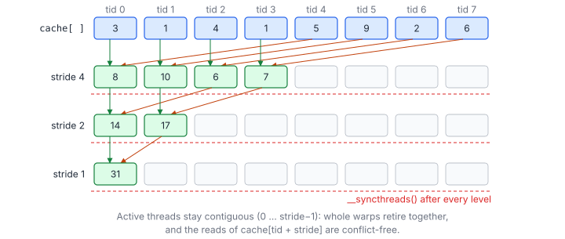
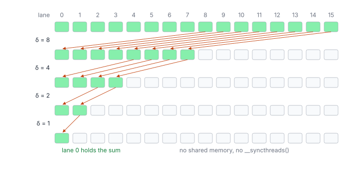
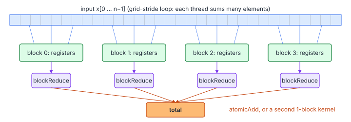

# 03 – Parallel Reduction

> **Part I · CUDA Foundations** · Prerequisites: [01](01-execution-model.md), [02](02-memory-hierarchy.md) ·
> Next: [09 – Profiling and Performance Analysis](09-profiling.md)

Goal: $s = \sum_i x_i$. The same pattern computes maxima, arg-max, dot
products, norms, softmax denominators, means and variances, so it is the
most reused building block in the practice sets. A reduction is
memory-bound (it reads each input once and does one addition with it); the
whole difficulty is to combine millions of values without wasting that
bandwidth on synchronization.

**You will learn**

- the work–depth view of a parallel reduction, and why each thread should
  first reduce sequentially;
- block reductions in shared memory, and why "sequential addressing" is the
  right tree;
- warp shuffles: what they are and how to reduce a warp without shared
  memory or barriers;
- four ways to combine the results of many blocks, including the
  single-pass "last block" pattern;
- reducing many rows at once (one warp or one block per row);
- the floating-point accuracy of each scheme, and Kahan summation;
- reductions with any associative operator (max, arg-max, softmax
  normaliser, mean and variance).

## 1. Work, Depth and Brent's Bound

A sequential sum does $n - 1$ additions in a chain of length $n - 1$. A
balanced tree does the same additions in far fewer levels:

$$
W = n - 1, \qquad D = \lceil \log_2 n \rceil, \qquad
T_p \le \frac{W}{p} + D
$$

| Symbol | Meaning |
|---|---|
| $n$ | Number of inputs |
| $W$ | Work: total number of additions |
| $D$ | Depth: length of the longest chain of dependent additions |
| $p$ | Number of processors (threads working at once) |
| $T_p$ | Time steps with $p$ processors (Brent's theorem) |

The tree is **work-efficient** (same $W$ as the sequential sum) and has
logarithmic depth. On a GPU, $p$ is in the tens of thousands while $n$ is in
the millions, so the $W/p$ term dominates. The practical recipe follows
from that: each thread first sums many elements **sequentially** (cheap,
no synchronization), and only the few per-thread results go through a tree.

## 2. Block-Level Tree Reduction in Shared Memory

### 2.1 The Kernel

```cpp
constexpr int kBlockSize = 256;

__global__ void reduceSum(const float* input, float* output, int n) {
    __shared__ float cache[kBlockSize];
    const int tid = threadIdx.x;

    // Grid-stride accumulation in a register first: fewer blocks, fewer atomics.
    float local_sum = 0.0f;
    for (int i = blockIdx.x * blockDim.x + tid; i < n; i += gridDim.x * blockDim.x) {
        local_sum += input[i];
    }
    cache[tid] = local_sum;
    __syncthreads();

    // Sequential addressing: active threads stay contiguous, so full warps
    // either all work or all idle (no divergence) and there are no bank conflicts.
    for (int stride = blockDim.x / 2; stride > 0; stride >>= 1) {
        if (tid < stride) cache[tid] += cache[tid + stride];
        __syncthreads();
    }

    if (tid == 0) atomicAdd(output, cache[0]);
}
```

`*output` must be zeroed before the launch (`cudaMemset`). The tree has
$\log_2 256 = 8$ levels, each ending in a barrier.

### 2.2 Walking Through the Tree



At level $j$ (stride $B/2^{j+1}$), threads $0 \dots \text{stride}-1$ each add
the element one stride away. After the last level, `cache[0]` holds the
block's sum.

### 2.3 Why This Tree and Not Another

Two properties decide whether a tree is fast on a GPU:

1. **Warp-uniform activity.** With `if (tid < stride)`, the active threads
   are a prefix: at stride 64 warps 0–1 work and warps 2–7 skip the whole
   level. A tree written as `if (tid % (2 * stride) == 0)` ("interleaved
   addressing") keeps every warp partly active with most lanes masked off.
2. **Bank-friendly addresses.** Lanes $\ell$ read `cache[ℓ + stride]`:
   consecutive words, 32 banks. The interleaved tree reads with a stride of
   $2 \cdot \text{stride}$ words, which conflicts.

### 2.4 Why Barriers at Every Level

Level $j+1$ reads values written by *other* threads at level $j$, so every
level needs a `__syncthreads()`. The barrier must be outside the `if`: all
threads reach it, including the ones that did no work at that level.

## 3. Warp Shuffles

### 3.1 What a Shuffle Is

A shuffle reads a register of another lane of the same warp, in one
instruction, without shared memory:

| Intrinsic | Lane $\ell$ receives the value of lane |
|---|---|
| `__shfl_sync(mask, v, src)` | `src` (broadcast when all lanes use the same `src`) |
| `__shfl_up_sync(mask, v, d)` | $\ell - d$ (unchanged if $\ell < d$) |
| `__shfl_down_sync(mask, v, d)` | $\ell + d$ (unchanged if $\ell + d \ge$ width) |
| `__shfl_xor_sync(mask, v, m)` | $\ell \oplus m$ (a butterfly) |

`mask` names the lanes that participate (all of them must execute the
call); `0xffffffff` is the whole warp. An optional last argument `width`
(a power of two ≤ 32) splits the warp into independent segments.

### 3.2 Reducing a Warp

Within a warp no shared memory or barrier is needed; `__shfl_down_sync`
reads a register of another lane:

$$
v^{(s+1)}_\ell = v^{(s)}_\ell + v^{(s)}_{\ell + \delta_s}, \qquad \delta_s = 16, 8, 4, 2, 1
$$

| Symbol | Meaning |
|---|---|
| $\ell$ | Lane index |
| $v^{(s)}_\ell$ | Lane $\ell$'s value after step $s$ |
| $\delta_s$ | Shuffle offset at step $s$; after 5 steps lane 0 holds the warp's sum |



With `__shfl_xor_sync` (a butterfly) instead, *every* lane ends with the
full sum, which saves a broadcast when all lanes need the result (softmax,
normalization).

### 3.3 From Warps to a Block

```cpp
__device__ float warpReduceSum(float value) {
    for (int offset = 16; offset > 0; offset >>= 1) {
        value += __shfl_down_sync(0xffffffff, value, offset);
    }
    return value;   // valid in lane 0
}

__device__ float blockReduceSum(float value) {
    __shared__ float warp_sums[32];
    const int lane = threadIdx.x % 32;
    const int warp_id = threadIdx.x / 32;

    value = warpReduceSum(value);
    if (lane == 0) warp_sums[warp_id] = value;
    __syncthreads();

    const int num_warps = (blockDim.x + 31) / 32;
    value = (threadIdx.x < num_warps) ? warp_sums[lane] : 0.0f;
    if (warp_id == 0) value = warpReduceSum(value);
    return value;   // valid in thread 0
}
```

Two shuffle rounds and **one** barrier, instead of eight barriers:

1. every warp reduces its 32 values to lane 0;
2. lane 0 of each warp writes one partial to `warp_sums`;
3. after the barrier, warp 0 reduces the (at most 32) partials.

If the function is called twice in a row (for example a sum and then a sum
of squares), add a `__syncthreads()` at its end so that the second call
does not overwrite `warp_sums` while warp 0 is still reading it.

## 4. The Classic Evolution

Mark Harris' *Optimizing Parallel Reduction in CUDA* walks through seven
versions. The lessons still hold:

| # | Change | What it fixes |
|---|---|---|
| 1 | Interleaved addressing, `if (tid % (2*s) == 0)` | (baseline) heavy divergence: half the lanes of every warp idle from the first step |
| 2 | Strided index `index = 2*s*tid` | Divergence, but introduces shared-memory bank conflicts |
| 3 | Sequential addressing (above) | Bank conflicts |
| 4 | First add during the global load | Half the threads idled in the first level |
| 5 | Unroll the last warp | Barriers and loop overhead when only one warp is left (today: shuffles) |
| 6 | Complete unrolling with templates | Loop overhead |
| 7 | Many elements per thread (grid-stride) | The kernel becomes bandwidth-bound: the target |

The reduction reads each input once, so its bound is

$$
T_{\min} = \frac{4n}{\beta}
$$

| Symbol | Meaning |
|---|---|
| $4n$ | Bytes read (float inputs) |
| $\beta$ | DRAM bandwidth |

Version 7 plus `float4` loads reaches 85–95 % of it. The tree itself costs
almost nothing once each thread has summed hundreds of elements first.

## 5. Finishing Across Blocks

### 5.1 The Options

Blocks cannot wait for each other, so the per-block results need a second
step:



| Method | How | Deterministic? |
|---|---|---|
| Atomics | Thread 0 of each block does `atomicAdd(out, block_sum)` | No: the order of additions varies from run to run |
| Two kernels | Kernel 1 writes $G$ partials; kernel 2 (one block) reduces them | Yes |
| Last-block | Each block writes its partial, `__threadfence()`, increments a counter; the block that sees the count reach $G$ reduces the partials | Yes |
| Cooperative groups | `grid.sync()` inside one cooperative launch | Yes |

The two-kernel version is used by most problem pages here (for example
[Tensara – Frobenius Norm](../tensara/frobenius-norm/) and
[Tensara – MSE Loss](../tensara/mse-loss/)): with $G \le 1024$ blocks the
second kernel is tiny.

### 5.2 The Last-Block Pattern

A single kernel can finish the job deterministically: the *last* block to
finish reduces everyone's partials.

```cpp
__device__ unsigned int g_blocks_done = 0;   // must be 0 at launch; the last block resets it

__global__ void reduceSinglePass(const float* in, float* partials, float* out, int n) {
    float v = 0.0f;
    for (int i = blockIdx.x * blockDim.x + threadIdx.x; i < n; i += gridDim.x * blockDim.x) v += in[i];
    v = blockReduceSum(v);

    __shared__ bool is_last;
    if (threadIdx.x == 0) {
        partials[blockIdx.x] = v;
        __threadfence();                                         // 1. publish the partial ...
        const unsigned int done = atomicAdd(&g_blocks_done, 1);  // 2. ... before being counted
        is_last = done == gridDim.x - 1;
    }
    __syncthreads();
    if (is_last) {                                               // block-uniform branch
        float s = 0.0f;
        for (int i = threadIdx.x; i < gridDim.x; i += blockDim.x) s += partials[i];
        s = blockReduceSum(s);
        if (threadIdx.x == 0) {
            *out = s;
            g_blocks_done = 0;                                   // ready for the next launch
        }
    }
}
```

#### Why It Is Correct

- The fence orders "write my partial" before "increment the counter", so
  the block that observes a count of $G - 1$ is guaranteed to see all $G$
  partials.
- `is_last` is a shared variable, so the branch is uniform across the
  block, and the barriers inside `blockReduceSum` are reached by all its
  threads.
- The partials are always added in index order, whatever order the blocks
  finished in, so the result is bitwise reproducible.

The last block calls `blockReduceSum` twice; the barrier after `is_last`
separates the two uses of `warp_sums`, as section 3.3 requires.

## 6. Reducing Many Rows

Softmax, layer normalization, row norms and arg-max per row reduce each row
of a matrix independently. The question becomes how many threads to give a
row:

| Row length | Mapping | Why |
|---|---|---|
| ≤ ~1024 | One warp per row | A warp reduction needs no shared memory and no barrier; many rows run in one block |
| ~1 K – 32 K | One block per row | Enough threads per row to keep bandwidth up; one block reduction per row |
| Larger, few rows | Several blocks per row | Otherwise too few blocks to fill the GPU; combine with atomics or a second pass |

```cpp
// One warp per row: in is rows x cols, row-major; out[r] = sum of row r.
__global__ void rowSum(const float* in, float* out, int rows, int cols) {
    const int row = (blockIdx.x * blockDim.x + threadIdx.x) / 32;
    const int lane = threadIdx.x % 32;
    if (row >= rows) return;                       // the whole warp exits together
    const float* p = in + static_cast<size_t>(row) * cols;
    float s = 0.0f;
    for (int c = lane; c < cols; c += 32) s += p[c];   // coalesced: lanes read consecutive columns
    s = warpReduceSum(s);
    if (lane == 0) out[row] = s;
}
```

The early `return` is safe because `row` is the same for all 32 lanes, so
the full-mask shuffles in `warpReduceSum` are executed by the whole warp or
not at all.

Reducing along **columns** is different: consecutive threads should take
consecutive columns (coalesced), and each thread walks down its column
([Tensara – Max Dim](../tensara/max-dim/)).

## 7. Accuracy

### 7.1 Error Bounds

Floating-point addition is not associative, so the GPU result differs from
a sequential CPU sum. Classical error bounds (Higham) for $n$ terms in a
format with unit roundoff $u$:

$$
\lvert \hat{s} - s \rvert \le \gamma_{n-1} \sum_i \lvert x_i \rvert \ \ (\text{sequential}), \qquad
\lvert \hat{s} - s \rvert \le \gamma_{\lceil \log_2 n \rceil} \sum_i \lvert x_i \rvert \ \ (\text{pairwise tree}), \qquad
\gamma_k = \frac{k u}{1 - k u}
$$

| Symbol | Meaning |
|---|---|
| $s, \hat{s}$ | Exact and computed sums |
| $u$ | Unit roundoff: $2^{-24}$ for fp32, $2^{-53}$ for fp64 |
| $\gamma_k$ | Error growth factor after $k$ dependent additions |

The GPU scheme (per-thread sequential chains, then a tree) sits between the
two: the chain length is about $n/p$. Practical consequences:

- with $n = 10^8$ fp32 values, a single sequential accumulator can lose
  4–5 significant digits; the tree loses almost nothing;
- accumulating the per-thread and per-block partials in `double` makes the
  result essentially exact for any size seen here.

### 7.2 Kahan Summation

Compensated summation carries the rounding error of each addition into the
next one:

```cpp
float sum = 0.0f, c = 0.0f;            // c: running compensation (the lost low bits)
for (int i = start; i < n; i += stride) {
    const float y = input[i] - c;      // add back what was lost last time
    const float t = sum + y;           // big + small: low bits of y are lost ...
    c = (t - sum) - y;                 // ... and recovered here (algebraically zero)
    sum = t;
}
```

The error becomes independent of the chain length (about $2u\sum|x_i|$). It
costs 4 flops per element, which is free in a memory-bound kernel. Beware of
`--use_fast_math`, which may reassociate `(t - sum) - y` to zero.

## 8. Reductions in General: Monoids

### 8.1 The Pattern

Any **associative** operator $\oplus$ with an identity $e$ can be reduced
with exactly the same code:

$$
x_0 \oplus x_1 \oplus \cdots \oplus x_{n-1}, \qquad (a \oplus b) \oplus c = a \oplus (b \oplus c), \qquad e \oplus a = a
$$

| Symbol | Meaning |
|---|---|
| $\oplus$ | The combine operator |
| $e$ | Its identity element (what padding lanes contribute) |

| Reduction | State | Identity $e$ | Combine $(a \oplus b)$ |
|---|---|---|---|
| Sum | $s$ | 0 | $s_a + s_b$ |
| Max | $m$ | $-\infty$ | $\max(m_a, m_b)$ |
| Arg-max (first index) | $(v, j)$ | $(-\infty, \infty)$ | The larger $v$; on ties the smaller $j$ |
| Softmax normaliser | $(m, z)$ | $(-\infty, 0)$ | $M = \max(m_a, m_b)$, $z = z_ae^{m_a - M} + z_be^{m_b - M}$ |
| Mean and variance (Welford / Chan) | $(n, \mu, M_2)$ | $(0, 0, 0)$ | See below |

Commutativity is not required for correctness, only for the freedom to
combine in any order; all operators above are also commutative.

### 8.2 Mean and Variance in One Pass

Chan's parallel merge for the mean and the sum of squared deviations:

$$
n = n_a + n_b, \qquad \delta = \mu_b - \mu_a, \qquad
\mu = \mu_a + \delta\,\frac{n_b}{n}, \qquad
M_2 = M_{2,a} + M_{2,b} + \delta^2\,\frac{n_a n_b}{n}
$$

| Symbol | Meaning |
|---|---|
| $n_a, n_b$ | Element counts of the two partial results |
| $\mu_a, \mu_b$ | Their means |
| $M_{2,a}, M_{2,b}$ | Their sums of squared deviations from their own means |
| $\delta$ | Difference of the means |
| $\mu, M_2$ | Merged mean and sum of squared deviations; the variance is $M_2 / n$ |

#### The Moments Struct in Code

As code, the state is a small struct and the combine a function; the warp
reduction shuffles each field:

```cpp
struct Moments { float n, mean, m2; };

__device__ Moments combine(Moments a, Moments b) {
    const float n = a.n + b.n;
    if (n == 0.0f) return a;                        // both empty: identity
    const float delta = b.mean - a.mean;
    return {n, a.mean + delta * (b.n / n), a.m2 + b.m2 + delta * delta * (a.n * b.n / n)};
}

__device__ Moments warpReduceMoments(Moments v) {
    for (int offset = 16; offset > 0; offset >>= 1) {
        Moments o{__shfl_down_sync(0xffffffff, v.n, offset), __shfl_down_sync(0xffffffff, v.mean, offset),
                  __shfl_down_sync(0xffffffff, v.m2, offset)};
        v = combine(v, o);
    }
    return v;   // valid in lane 0
}
```

This gives mean and variance in a single pass without the cancellation of
$\mathbb{E}[x^2] - \mathbb{E}[x]^2$. The Tensara pages implement exactly
this "accumulator struct" idea ([Argmax](../tensara/argmax/),
[Sum Dim](../tensara/sum-dim/)); the softmax monoid is the heart of
FlashAttention ([Tensara – Scaled Dot-Product Attention](../tensara/scaled-dot-attention/)).

## Key Takeaways

1. Sum sequentially per thread first (grid-stride), then reduce a few
   values per block with a tree: the $W/p$ term dominates.
2. Use sequential addressing in shared memory, or better, warp shuffles
   plus one barrier.
3. Pick the cross-block step by the need for determinism: atomics (fast,
   not reproducible), two kernels or the last-block pattern (reproducible).
4. Map rows to warps or blocks according to their length.
5. Tree reductions are more accurate than a single accumulator; `double`
   partials or Kahan summation remove the rest of the error.
6. Anything associative (max, arg-max, softmax statistics, Welford
   moments) reduces with the same code and a different combine.

## Exercises

1. Why does `blockReduceSum` still work for a block of 96 threads? What
   goes wrong if `blockDim.x` is not a multiple of 32 and the warp shuffles
   use `0xffffffff`?

    <details markdown="1"><summary>Answer</summary>

    96 threads = 3 full warps; warp 0 reads `warp_sums[0..2]` and zero for
    lanes ≥ 3. With a partial last warp, the full mask names lanes that do
    not exist: the behaviour is undefined. Use `__activemask()`-derived
    masks, or pad the block to a multiple of 32 and give the padding lanes
    the identity.

    </details>

2. Replace the shuffles in `warpReduceSum` by `__shfl_xor_sync` and show
   that every lane ends with the sum.

    <details markdown="1"><summary>Answer</summary>

    After step $\delta$, lanes $\ell$ and $\ell \oplus \delta$ hold the same
    value (the sum of their two groups). After $\delta = 16, 8, 4, 2, 1$
    every lane has combined all 32 values.

    </details>

3. Write the softmax-normaliser combine $(m, z)$ as a `__device__`
   function and check it on two halves of a small array by hand.

4. For $n = 2^{26}$ floats on an A100, what is $T_{\min}$? If your kernel
   takes 0.21 ms, what fraction of peak bandwidth is that?

    <details markdown="1"><summary>Answer</summary>

    $4n = 268$ MB, $T_{\min} = 268\text{ MB} / 1.55\text{ TB/s} \approx
    0.173$ ms; 0.21 ms is 82 %.

    </details>

## Practice

- [LeetGPU – Reduction](../leetgpu/004-reduction/)
- [LeetGPU – Dot Product](../leetgpu/017-dot-product/)
- [LeetGPU – Softmax](../leetgpu/005-softmax/)
- [Tensara – Argmax](../tensara/argmax/), [Tensara – Layer Norm](../tensara/layer-norm/)
