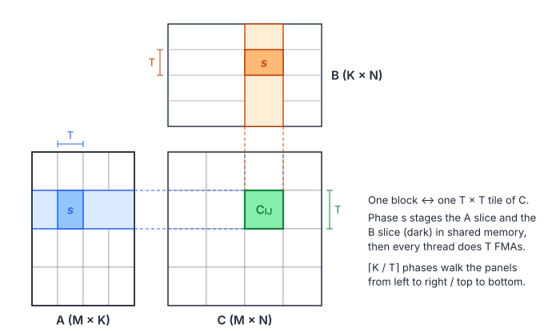
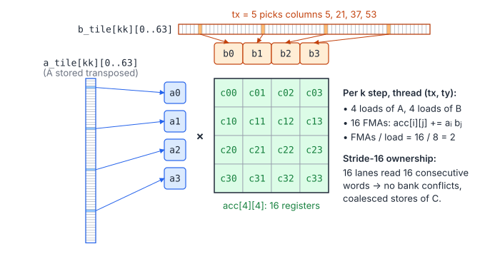
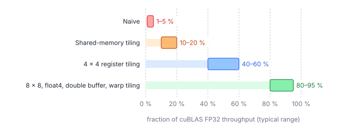

# 04 – Tiled Matrix Multiplication

Matrix multiplication is the opposite of the kernels in chapters 01–03: it
has plenty of arithmetic per byte, so it *can* be compute-bound, but only if
data is reused from fast memory. This chapter builds the standard
optimisation ladder:

1. naive;
2. shared-memory tiling;
3. register tiling;
4. the techniques that get to 80–90 % of cuBLAS.

Throughout, $C = AB$ with $A$ of size $M\times K$, $B$ of size $K\times N$
and $C$ of size $M\times N$, all row-major FP32.

## 1. The Numbers That Matter

$$
C_{ij} = \sum_{k=0}^{K-1} A_{ik} B_{kj}, \qquad
W = 2MNK, \qquad Q_{\min} = 4\,(MK + KN + MN), \qquad
I_{\max} = \frac{W}{Q_{\min}} \xrightarrow{M = N = K} \frac{n}{6}
$$

| Symbol | Meaning |
|---|---|
| $A, B, C$ | Operands and result |
| $M, N, K$ | Rows of $C$, columns of $C$, reduction length |
| $W$ | Flops (each multiply-add counts as 2) |
| $Q_{\min}$ | Compulsory DRAM bytes if every element were read or written exactly once |
| $I_{\max}$ | Best possible arithmetic intensity; for square $n\times n$ matrices it grows like $n/6$ |

At $n = 4096$, $I_{\max} \approx 680$ flop/byte, far above any GPU's ridge
point (chapter 00). The whole game is to get the *actual* intensity, as
seen from DRAM and from each level of on-chip memory, high enough.

## 2. Naive Kernel

One thread per output element:

```cpp
__global__ void matmulNaive(const float* a, const float* b, float* c, int m, int n, int k) {
    const int row = blockIdx.y * blockDim.y + threadIdx.y;
    const int col = blockIdx.x * blockDim.x + threadIdx.x;
    if (row >= m || col >= n) return;
    float acc = 0.0f;
    for (int kk = 0; kk < k; ++kk) acc = fmaf(a[row * k + kk], b[kk * n + col], acc);
    c[row * n + col] = acc;
}
```

Every FMA loads two floats (8 bytes) and does 2 flops:

$$
I_{\text{naive}} = \frac{2}{8} = 0.25\ \frac{\text{flop}}{\text{byte}}
$$

| Symbol | Meaning |
|---|---|
| $I_{\text{naive}}$ | Intensity seen by the load/store units |

Caches rescue some of it (the warp's 32 threads share the row of $A$, and
neighbouring warps reuse $B$), but the kernel still typically reaches only
1–5 % of peak.

## 3. Shared-Memory Tiling

Split $C$ into $T\times T$ tiles, one per block of $T\times T$ threads, and
split the $k$ loop into phases of $T$:

$$
C_{\mathcal{I}\mathcal{J}} = \sum_{s=0}^{\lceil K/T \rceil - 1} A_{\mathcal{I},\,\mathcal{K}_s}\; B_{\mathcal{K}_s,\,\mathcal{J}}
$$

| Symbol | Meaning |
|---|---|
| $\mathcal{I}, \mathcal{J}$ | The $T$ rows and $T$ columns of one output tile |
| $\mathcal{K}_s$ | The $s$-th slice of $T$ reduction indices |
| $A_{\mathcal{I},\mathcal{K}_s}$, $B_{\mathcal{K}_s,\mathcal{J}}$ | $T\times T$ sub-matrices staged in shared memory |



```cpp
constexpr int kTile = 32;

// launch: block(kTile, kTile), grid(ceil(n / kTile), ceil(m / kTile))
__global__ void matmulTiled(const float* a, const float* b, float* c, int m, int n, int k) {
    __shared__ float a_tile[kTile][kTile];
    __shared__ float b_tile[kTile][kTile];
    const int row = blockIdx.y * kTile + threadIdx.y;
    const int col = blockIdx.x * kTile + threadIdx.x;
    float acc = 0.0f;
    for (int k0 = 0; k0 < k; k0 += kTile) {
        // Each thread loads one element of each tile; out-of-range -> 0.
        const int a_col = k0 + threadIdx.x, b_row = k0 + threadIdx.y;
        a_tile[threadIdx.y][threadIdx.x] = (row < m && a_col < k) ? a[row * k + a_col] : 0.0f;
        b_tile[threadIdx.y][threadIdx.x] = (b_row < k && col < n) ? b[b_row * n + col] : 0.0f;
        __syncthreads();
        for (int kk = 0; kk < kTile; ++kk) acc = fmaf(a_tile[threadIdx.y][kk], b_tile[kk][threadIdx.x], acc);
        __syncthreads();   // before the next phase overwrites the tiles
    }
    if (row < m && col < n) c[row * n + col] = acc;
}
```

- Loads of both tiles are coalesced: `threadIdx.x` walks a row of $A$'s
  tile and a row of $B$'s tile.
- In the inner loop, `a_tile[ty][kk]` is the same address for the whole
  warp (a broadcast), and `b_tile[kk][tx]` reads a row (conflict-free).

Each block loads $2T^2$ floats per phase and performs $T^3$ FMAs with them:

$$
Q_{\text{tiled}} = \underbrace{\frac{MN}{T^2}}_{\text{blocks}}\cdot\underbrace{\frac{K}{T}}_{\text{phases}}\cdot\underbrace{2T^2\cdot 4}_{\text{bytes per phase}} = \frac{8MNK}{T}, \qquad
I_{\text{tiled}} = \frac{2MNK}{8MNK/T} = \frac{T}{4}
$$

| Symbol | Meaning |
|---|---|
| $T$ | Tile width (32 here) |
| $Q_{\text{tiled}}$ | Bytes loaded from global memory (L2/DRAM) in total |
| $I_{\text{tiled}}$ | global-memory intensity: global traffic drops by a factor of $T$ |

With $T = 32$, $I = 8$ flop/byte from L2/DRAM. The new bottleneck is shared
memory: the inner loop still does **one shared load per FMA** (the
broadcast of `a_tile` is nearly free, the `b_tile` read is not), and an SM
can issue far fewer shared loads than FMAs per cycle. This kernel typically
reaches 10–20 % of peak.

## 4. Register Tiling

Give each thread a $t_M\times t_N$ patch of outputs held in registers. For
each $k$, a thread loads $t_M$ values of $A$ and $t_N$ values of $B$ from
shared memory and does $t_Mt_N$ FMAs (an outer product):

$$
\frac{\text{FMAs}}{\text{shared loads}} = \frac{t_M t_N}{t_M + t_N}, \qquad
I_{\text{L2}} = \frac{2\,B_MB_NB_K}{4\,B_K\,(B_M + B_N)} = \frac{B_MB_N}{2\,(B_M + B_N)}
$$

| Symbol | Meaning |
|---|---|
| $t_M, t_N$ | Outputs per thread along $M$ and $N$ (register tile) |
| $B_M, B_N$ | Outputs per block (block tile) |
| $B_K$ | Depth of one K-slice staged in shared memory |
| $I_{\text{L2}}$ | Flops per byte loaded into shared memory from L2/DRAM |

| Configuration | FMAs per shared load | $I_{\text{L2}}$ (flop/B) |
|---|---|---|
| $T = 32$, 1 output per thread | 1 (0.5 counting both loads) | 8 |
| $64\times64$ block, $4\times4$ per thread | 2 | 16 |
| $128\times128$ block, $8\times8$ per thread | 4 | 32 |



The Tensara matmul pages use the $64\times64$ / $4\times4$ version
([Tensara – Matrix Multiplication](../tensara/matrix-multiplication/)). Its
inner loop is:

```cpp
#pragma unroll
for (int kk = 0; kk < kTileK; ++kk) {
    float a_frag[4], b_frag[4];
#pragma unroll
    for (int i = 0; i < 4; ++i) a_frag[i] = a_tile[kk][ty + 16 * i];   // A stored transposed
#pragma unroll
    for (int j = 0; j < 4; ++j) b_frag[j] = b_tile[kk][tx + 16 * j];
#pragma unroll
    for (int i = 0; i < 4; ++i)
#pragma unroll
        for (int j = 0; j < 4; ++j) acc[i][j] = fmaf(a_frag[i], b_frag[j], acc[i][j]);
}
```

Details that matter:

- **Transposed $A$ tile** (`a_tile[k][m]`): both operands are then read
  along rows of shared memory.
- **Stride-16 ownership** (`ty + 16 * i`, `tx + 16 * j`) instead of four
  adjacent elements: at every store instruction, 16 consecutive lanes
  write 16 consecutive columns (coalesced), and shared reads stay
  conflict-free.
- **Padding** of the shared tiles (`[kTileK][64 + 4]`) avoids conflicts in
  the transposed store.
- **Full unrolling** keeps `acc[4][4]` in registers; a dynamic index would
  force it into local memory.

## 5. The Rest of the Ladder

Each technique below has its own page in the
[GEMM deep dive](gemm/README.md), with a complete program that is tested
on the CPU emulator:

| Technique | Why it helps | Page |
|-----------|-----|---|
| `float4` shared loads (`LDS.128`) | 4× fewer shared-load instructions for the fragments | [04.1](gemm/01-vectorized-loads.md) |
| Double buffering (two sets of tiles) | Load slice $s+1$ while computing slice $s$; one barrier per slice instead of two | [04.2](gemm/02-double-buffering.md) |
| `cp.async` (sm_80+) / TMA (sm_90) | Global → shared copies without going through registers, asynchronous | [04.3](gemm/03-async-copies.md) |
| Warp tiling | A warp owns a $64\times32$ sub-tile; matches the hardware hierarchy block → warp → thread and improves register reuse | [04.4](gemm/04-warp-tiling.md) |
| Swizzled tile order ("grouped" launch) | Blocks that run together share rows of $A$ and columns of $B$ in L2 | [04.5](gemm/05-tile-swizzling.md) |
| Split-K / Stream-K | More parallelism when $M\cdot N$ has too few tiles to fill the GPU | [04.6](gemm/06-split-k-stream-k.md) |
| Tensor cores (WMMA, `mma.sync`, `wgmma`, CUTLASS/CuTe) | 8–16× the FLOPs for FP16/BF16/TF32/FP8; changes the whole data flow | [04.7](gemm/07-tensor-cores.md) |

A typical progression on one GPU, as a fraction of cuBLAS FP32:

| Kernel | Fraction of cuBLAS |
|---|---|
| Naive | 1–5 % |
| Shared-memory tiling | 10–20 % |
| $4\times4$ register tiling | 40–60 % |
| $8\times8$, `float4`, double buffering, warp tiling | 80–95 % |



Chapters 05–07 continue the story on AMD hardware with matrix-core
instructions, a hand-written assembly kernel and a kernel generator.

## 6. Checklist

- `threadIdx.x` ↔ column, for coalesced $B$ reads and $C$ writes.
- Zero-fill out-of-range elements when staging edge tiles, instead of
  skipping the load (the FMA loop then needs no bounds checks).
- Two `__syncthreads()` per slice with single buffering: after the loads,
  and before the next loads overwrite the tiles.
- Index with `size_t` once $MK$, $KN$ or $MN$ can exceed $2^{31}$ elements
  (for example a $64\cdot4096 \times 4096$ activation in
  [Tensara – Matmul 3D](../tensara/matmul-3d/)).
- Accumulate in FP32 even when inputs are FP16/BF16.

## Practice

- [LeetGPU – Matrix Multiplication](../leetgpu/002-matrix-multiplication/)
- [LeetGPU – GEMM](../leetgpu/022-gemm/)
- [Tensara – Matrix Multiplication](../tensara/matrix-multiplication/)
- [Tensara – GEMM + ReLU](../tensara/gemm-relu/) (fused epilogue)
