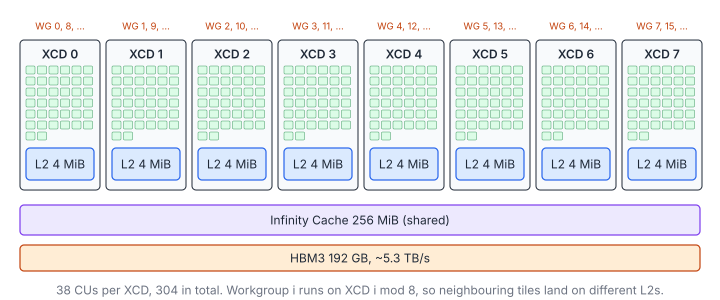
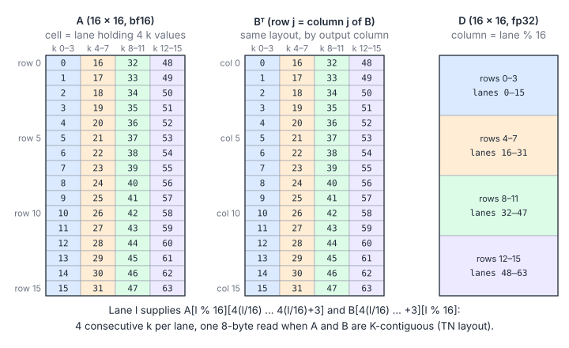

# 05 – AMD CDNA3 and MFMA: From CUDA to wave64 Matrix Cores

> **Part V · AMD Architecture & Libraries** · Prerequisites: [Matrix Multiplication 1](04-tiled-matmul.md) (and ideally [Matrix Multiplication 8](gemm/07-tensor-cores.md)) ·
> Next: [06 – Inside a Hand-Written AMD GEMM](06-aiter-asm-gemm.md)

Chapters 01–03 and Matrix Multiplication 1 used CUDA vocabulary. This chapter
maps it onto AMD's data-centre GPUs (CDNA3: MI300X / MI300A / MI325X, ISA
target `gfx942`). It
then builds a small bf16 GEMM with the MFMA matrix-core instruction and reads
the ISA the compiler emits. Chapters 06 and 07 use this vocabulary to take
apart the hand-written assembly GEMMs in **AITER** and the generated ones in
**hipBLASLt**.

**You will learn**

- how CUDA concepts map onto AMD's (CU, wavefront, LDS, VGPR/AGPR/SGPR);
- the hardware differences that change how kernels are written: wave64,
  the scalar unit, explicit memory counters, register-limited occupancy and
  XCD placement;
- what one MFMA instruction computes, and exactly which lane holds which
  operand element;
- how to compile a HIP kernel for gfx942 and read its ISA without a GPU;
- why a straightforward MFMA GEMM is far from peak, and the list of
  techniques that close the gap (chapters 06–07).

## 1. Vocabulary Map

### 1.1 CUDA to HIP

| CUDA | HIP / AMD | Notes |
|------|-----------|-------|
| SM | CU (compute unit) | MI300X: 304 CUs, 38 per XCD, 8 XCDs |
| Warp (32) | **Wavefront (64)** | `warpSize == 64` on CDNA; lane masks are 64-bit |
| Shared memory | LDS (local data share) | 64 KiB per CU on gfx942 |
| Registers | VGPRs (per lane), **AGPRs** (per lane, accumulators), SGPRs (per wave, scalar) | Up to 512 VGPR+AGPR per lane per wave |
| Tensor cores / `mma.sync` | **MFMA** (`v_mfma_*`) | One instruction per wave, operands spread across 64 lanes |
| `cp.async` / TMA | `buffer_load … lds` (direct-to-LDS) | Global → LDS without passing through VGPRs |
| `__syncthreads()` | `s_barrier` (+ fences) | |
| Scoreboard | **Explicit** `s_waitcnt vmcnt/lgkmcnt` | The compiler (or you, in asm) waits on counters |
| L2 per GPU | L2 **per XCD** (4 MiB) + 256 MiB Infinity Cache | Workgroup→XCD placement matters |

### 1.2 Things That Change How You Write Kernels

1. **Wave64.** A reduction over a wave needs `log2(64) = 6` steps. Ballots and
   masks are 64 bits wide. Use `__shfl_xor` with width 64, or DPP / `ds_swizzle`
   in asm.
2. **Scalar unit.** Values that are the same across the wave (pointers,
   loop counters, strides) live in SGPRs. Scalar ALU work runs alongside
   vector work. `s_load_dword` reads kernel arguments through the scalar cache.
3. **Explicit memory counters.** Each wave has counters for outstanding
   operations:
   - `vmcnt`: vector memory (global and buffer) loads.
   - `lgkmcnt`: LDS, GDS, constant and message operations.
   - `expcnt`: exports.

   `s_waitcnt vmcnt(N)` blocks until at most `N` vector loads are still in
   flight. Loads return in order, so `vmcnt(N)` means "everything except the
   N most recent has landed". Hand-written kernels pipeline their loads with
   this.
4. **Occupancy is set by registers far more than on NVIDIA.** Each SIMD has
   512 registers per lane to share among its waves:
   - A kernel that uses all 512 (256 VGPRs + 256 AGPRs) gets **one wave per
     SIMD**, and so four waves per CU.
   - The fastest AMD GEMMs are built exactly like that: one fat wave per SIMD,
     with latency hidden by software pipelining instead of by other waves.
5. **Workgroups are dispatched round-robin across XCDs.** Workgroup `i` goes
   to XCD `i % 8`.
   - Two neighbouring output tiles that share an `A` panel therefore land on
     different L2s.
   - hipBLASLt's `WorkGroupMappingXCC` (chapter 07) exists to undo this.




### 1.3 A First Example: Reducing a Wave

The wave reduction of chapter 03 needs one more step on wave64, and the
width comes from `warpSize` instead of a hard-coded 32:

```cpp
__device__ float waveReduceSum(float v) {
    for (int offset = warpSize / 2; offset > 0; offset >>= 1) v += __shfl_down(v, offset);  // 6 steps on wave64
    return v;   // valid in lane 0
}
```

Code that hard-codes 32 (lane masks as `unsigned`, `threadIdx.x % 32`,
32-entry arrays of per-warp partials) is the most common porting bug. HIP
compiles the same source for NVIDIA as well, where `warpSize` is 32.

## 2. MFMA: One Instruction, One Wave, a Whole Tile

### 2.1 What One Instruction Computes

`v_mfma_f32_16x16x16_bf16 D, A, B, C` computes `D = A·B + C` for a 16×16×16
tile, cooperatively across the 64 lanes of a wave. Unlike an FMA, which
every lane executes on its own data, an MFMA is a *wave-level* operation:
each lane contributes a few operand values and receives a few results, and
the matrix core does the $16\times16\times16$ product in between.

### 2.2 Which Lane Holds What

| Operand | Size per lane | Which elements lane `l` holds (`l ∈ [0, 64)`) |
|---------|---------------|-----------------------------------------------|
| `A` (16×16, bf16) | 4 × bf16 = 2 VGPRs | Row `l % 16`, k = `4·(l/16) … 4·(l/16)+3` |
| `B` (16×16, bf16) | 4 × bf16 = 2 VGPRs | Col `l % 16`, k = `4·(l/16) … 4·(l/16)+3` |
| `C`/`D` (16×16, fp32) | 4 × fp32 = 4 regs | Col `l % 16`, rows `4·(l/16) … 4·(l/16)+3` |

In formulas, for lane $\ell$ and register slot $t \in \{0, 1, 2, 3\}$:

$$
a_{\ell,t} = A\bigl[\ell \bmod 16,\ 4\lfloor \ell/16 \rfloor + t\bigr], \qquad
b_{\ell,t} = B^{\mathsf T}\bigl[\ell \bmod 16,\ 4\lfloor \ell/16 \rfloor + t\bigr], \qquad
d_{\ell,t} = D\bigl[4\lfloor \ell/16 \rfloor + t,\ \ell \bmod 16\bigr]
$$

$$
D_{ij} = \sum_{k=0}^{15} A_{ik}\,B_{kj} + C_{ij}, \qquad 0 \le i, j < 16
$$

| Symbol | Meaning |
|---|---|
| $\ell$ | Lane index, $0 \dots 63$ |
| $t$ | Which of the lane's 4 values (bf16 halves of 2 VGPRs, or 4 accumulator registers) |
| $a_{\ell,t}, b_{\ell,t}$ | Operand values held by lane $\ell$ |
| $d_{\ell,t}$ | Accumulator value held by lane $\ell$ |
| $B^{\mathsf T}[j, k]$ | $B[k, j]$: the B operand is indexed by output column, then $k$ |
| $A, B, C, D$ | The $16\times16$ operand, accumulator-in and result tiles |



### 2.3 Throughput

One instruction performs $2\cdot16^3 = 8192$ flops. The chip's peak is

$$
F = n_{\text{CU}}\cdot f\cdot \phi, \qquad 304 \times 2.1\ \text{GHz} \times 2048 \approx 1.31\ \text{PFLOP/s (dense bf16, MI300X)}
$$

| Symbol | Meaning |
|---|---|
| $n_{\text{CU}}$ | Compute units (304 on MI300X) |
| $f$ | Peak engine clock |
| $\phi$ | Dense bf16 flops per CU per clock (2048 on CDNA3, spread over 4 SIMDs) |

### 2.4 Why the TN Layout

Compare this with the opaque NVIDIA WMMA fragments used in
[leetgpu/022-gemm](../leetgpu/022-gemm/solution.cu): on AMD the layout is
documented and hand-written kernels rely on it.

The important consequence is that **the A operand is 4 consecutive k values
of one row, and so is the B operand when B is stored `[N][K]`.** If both
matrices are K-contiguous (the "TN" layout, `C = A · Bᵀ`), then every operand
fetch is one aligned 8-byte read per lane. That is why AITER's asm GEMMs are
all `_tn_`, and why PyTorch's `nn.Linear` weight layout `[out, in]` is exactly
right.

### 2.5 Other Shapes

Other shapes follow the same idea:
- `32x32x8`: fewer instructions per FLOP, 16 accumulator registers.
- `16x16x32` fp8.
- `v_mfma_f32_16x16x16_f16`.
- `v_mfma_i32_16x16x32_i8`, and so on.

The authoritative tables are the *CDNA3 ISA* guide and AMD's
[Matrix Instruction Calculator](https://github.com/ROCm/amd_matrix_instruction_calculator).
The calculator prints the exact register ↔ element mapping and the cycle
count for every instruction.

### 2.6 Accumulation Registers (AGPRs)

The accumulators can live in **AGPRs** (`a[0:3]`) or VGPRs:
- AGPRs roughly double the register file available to a wave.
- Moving between the two costs `v_accvgpr_read/write`.
- Compilers put accumulators in AGPRs. Hand-written kernels also park
  *operands* there (chapter 06).

## 3. A Teaching Kernel

### 3.1 Structure

[`tutorials/amd/mfma_gemm.hip`](amd/mfma_gemm.hip) is a complete bf16 TN
GEMM, about 120 lines of device code plus a host test and timer:

- **Block tile 64×64×32**, 256 threads = 4 waves in a 2×2 layout. Each wave
  owns 32×32 = 2×2 MFMA tiles.
- **Global → registers → LDS**. Each thread moves 16 bytes of A and 16 bytes
  of B per K step. LDS rows are padded to 40 bf16 (80 bytes) so the 16 rows
  touched by one operand read spread over banks.
- **Double-buffered LDS, one barrier per step**:
  1. Issue the global loads for tile `k+1`.
  2. Run the MFMAs on tile `k` from LDS.
  3. Write tile `k+1` into the other buffer.
  4. Barrier.

  The other buffer was last read in the previous iteration, which ended with
  a barrier, so overwriting it is safe.
- **Operand fetch** is exactly the table above:

  ```cpp
  // One MFMA operand: lane l supplies row (l % 16), k = k0 + 4 * (l / 16) .. +3.
  const uint16_t* p = tile + (row0 + lane % 16) * kLdsStride + k0 + 4 * (lane / 16);
  return *reinterpret_cast<const Short4*>(p);
  ```
- **Epilogue** writes `acc[i][j][r]` to row `4·(lane/16) + r`, column
  `lane % 16`.

### 3.2 Compile It Without a GPU

You do not need ROCm to look at the ISA. Stock clang ≥ 17 has the AMDGPU
back end. [`hip_compat.h`](amd/hip_compat.h) supplies the few HIP macros the
kernel uses:

```bash
clang++ -x hip -nogpuinc -nogpulib --cuda-device-only --offload-arch=gfx942 \
        -O3 -S -o mfma_gemm.s tutorials/amd/mfma_gemm.hip
```

### 3.3 Reading the ISA

This is the inner loop clang 18 produces (trimmed):

```asm
.LBB0_6:                                   ; K loop
	global_load_dwordx4 v[0:3], v[24:25], off    ; next A tile (16 B / lane)
	global_load_dwordx4 v[4:7], v[22:23], off    ; next B tile
	...
	ds_read2_b64 v[22:25], v21 offset1:4         ; A operands for k0 = 0 and 16, fused
	ds_read2_b64 v[34:37], v21 offset0:160 offset1:164
	ds_read2_b64 v[26:29], v30 offset1:4         ; B operands
	ds_read2_b64 v[30:33], v30 offset0:160 offset1:164
	s_waitcnt lgkmcnt(1)
	v_mfma_f32_16x16x16_bf16 a[12:15], v[22:23], v[26:27], a[12:15]
	s_waitcnt lgkmcnt(0)
	v_mfma_f32_16x16x16_bf16 a[8:11], v[22:23], v[30:31], a[8:11]
	... 6 more MFMAs ...
	s_waitcnt vmcnt(1)
	ds_write_b128 v22, v[0:3]                    ; stage next tile into the other buffer
	s_waitcnt vmcnt(0)
	ds_write_b128 v21, v[4:7]
	...
	s_barrier
```

Notice:

1. The accumulators went to AGPRs: `a[0:15]`, `.agpr_count: 16`.
2. The two 8-byte reads for `k0 = 0` and `k0 = 16` were fused into one
   `ds_read2_b64` (`offset1:4` is 4 × 8 bytes = 16 bf16 further along).
3. `s_waitcnt lgkmcnt(1)` lets the first MFMA start while the last LDS read is
   still in flight.
4. There are 8 MFMAs per K step against 2 global loads, 4 LDS reads and 2 LDS
   writes. **This ratio is far too low.**
   - The MFMA pipe will be starved.
   - Expect a small fraction of MI300X's roughly 1.3 PFLOP/s dense bf16 peak.

   The rest of this chapter and the next two are about fixing that ratio.

### 3.4 Why It Is Slow: Tile Intensity

The block-tile arithmetic makes the problem concrete. A workgroup that
owns a $B_M\times B_N$ output tile and walks $K$ in slices of $B_K$
loads $(B_M + B_N)B_K$ bf16 values per slice and performs
$2B_MB_NB_K$ flops:

$$
I_{\text{tile}} = \frac{2B_MB_NB_K}{2\,(B_M + B_N)\,B_K} = \frac{B_MB_N}{B_M + B_N}\ \frac{\text{flop}}{\text{byte}}, \qquad
I^{\star} = \frac{F}{\beta} \approx \frac{1.31\times10^{15}}{5.3\times10^{12}} \approx 250\ \frac{\text{flop}}{\text{byte}}
$$

| Symbol | Meaning |
|---|---|
| $B_M, B_N, B_K$ | Workgroup tile sizes (64, 64, 32 here) |
| $I_{\text{tile}}$ | Flops per byte the workgroup pulls from L2/HBM |
| $\beta$ | HBM bandwidth (~5.3 TB/s on MI300X) |
| $I^{\star}$ | Ridge point of the chip |

The teaching kernel's $64\times64$ tile gives $I_{\text{tile}} = 32$,
an eighth of the ridge point: without help from the caches it could
reach at most ~13 % of peak. A $256\times256$ tile gives 128, and L2 and
Infinity Cache reuse between neighbouring tiles provide the rest.

> This kernel is compile-checked for gfx942 in this repo, but it has not been
> run: there is no AMD GPU in CI. On a ROCm machine,
> `hipcc -O3 --offload-arch=gfx942 tutorials/amd/mfma_gemm.hip -o mfma_gemm && ./mfma_gemm 4096 4096 4096`
> runs the built-in check against an fp64 CPU reference and prints TFLOP/s.

## 4. What a Fast GEMM Does Differently

### 4.1 The Steps

Each step below is visible in chapter 06's disassembly:

| Step | Change | Effect |
|------|--------|--------|
| 1 | **Bigger tiles per wave** (e.g. 16×128 or 64×64 per wave, 128×128–256×256 per workgroup) | More MFMAs per byte loaded; accumulators grow to 128–256 registers |
| 2 | **Direct-to-LDS loads** (`buffer_load_dword … lds`) | Global data is written straight into LDS. No VGPR staging, no `ds_write`, fewer instructions and registers |
| 3 | **Skip LDS for operands a wave does not share** | If each wave owns distinct columns of B, it can load B straight into registers. The weights are pre-shuffled offline into MFMA operand order (`bpreshuffle`) |
| 4 | **Software pipelining with counters** | Keep 2–3 K steps of loads in flight and wait with `s_waitcnt vmcnt(N)` where `N` is the number of loads issued since, instead of `vmcnt(0)` |
| 5 | **Interleave everything with MFMAs** | An MFMA occupies the matrix pipe for several cycles. Issuing one load, LDS read or address update between consecutive MFMAs hides their issue cost completely. Compilers do this poorly, which is why the best kernels are asm or generated (TensileLite's `ScheduleIterAlg`) |
| 6 | **Split-K / Stream-K** for small M·N | Too few output tiles to fill 304 CUs? Split the K loop across workgroups and reduce with atomics or a fix-up pass |
| 7 | **Cache-aware tile order** | Make workgroups that run concurrently on one XCD share A/B panels in that XCD's L2 |

### 4.2 Filling the Machine

Why step 6 matters is simple counting. With $T$ output tiles and
$n_{\text{CU}}$ compute units each running one workgroup at a time:

$$
T = \left\lceil \frac{M}{B_M} \right\rceil\left\lceil \frac{N}{B_N} \right\rceil, \qquad
\text{waves} = \left\lceil \frac{T}{n_{\text{CU}}} \right\rceil, \qquad
\eta_{\text{fill}} = \frac{T}{n_{\text{CU}}\cdot\text{waves}}
$$

| Symbol | Meaning |
|---|---|
| $T$ | Number of output tiles (workgroups without split-K) |
| Waves | Rounds of workgroups needed to cover all tiles |
| $\eta_{\text{fill}}$ | Fraction of CU-time doing useful work, ignoring per-tile imbalance |

For $M = N = 2048$ with $256\times256$ tiles, $T = 64$: only 21 % of
MI300X's 304 CUs are busy. For $T = 320$, two waves are needed and the
second one is 5 % full, so $\eta_{\text{fill}} = 53\%$. Split-K multiplies
$T$ by the split factor; Stream-K gives every CU an equal share of the
$T\cdot\lceil K/B_K\rceil$ loop iterations (chapter 07).

## 5. Tools You Will Want

| Tool | Use |
|------|-----|
| `llvm-objdump -d --mcpu=gfx942 file.co` | Disassemble a code object (`.co`, `.hsaco`) |
| `readelf --notes file.co` | Kernel metadata: VGPR/AGPR/SGPR counts, LDS size, kernarg layout |
| `roc-obj-ls` / `roc-obj-extract` | Pull code objects out of a fat binary / `.so` |
| `rocprofv3 --kernel-trace --stats` | Kernel times |
| `rocprofv3 --pmc SQ_INSTS_VALU_MFMA_MOPS_BF16 …` | Hardware counters (MFMA utilisation, LDS bank conflicts `SQ_LDS_BANK_CONFLICT`) |
| rocprofv3 ATT (thread trace) + Radeon GPU Analyzer / ROCm Compute Viewer | Instruction-level timeline: where each wave stalls |
| `rocprof-compute` (Omniperf) | Roofline and "speed of light" summaries |

## Key Takeaways

1. A CU is an SM, a wavefront is a 64-lane warp, LDS is shared memory; the
   differences that matter are wave64, the scalar unit, explicit `s_waitcnt`
   counters, register-limited occupancy and per-XCD L2s.
2. An MFMA is a wave-level instruction with a documented operand layout:
   lane $\ell$ holds row $\ell \bmod 16$ and 4 consecutive $k$ of A (and of
   B's column), and 4 rows of one column of D.
3. With both operands K-contiguous (TN), every operand fetch is one aligned
   8-byte read per lane.
4. A correct MFMA GEMM is easy; a fast one needs big wave tiles, direct-to-LDS
   loads, software pipelining with counters, interleaving, work
   decomposition and cache-aware tile order: the subject of chapters 06–07.

## Exercises

1. Change the teaching kernel to 32×32×8 MFMAs
   (`__builtin_amdgcn_mfma_f32_32x32x8bf16_1k`). Work out the new operand
   and accumulator layout with the Matrix Instruction Calculator.

    <details markdown="1"><summary>Hint</summary>

    The calculator's `--detail-instruction` and `--register-layout` options
    (see its `--help`) print the register ↔ element tables for a CDNA3
    instruction. The accumulator becomes 16 registers
    per lane, and each lane holds 4 consecutive $k$ of one row of A
    (32 rows × 2 groups of 4 $k$ over 64 lanes).

    </details>

2. Make each wave compute 32×64 instead of 32×32. How many AGPRs does the
   compiler report now, and what happens to occupancy?

    <details markdown="1"><summary>Hint</summary>

    The accumulators double from 16 to 32 registers per lane (2×4 tiles of 4
    registers). Read `.agpr_count` and `.vgpr_count` in the `.s` metadata, and
    remember each SIMD has 512 registers per lane to share among its waves.

    </details>

3. Replace the register-staged loads with direct-to-LDS loads: use
   `__builtin_amdgcn_global_load_lds` (clang 19 or newer), or inline asm.
   Compare the instruction counts in the loop.

4. Compute $\eta_{\text{fill}}$ for $M = 4096$, $N = 1024$ with
   $256\times256$ tiles on MI300X. How would split-K with $S = 4$ change it?

    <details markdown="1"><summary>Answer</summary>

    $T = 16\cdot4 = 64$ tiles, one wave, $\eta = 64/304 = 21\%$. With
    $S = 4$: 256 workgroups, $\eta = 256/304 = 84\%$ (before the cost of
    combining partial tiles).

    </details>
