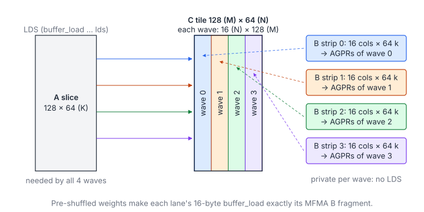
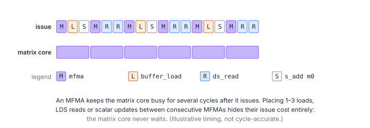
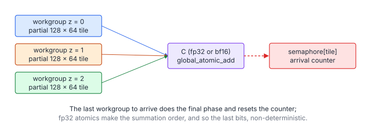

# 06 – Inside a Hand-Written AMD GEMM: AITER's bf16 Asm Kernels

> **Part IV · AMD GPUs** · Prerequisites: [05 – CDNA3 and MFMA](05-amd-cdna3-mfma.md) ·
> Next: [07 – hipBLASLt and TensileLite](07-hipblaslt-tensilelite.md)

[AITER](https://github.com/ROCm/aiter) is AMD's operator library for LLM
inference; vLLM and SGLang use it on MI300 and MI355. Most of its
performance-critical kernels are shipped as **pre-assembled code objects
(`.co`)**, written and tuned directly in GCN/CDNA assembly. This chapter
dissects one of them:

```
hsa/gfx942/bf16gemm/bf16gemm_fp32bf16_tn_128x64_bshuffle_splitk.co
```

This is a bf16 × bf16 → fp32/bf16 GEMM with a 128×64 output tile, pre-shuffled
weights and split-K. It uses the MFMA vocabulary from
[chapter 05](05-amd-cdna3-mfma.md). Every number quoted here was measured on
the disassembly of AITER commit `569ae98`. You can reproduce all of it on a
machine without a GPU (see [Reproduce this chapter](#reproduce-this-chapter)).

**You will learn**

- how a GEMM library dispatches a call to one of many specialised kernels
  (tuned tables, heuristics, pre-shuffled weights);
- to read a kernel descriptor and see why the fastest AMD GEMMs run one fat
  wave per SIMD;
- to reconstruct a kernel's work decomposition from its register numbers;
- the main-loop techniques of a hand-written kernel: direct-to-LDS loads,
  register double buffering, MFMA interleaving, counter-based pipelining and
  a branch-free K tail;
- how split-K partials are combined, and why AITER's bf16 rounding differs
  from PyTorch's;
- the workflow for modifying and profiling such a kernel safely.

Read it with the disassembly open: every claim below points at instructions
you can find in it.

## 1. How AITER Finds and Launches the Kernel

The Python call chain for `C = A · Bᵀ` (an `nn.Linear`) is:

```
aiter.tuned_gemm.gemm_a16w16(A, B, bias)          # aiter/tuned_gemm.py
  └─ get_GEMM_A16W16_config(M, N, K, …)           # lookup in aiter/configs/bf16_tuned_gemm.csv
       └─ libtype ∈ {asm, hipblaslt, triton, skinny, opus, flydsl, torch}
  └─ solMap["asm"] → gemm_a16w16_asm(…)            # aiter/ops/gemm_op_a16w16.py
       └─ C++: csrc/py_itfs_cu/asm_gemm_a16w16.cu  # picks a .co, fills KernelArgs, hipModuleLaunchKernel
```

### 1.1 Tuned Table

`aiter/configs/bf16_tuned_gemm.csv` holds one row per
`(gfx, cu_num, M, N, K, bias, dtype, outdtype, scaleAB, bpreshuffle)` key.
Each row records:
- the winning `libtype`;
- `solidx`, `splitK` and `kernelName`;
- the measured `us` and `tflops`.

It is produced offline by `csrc/gemm_a16w16/gemm_a16w16_tune.py`, which
benchmarks every backend for every shape. At the pinned commit its 232 rows
were split: 120 triton, 71 asm, 36 opus, 5 flydsl.

In other words, the hand-written kernels win only for particular shapes. The
practical lesson is that **a GEMM library is a dispatch table plus a zoo of
specialised kernels.** Chapter 07 shows hipBLASLt doing the same thing at a
much larger scale.

### 1.2 Kernel Table

`hsa/gfx942/bf16gemm/bf16gemm_fp32bf16.csv` lists every `.co` in the family
with its properties:

| co_name | tn | tileM | tileN | pf | bPreshuffle | splitK | subK | bias |
|---------|----|-------|-------|----|-------------|--------|------|------|
| `…_128x64_bshuffle_splitk.co` | 1 | 128 | 64 | 0 | 1 | 0 | 64 | 1 |
| `…_32x64_pf3_splitk.co` | 1 | 32 | 64 | 3 | 0 | 0 | 64 | 1 |
| `…_64x64_splitk_clean.co` | 1 | 64 | 64 | 0 | 0 | 1 | 64 | 1 |

The family has 22 kernels: tileM ∈ {32, 48, 64, 80, 96, 128, 160}, with and
without pre-shuffled B.

### 1.3 Heuristic

When no tuned row matches, `get_heuristic_kernel` in the C++ launcher:

1. Filters kernels by `N % tileN == 0`, the pre-shuffle flag and bias support.
2. For split-K-capable kernels, picks
   `splitK = max(2, min(num_cu / tiles, 16, K / subK))`.
3. Minimises the number of **waves of workgroups** ("rounds") over the CUs.
4. Breaks ties by fewer idle CUs in the last round, less M padding and a
   higher `tileM·tileN / (tileM + tileN)` (compute-to-memory ratio).

This is the same "fill the machine, then maximise reuse" reasoning a human
applies.

### 1.4 Arguments and Launch

`KernelArgs` is a packed struct in which **every field is padded to 16
bytes**: `ptr_D`, `ptr_C`, `ptr_A`, `ptr_B`, `alpha`, `beta`, strides, `M`,
`N`, `K`, `splitk`, `is_out_b16`, `ptr_Bias`, `add_bias`, `ptr_semaphore`.
That is why the prologue reads them at offsets `0x0, 0x10, 0x20, …`:

```asm
s_load_dwordx2 s[16:17], s[0:1], 0x0     ; ptr_D
s_load_dwordx2 s[4:5],   s[0:1], 0x20    ; ptr_A  -> becomes buffer resource s[4:7]
s_load_dwordx2 s[8:9],   s[0:1], 0x30    ; ptr_B  -> buffer resource s[8:11]
s_load_dword   s25,      s[0:1], 0xe0    ; M
s_load_dword   s26,      s[0:1], 0xf0    ; N
s_load_dword   s27,      s[0:1], 0x100   ; K
s_load_dword   s48,      s[0:1], 0x110   ; splitk
```

The launch grid is `(ceil(N/64), ceil(M/128), splitK)` with 256 threads per
workgroup.

### 1.5 Pre-Shuffled Weights

`aiter.ops.shuffle.shuffle_weight(w, layout=(16, 16))` permutes the weight
**once, offline**:

```python
# bf16: 16 rows (N) x 32 cols (K) blocks, each stored as [k_chunk(4)][n(16)][8 elems]
x.view(-1, N // 16, 16, K // 32, 4, 8).permute(0, 1, 3, 4, 2, 5)
```

After this permutation, one `buffer_load_dwordx4` per lane (64 lanes × 16
bytes = a 16×32 block) delivers *exactly* the MFMA B-operand fragments:
lane `l` gets column `l % 16` and 8 consecutive k values. Section 3 explains
why this matters.

Written as an index map: split the weight coordinates as
$n = 16n_1 + n_0$ and $k = 32k_1 + 8k_2 + k_3$. The permutation stores
element $(n, k)$ at

$$
\pi(n, k) = \Bigl(\bigl(n_1\,\tfrac{K}{32} + k_1\bigr)\cdot 4 + k_2\Bigr)\cdot 128 + 8\,n_0 + k_3, \qquad
\ell = 16\,k_2 + n_0
$$

| Symbol | Meaning |
|---|---|
| $n_1, n_0$ | 16-row block of $W$ and row inside it ($0 \le n_0 < 16$) |
| $k_1, k_2, k_3$ | 32-wide K block, 8-element chunk inside it ($0 \le k_2 < 4$), element inside the chunk |
| $\pi(n, k)$ | Element offset in the shuffled buffer |
| $\ell$ | The lane that receives the element when a wave reads 1 KiB contiguously (16 bytes per lane) |

Each contiguous 1 KiB chunk is one $16\times32$ block, and lane $\ell$ gets
row $n_0 = \ell \bmod 16$ with 8 consecutive $k$: the MFMA B-operand
layout for two consecutive 16x16x16 instructions.

## 2. The Kernel Descriptor: One Fat Wave per SIMD

```
$ llvm-objdump -D -j .rodata --mcpu=gfx942 bf16gemm_fp32bf16_tn_128x64_bshuffle_splitk.co
	.amdhsa_group_segment_fixed_size 65536     ; all 64 KiB of LDS
	.amdhsa_accum_offset 256                   ; v0-v255 arch VGPRs, a0-a255 AGPRs
	.amdhsa_next_free_vgpr 512                 ; 512 registers per lane: the whole file
	.amdhsa_next_free_sgpr 112
	.amdhsa_ieee_mode 0
	.amdhsa_dx10_clamp 0
```

With 256 threads (4 waves), 512 registers per lane and 64 KiB of LDS:
- exactly **one workgroup fits per CU**;
- that workgroup has **one wave per SIMD**.

Nothing hides latency except the kernel's own instruction schedule. This is
the opposite of the "maximise occupancy" advice for simple kernels, and it is
normal for peak-performance GEMMs on CDNA.

## 3. The Work Decomposition: Why B Never Touches LDS

### 3.1 Reading the Register Numbers

The MFMAs in the main loop look like this:

```asm
v_mfma_f32_16x16x16_bf16 v[44:47], a[128:129], a[0:1],  v[44:47]
v_mfma_f32_16x16x16_bf16 v[48:51], a[128:129], a[8:9],  v[48:51]
...
v_mfma_f32_16x16x16_bf16 v[72:75], a[128:129], a[56:57], v[72:75]
```

Reading the register numbers:

- **Accumulators** are `v[44:75]`: 8 tiles × 4 registers. Unusually, they sit
  in *arch VGPRs*, not AGPRs.
- **First operand** `a[128:135]` (4 k-steps × 2 regs) is the same for all 8
  accumulators. It is one 16-wide strip, and it comes from **B**.
- **Second operand** `a[0:63]` changes with the accumulator. There are 8
  different 16-row blocks of **A**, 128 rows in all.

### 3.2 The Decomposition and Its Consequences

So each wave computes a **16(N) × 128(M)** slab of the output, and the four
waves split N: 4 × 16 = 64 = tileN. Two consequences follow:

1. **A (128 × 64 per K step) is needed by all four waves**, so it goes through
   LDS.
2. **B is private to each wave**: nobody else uses its 16 columns. Staging B
   through LDS would only cost instructions and bandwidth. Instead each wave
   loads its B strip **straight from global memory into AGPRs**:

   ```asm
   buffer_load_dwordx4 a[144:147], v38, s[8:11], 0 offen   ; B, 16 bytes per lane
   buffer_load_dwordx4 a[148:151], v39, s[8:11], 0 offen
   ```

   This only works because the weights were pre-shuffled (section 1): each
   lane's 16 bytes are already MFMA operand fragments. That is what `bshuffle`
   in the name means. The `pf3` variants without pre-shuffling go through LDS
   instead, with a deeper prefetch.

   Why is it legal for a lane to receive 8 k values when the MFMA takes 4 at
   a time? Any permutation of the k index that is applied consistently to A
   and B leaves `Σₖ aₖ·bₖ` unchanged. The shuffle picks the k order that makes
   loads contiguous.



### 3.3 Why Reordering k Is Legal

In symbols, for any permutation $\sigma$ of $\{0, \dots, K-1\}$:

$$
C_{ij} = \sum_{k=0}^{K-1} A_{ik}\,B_{kj} = \sum_{k=0}^{K-1} A_{i\sigma(k)}\,B_{\sigma(k)j}
$$

| Symbol | Meaning |
|---|---|
| $\sigma$ | A reordering of the reduction index, applied identically to both operands |

The only requirement is that the A fragments read from LDS use the same
$\sigma$ as the pre-shuffled B, which the kernel's LDS read offsets
guarantee.

## 4. The Main Loop

The steady state is a block that repeats for every K step of 64.

### 4.1 Per-Block Instruction Budget

Counted from the disassembly:

| Per K=64 step, per wave | Count | Bytes |
|-------------------------|-------|-------|
| `v_mfma_f32_16x16x16_bf16` | 32 | – |
| `buffer_load_dword … offen lds` (A, direct-to-LDS) | 16 | 16 × 64 × 4 = 4 KiB |
| `buffer_load_dwordx4` into AGPRs (B) | 2 | 2 KiB |
| `ds_read_b128` into AGPRs (A operands for the *next* step) | 16 | 16 KiB |
| `s_barrier` | 1 | – |

The four waves together load the whole 128×64 A tile (16 KiB) into LDS and
their own 64×64 B columns (8 KiB), then issue 128 MFMAs:
128 × 16·16·16 × 2 = 1 MFLOP per 24 KiB fetched. Compare this with
chapter 05's teaching kernel, which issues 8 MFMAs for every 2 global loads,
4 LDS reads and 2 LDS writes.

The tile shape sets the reuse. For a $128\times64$ workgroup tile and
K steps of 64 (bf16, 2 bytes):

$$
I_{\text{tile}} = \frac{2\,B_MB_NB_K}{2\,(B_M + B_N)\,B_K} = \frac{128\cdot64}{128 + 64} \approx 42.7\ \frac{\text{flop}}{\text{byte}}, \qquad
\rho = \frac{n_{\text{MFMA}}}{n_{\text{mem}}} = \frac{32}{16 + 2 + 16} \approx 0.94
$$

| Symbol | Meaning |
|---|---|
| $B_M, B_N, B_K$ | Workgroup tile: 128 (M), 64 (N), 64 (K per step) |
| $I_{\text{tile}}$ | Flops per byte fetched from L2/HBM |
| $n_{\text{MFMA}}$ | MFMAs per wave per K step |
| $n_{\text{mem}}$ | Memory instructions per wave per K step (buffer loads plus LDS reads) |
| $\rho$ | MFMAs per memory instruction: about one, so every memory instruction can sit in the shadow of an MFMA |

The teaching kernel of chapter 05 has $\rho = 8/8 = 1$ as well, but each of
its MFMAs is surrounded by address arithmetic, waits and barriers; here the
whole loop body is scheduled so that the matrix pipe never idles.

### 4.2 Direct-to-LDS Loads

```asm
s_add_u32 m0, 0x100, s42                     ; LDS destination = M0 (+ lane * 4)
buffer_load_dword v22, s[4:7], 0 offen lds   ; global A[...] -> LDS, bypassing VGPRs
```

With the `lds` modifier, each lane's dword is written to LDS at
`M0 + lane·4` instead of into `v22` (here `v22` is only the *address offset*).
Each instruction moves 256 bytes, so `M0` advances by `0x100`.
`s42`/`s43` alternate between iterations: they are the two LDS buffers.

There are no `ds_write`s at all in the loop. That saves 16 instructions per
step, plus the VGPRs that would have staged the data.

### 4.3 Register Double Buffering

```asm
v_mfma_f32_16x16x16_bf16 v[44:47], a[128:129], a[0:1], v[44:47]   ; compute with a[0:63]...
ds_read_b128 a[64:67], v37 offset:16512                            ; ...while loading a[64:127]
```

The MFMAs of step *k* read A fragments from `a[0:63]` while the `ds_read`s
for step *k+1* fill `a[64:127]`. The next block swaps the roles. B rotates
the same way through `a[128:135]`, `a[136:143]` and `a[144:151]`.

AMD GPUs cannot index registers dynamically, so the rotation is **unrolled in
the code**:
- two loop bodies, `label_02CA` and `label_0703`, each with 6 unrolled blocks;
- 192 MFMAs, 96 direct-to-LDS loads and 96 `ds_read_b128` per body.

The disassembly has 384 MFMAs, 240 direct-to-LDS loads and 208 `ds_read_b128`
in total.

### 4.4 Interleaving

Look at the first lines of a block:

```asm
s_waitcnt vmcnt(18) lgkmcnt(0)      ; previous step's loads have landed
s_barrier                           ; every wave's A slice is in LDS
v_mfma_f32_16x16x16_bf16 ...
s_add_u32 m0, 0, s42
buffer_load_dword v21, s[4:7], 0 offen lds
v_mfma_f32_16x16x16_bf16 ...
s_add_u32 m0, 0x100, s42
buffer_load_dword v22, s[4:7], 0 offen lds
ds_read_b128 a[64:67], v37 offset:16512
ds_read_b128 a[68:71], v37 offset:16576
v_mfma_f32_16x16x16_bf16 ...
```

The pattern is **MFMA, then 1–3 memory or scalar instructions**, repeated.
An MFMA keeps the matrix core busy for several cycles after it issues. While
it runs, the wave's instruction arbiter can issue the load, the `M0` update or
the pointer increment for free.



This is the single most important scheduling idea in AMD GEMMs. It is exactly
what TensileLite's `ScheduleIterAlg=3` automates (chapter 07).

### 4.5 Counting Outstanding Loads

`s_waitcnt vmcnt(18)` means "continue once at most 18 vector-memory operations
are still in flight". Each block issues 16 + 2 = 18 of them. Vector memory
operations complete in order, so `vmcnt(18)` at the top of block *k+1* waits
for everything from block *k-1* and earlier, while block *k*'s loads keep
flying. That is **one full block of prefetch**, expressed with a single
counter, with no extra registers and no branches.

### 4.6 Branch-Free K Tail

```asm
s_add_u32 s31, 0x100, s33
s_cmp_lt_u32 s31, s34
s_cselect_b32 s40, s40, 0     ; pointer increment becomes 0 past the end of K
s_add_u32 s4, s40, s4         ; advance A's buffer base
```

Near the end of K, the pointer increment is set to zero, so the prefetch
harmlessly re-reads the last tile instead of reading out of bounds. The loop
body stays branch-free.

Buffer resources (`s[4:7]`, `s[8:11]`) can also bound-check in hardware:
out-of-range loads return 0 and out-of-range stores are dropped. Generated
kernels such as TensileLite's rely on that for edge tiles. This kernel sets
`num_records` to `0xFFFFFFF0` (`s_mov_b32 s6, -16` in the prologue), which
effectively disables the check.

## 5. Epilogue: Split-K and bf16 Rounding

### 5.1 Combining Partial Tiles

With `splitk > 1`, the grid's z dimension splits K. Each z-slice accumulates a
partial 128×64 tile:

- **fp32 output:** partials are added with `global_atomic_add_f32` (64 of them
  in the listing).
- **bf16 output:** partials are rounded and added with
  `global_atomic_pk_add_bf16`, two bf16 values per atomic (48 of them in the
  listing).
- The listing also has 16 plain stores, for the non-split path.

A small **semaphore workspace** (`ptr_semaphore`, 16 × 64 `uint32`,
zero-initialised per stream in `gemm_op_a16w16.py`) holds per-tile arrival
counters. The last workgroup to arrive does the final phase and resets the
counter. That is why the launcher asserts `gdx·gdy ≤ 1024` and why separate
streams need separate workspaces: shared counters would deadlock.



### 5.2 bf16 Rounding by Hand

The fp32 → bf16 conversion is done by hand:

```asm
v_cmp_u_f32_e64 s[56:57], v44, v44     ; NaN?
v_add3_u32 v8, v44, v11, 1             ; bits + 0x7fff + 1  (v11 = 0x7fff)
v_cndmask_b32_e64 v4, v8, v10, s[56:57] ; NaN -> 0x7fff0000 (canonical qNaN)
v_perm_b32 v76, v5, v4, s35            ; s35 = 0x07060302: pack the two high halves
```

Adding `0x8000` and truncating rounds ties *away from zero in magnitude*. This
is **not round-to-nearest-even**; torch's `.to(torch.bfloat16)` adds
`0x7fff + lsb`. The results can differ by 1 ulp on exact ties, which matters
when you compare against a reference bit for bit.

The two rounding rules, on the 32-bit pattern $u$ of the fp32 value:

$$
\operatorname{bf16}_{\text{RNE}}(u) = \Bigl\lfloor \frac{u + \texttt{0x7FFF} + \bigl(\lfloor u / 2^{16} \rfloor \bmod 2\bigr)}{2^{16}} \Bigr\rfloor, \qquad
\operatorname{bf16}_{\text{AITER}}(u) = \Bigl\lfloor \frac{u + \texttt{0x8000}}{2^{16}} \Bigr\rfloor
$$

| Symbol | Meaning |
|---|---|
| $u$ | fp32 bit pattern as an unsigned integer (NaN handled separately) |
| $\lfloor u/2^{16}\rfloor \bmod 2$ | The lowest kept bit (the bf16 mantissa LSB) |
| $\operatorname{bf16}_{\text{RNE}}$ | Round to nearest, ties to even (PyTorch) |
| $\operatorname{bf16}_{\text{AITER}}$ | Round to nearest, ties away from zero (this kernel) |

They differ only when the low 16 bits are exactly `0x8000` and the kept
LSB is 0.

### 5.3 The Arithmetic of Split-K

Split-K itself is just the sum over K ranges:

$$
C = \sum_{z=0}^{S-1} A_{:,\,\mathcal{K}_z}\,B_{\mathcal{K}_z,\,:}, \qquad
\mathcal{K}_z = \Bigl[\,z\,\tfrac{K}{S},\ (z+1)\,\tfrac{K}{S}\Bigr)
$$

| Symbol | Meaning |
|---|---|
| $S$ | Split factor (`splitk`, the grid's z extent) |
| $\mathcal{K}_z$ | The K range handled by slice $z$ |

It multiplies the number of workgroups by $S$ at the cost of $S$ partial
results per tile (atomics) and non-deterministic fp32 summation order.

## 6. Modifying and Profiling Such a Kernel

AITER documents the full workflow in `docs/isa_kernel_optimization.md`, and
its scripts are in `docs/examples/isa_optimization/`:

1. **Round-trip first.** `roundtrip.sh <kernel.co>` extracts a standalone
   `kernel.s`, reassembles it with
   `clang -x assembler -target amdgcn-amd-amdhsa -mcpu=gfx942`, and compares
   `.text`, the kernel descriptor and the metadata note. Any difference after
   that point is one you introduced.
2. **Edit.** Nothing checks hazards for you in hand-written asm:
   - The assembler encodes exactly what you write.
   - Hazard `s_nop`s are mandatory wait states (for example, between
     dependent MFMAs or after a transcendental op). An `s_nop N` gives N+1
     wait states.
   - Every `s_waitcnt` count must be recomputed when you move loads.
   - Violations do not fault; they silently read stale data.
3. **Resize.** Changing register or LDS usage means editing
   `.amdhsa_next_free_vgpr`, `.amdhsa_accum_offset`,
   `.amdhsa_group_segment_fixed_size` *and* the metadata.
4. **Test.** Replace the `.co` in `hsa/gfx942/…` and run the op test. AITER
   logs `LoadKernel: … hsaco: <path>`.
5. **Profile.**
   - `rocprofv3 --kernel-trace --stats --kernel-include-regex bf16gemm` for
     timing.
   - `rocprofv3 --att --kernel-iteration-range 5-5 --att-target-cu 1` for a
     per-instruction thread trace, which you view in ROCprof Compute Viewer.
     It shows whether the loop is bound by MFMA issue, `s_waitcnt` or LDS bank
     conflicts.

## Reproduce This Chapter

No GPU or ROCm is needed; Ubuntu's LLVM 18 packages are enough.

```bash
git clone --filter=blob:none https://github.com/ROCm/aiter && cd aiter
CO=hsa/gfx942/bf16gemm/bf16gemm_fp32bf16_tn_128x64_bshuffle_splitk.co
llvm-objdump-18 -d --mcpu=gfx942 $CO > gemm.isa
grep -c v_mfma gemm.isa                   # 384
grep -c 'offen lds' gemm.isa              # 240
llvm-readelf-18 --notes $CO | grep -E 'vgpr_count|group_segment|wavefront'

# Round trip with a stock LLVM: point ROCM_PATH at a directory whose llvm/bin
# holds (links to) clang, llvm-objdump, llvm-readelf, llvm-readobj, llvm-objcopy, ld.lld.
mkdir -p /tmp/rocm/llvm/bin
for t in clang llvm-objdump llvm-readelf llvm-readobj llvm-objcopy llvm-mc ld.lld; do
  ln -sf "$(command -v $t-18 || command -v $t)" /tmp/rocm/llvm/bin/$t; done
ROCM_PATH=/tmp/rocm bash docs/examples/isa_optimization/roundtrip.sh $CO
```

With LLVM 18 the round trip reports `.text`, the kernel descriptor and the
metadata as **identical**. The script also prints an `e_flags` "DIFFERS" line
with the same value (`0x54C`) on both sides; that is a quirk of how the script
compares LLVM 18's output, not a real difference.

## Key Takeaways

1. A production GEMM is a dispatch table over specialised kernels; the
   hand-written ones win only for some shapes.
2. The fastest CDNA GEMMs use all 512 registers and 64 KiB of LDS: one wave
   per SIMD, latency hidden by the instruction schedule, not by other waves.
3. Operands shared by several waves go through LDS; operands private to a
   wave (pre-shuffled weights) go straight to registers.
4. The main loop interleaves one MFMA with 1–3 memory or scalar
   instructions, double-buffers operands in registers, and pipelines global
   loads with a single `s_waitcnt vmcnt(N)`.
5. Split-K adds partial tiles with atomics (non-deterministic in fp32), and
   hand-rolled bf16 rounding can differ from PyTorch's by 1 ulp on ties.
6. Modify such kernels only after a byte-identical round trip; nothing checks
   hazards for you.

## Exercises

1. Disassemble `bf16gemm_fp32bf16_tn_32x64_pf3_splitk.co` (no pre-shuffle).
   - Where does B go now?
   - What is its `vmcnt` in the main loop, and how many K steps of prefetch
     does that give (the `pf3`)?
2. From the MFMA count and 16×16×16 per MFMA, compute the FLOPs per `.co`
   loop body.
   - Hint: MI300X's 1307 TFLOP/s dense bf16 peak ÷ (304 CUs × 4 SIMDs ×
     2.1 GHz) ≈ 512 FLOP/cycle/SIMD, so one 16x16x16 MFMA (8192 FLOP) takes
     about 16 cycles.
   - How many cycles of MFMA work does one K step give each wave?
   - How many non-MFMA instructions must fit between the MFMAs?

    <details markdown="1"><summary>Answer</summary>

    Each wave issues 32 MFMAs per K step of 64 (section 4.1), about
    $32 \times 16 = 512$ cycles of matrix-core work, and 34 memory
    instructions (16 + 2 + 16), plus scalar and address updates: roughly one
    other instruction per MFMA, which is exactly the interleaving pattern of
    section 4.4. A loop body (6 blocks) has 192 MFMAs:
    $192 \times 8192 \approx 1.57$ MFLOP per wave.

    </details>
3. Write down the exact k permutation that `shuffle_weight(layout=(16,16))`
   applies inside a 16×32 block. Check that the A-side LDS layout must use the
   same permutation.
