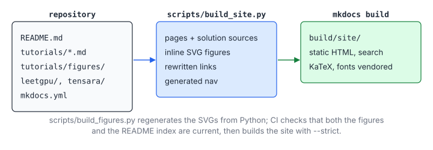

# 08 – Deploying This Site

> **Part IV · Publishing** · Prerequisites: none (Python, Git) ·
> Back to: [Tutorials index](README.md)

This repository renders to a static website. It contains:
- every tutorial;
- every LeetGPU and Tensara problem page, with the write-up and the complete
  solution source;
- the example code.

It can also be exported as offline formats: a zipped HTML site, EPUB, a
single Markdown file, and a PDF if you have LaTeX. This chapter explains how
the pipeline works and gives four ways to publish the site.

**You will learn**

- how `scripts/build_site.py` turns the repository into MkDocs sources
  (pages, navigation, figures, links), and what it deliberately leaves out;
- how to build and preview the site locally;
- four ways to publish it: GitHub Pages via Actions, `mkdocs gh-deploy`, any
  static host, and offline formats (HTML zip, EPUB, PDF);
- what CI checks before anything is published;
- how to add problems, chapters and figures, and how math and code are
  rendered.

## 1. How the Site Is Built

```
repository                       scripts/build_site.py              mkdocs build
───────────────────────────      ─────────────────────────────      ─────────────────
README.md                  ──►   build/site-src/index.md      ──►   build/site/index.html
tutorials/*.md, amd/*.hip  ──►   tutorials/*.md, *-hip.md     ──►   …/tutorials/…
leetgpu/NNN/README.md      ─┐
leetgpu/NNN/solution.cu    ─┴►   leetgpu/NNN/index.md         ──►   leetgpu/NNN/index.html
                                 (+ solution.cu, downloadable)
mkdocs.yml (theme, etc.)   ──►   build/mkdocs.yml (INHERIT + generated nav)
```



`scripts/build_site.py` does seven things:

1. **Tutorial pages.** Every Markdown file under `tutorials/` becomes a page.
   Every code file there (`.hip`, `.h`, …) also gets a rendered page with a
   download link.
2. **Problem pages.** Every problem folder becomes one page:
   - the README's front matter is removed;
   - the write-up follows;
   - then `## Solution: solution.cu` with the full source (line numbers and a
     copy button), a download link and a "view on GitHub" link.
3. **Index pages.** It builds `leetgpu/index.md` and `tensara/index.md`, with
   problem tables grouped by difficulty.
4. **Links.** It rewrites relative links so that they work on the site:
   - a link to a problem folder goes to its page;
   - a link to a `README.md` goes to the `index.md` it became;
   - a link to a source file publishes that file verbatim.

   With `--strict`, any broken link fails the build.
5. **Navigation.** It generates `build/mkdocs.yml`. That file inherits the
   theme and Markdown extensions from the root `mkdocs.yml` and adds the full
   navigation tree.

6. **Static assets.** It copies `site_assets/` to `assets/` in the site:
   the stylesheet, the favicon, the KaTeX loader and the vendored KaTeX and
   font files (section 9).
7. **Figures.** A tutorial line that holds nothing but a Markdown image of
   an SVG from `tutorials/figures/` is replaced by the SVG itself, inside a
   `<figure>` with the caption. Inlined, the figure's colours come from the
   `--fig-*` CSS properties in `extra.css`, so it follows the light/dark
   toggle; on GitHub the same line renders as an ordinary image with the
   light colours.

The theme is [Material for MkDocs](https://squidfunk.github.io/mkdocs-material/).
It is pinned in `requirements-docs.txt` below MkDocs 2.0, which removes the
plugin system Material depends on.

### 1.1 What Is *Not* Published

- **Problem statements.** LeetGPU's challenge texts are CC BY-NC-ND, and
  Tensara's problem repository has no license, so this repository never
  copies them.
  - Each page links to the official statement.
  - The pages contain only my own summaries and code.
  - Keep it that way when you deploy: `scripts/fetch_upstream.sh` clones the
    upstream definitions into `.upstream/`, which is git-ignored and never
    read by the site builder.
- **AITER / hipBLASLt sources.** They are MIT licensed, but chapters 06–07
  only quote short excerpts and link to the upstream repositories.

## 2. Build and Preview Locally

```bash
python3 -m venv .venv && . .venv/bin/activate
pip install -r requirements-docs.txt

python3 scripts/build_site.py --strict        # -> build/site-src/, build/mkdocs.yml
mkdocs serve -f build/mkdocs.yml              # http://127.0.0.1:8000, live reload
mkdocs build --strict -f build/mkdocs.yml     # -> build/site/ (plain static files)
```

`make serve` and `make site` wrap the same commands.

`mkdocs serve` watches `build/site-src/`, not the repository. After editing
a tutorial or a solution, run `scripts/build_site.py` again and the preview
reloads.

`build/site/` is completely static: HTML, CSS, JS, a client-side search index
and the solution files. Any web server can host it, and you can open it
straight from disk.

## 3. Option A – GitHub Pages (Automatic, Recommended)

`.github/workflows/pages.yml` builds and deploys on every push to `main`.

1. On GitHub, go to **Settings → Pages → Build and deployment** and set
   **Source** to **GitHub Actions**.
   - Pages on a *private* repository needs a paid plan (Pro, Team or
     Enterprise). On the free plan, make the repository public first.
2. Push to `main`, or run the workflow by hand from **Actions → Deploy site →
   Run workflow**.
3. The workflow's `deploy` job prints the URL, for example
   `https://<user>.github.io/gpu-programming-notes/`.

The workflow runs these steps:

```yaml
- uses: actions/configure-pages@v5          # gives the public base URL
- run: python3 scripts/build_site.py --strict --bundle --site-url "<base_url>/" ...
- run: mkdocs build --strict -f build/mkdocs.yml
- run: pandoc ... -o build/site/downloads/gpu-programming-notes.epub   # offline formats
- uses: actions/upload-pages-artifact@v3    # path: build/site
- uses: actions/deploy-pages@v4
```

To use a **custom domain**:
1. Add it under **Settings → Pages**.
2. Create the DNS record: a `CNAME` pointing to `<user>.github.io`.

`configure-pages` then reports the new base URL, and the sitemap and
canonical links follow it automatically.

## 4. Option B – `mkdocs gh-deploy` (Manual, No Actions)

```bash
python3 scripts/build_site.py --strict --site-url https://<user>.github.io/gpu-programming-notes/
mkdocs gh-deploy -f build/mkdocs.yml --force
```

This builds the site and force-pushes it to a `gh-pages` branch. Then set
**Settings → Pages → Source** to *Deploy from a branch*, choose `gh-pages`
and `/ (root)`.

Do not use this together with Option A, because they fight over the Pages
source.

## 5. Option C – Any Static Host

Upload the `build/site/` folder:

| Host | How |
|------|-----|
| Netlify | Build command `pip install -r requirements-docs.txt && python3 scripts/build_site.py --strict && mkdocs build -f build/mkdocs.yml`; publish directory `build/site` |
| Cloudflare Pages | Same build command and output directory; set `PYTHON_VERSION=3.12` |
| Vercel | Same, with "Other" framework preset |
| Your own server | `rsync -av --delete build/site/ user@host:/var/www/gpu-notes/`, then serve with nginx/caddy |
| Anywhere, quickly | `python3 -m http.server -d build/site 8000` |

If the site lives under a sub-path (`https://host/notes/`), pass
`--site-url https://host/notes/`. MkDocs uses relative URLs, so the pages
work either way; `site_url` only affects the sitemap and canonical links.

## 6. Option D – Offline Formats

| Format | Command | Notes |
|--------|---------|-------|
| Zipped HTML | `cd build && zip -r gpu-notes-html.zip site` | Unzip, open `site/index.html`. Search works offline too |
| Single Markdown | `python3 scripts/build_site.py --bundle` → `build/gpu-programming-notes.md` | All tutorials and problems, in navigation order. Inter-page links become plain text |
| EPUB | `pandoc build/gpu-programming-notes.md --resource-path=build/site-src --toc -o gpu-notes.epub` | No LaTeX needed; good on e-readers and tablets |
| PDF | `pandoc build/gpu-programming-notes.md --resource-path=build/site-src --toc --pdf-engine=xelatex -V geometry:margin=2cm -V mainfont="DejaVu Serif" -V monofont="DejaVu Sans Mono" -o gpu-notes.pdf` | Needs a TeX distribution (`texlive-xetex`). Long code lines wrap poorly; landscape (`-V geometry:landscape`) helps |
| Print single pages | Browser **Print → Save as PDF** on any page | Material's print stylesheet hides navigation |

The Pages workflow publishes the zipped HTML, the single Markdown file and
the EPUB under `downloads/` on the deployed site.

## 7. Keeping the Site Honest: CI

`.github/workflows/ci.yml` runs on every push, and a red CI means the site
would publish something broken or wrong:

| Job | What it guarantees |
|-----|--------------------|
| `nvcc compile check` | Every `solution.cu` and every GEMM tutorial program compiles with the real CUDA toolkit |
| `cuemu tests (leetgpu / tensara)` | Every solution produces correct results against the platforms' reference implementations, on the CPU emulator (see [tools/cuemu](../tools/cuemu/README.md)) |
| `GEMM tutorial programs (cuemu)` | Every program in `tutorials/gemm/` passes its `--test` shapes on the CPU emulator |
| `AMD tutorial code` | `tutorials/amd/mfma_gemm.hip` compiles for gfx942 with `-Werror` |
| `README index and site build` | The README tables and the figures are current, and the site builds with no broken links |

## 8. Adding Content Later

```bash
scripts/fetch_upstream.sh && python3 scripts/sync_problems.py   # scaffold new upstream problems
# ...solve, write the README (status: solved)...
python3 tools/cuemu/run_tests.py leetgpu/NNN-new-problem        # test on CPU
python3 scripts/build_index.py                                  # refresh README tables
git commit -am "LeetGPU NNN: …" && git push                     # CI tests, Pages redeploys
```

A new tutorial chapter only needs a Markdown file in `tutorials/` and a row
in `tutorials/README.md`. The navigation is generated.

Figures are not drawn by hand: each one is a Python function in
`scripts/figures/<chapter>.py` that uses the small SVG helper in
`scripts/figures/svg.py`. Run `python3 scripts/build_figures.py` (or
`make figures`) after editing one and commit the regenerated SVGs; CI fails
if they are stale. `scripts/check_figures.py` renders every figure in
headless Chromium and fails when a label overlaps another label, sticks out
of the figure, is crossed by a line or a box border, or is smaller than
11 px; `make figures` runs it too. A label that has to sit on a grid or a
line can be given an opaque background with `plate=True`. Pages in a sub-directory of `tutorials/` (such as
`gemm/`) appear in the navigation after the chapter named in
`TUTORIAL_SECTIONS` in `scripts/build_site.py`.

## 9. How Math and Code Are Rendered

Every problem page and tutorial writes formulas in TeX and follows each
display formula with a table that explains every symbol. The pieces:

| Piece | Where | What it does |
|---|---|---|
| `pymdownx.arithmatex` (generic mode) | `mkdocs.yml` | Leaves `$...$` and `$$...$$` untouched in the HTML, wrapped in `<span class="arithmatex">` / `<div class="arithmatex">` |
| KaTeX 0.16 | `site_assets/vendor/katex/` | Renders those spans in the browser; its fonts are included |
| `site_assets/javascripts/katex.js` | Loader | Calls `renderMathInElement` on every page load, including Material's instant navigation (`document$.subscribe`), and defines the macros `\ceil`, `\floor`, `\R` |
| Ubuntu Mono, Inter | `site_assets/vendor/fonts/`, `stylesheets/fonts.css` | Self-hosted fonts; `theme.font: false` stops Material from loading Google Fonts |
| `stylesheets/extra.css` | Theme | Colours, the problem header, formula blocks, tables, code in Ubuntu Mono |

Nothing is fetched from a CDN, so the site (and the zipped HTML) works
offline and behind firewalls. The vendored files add about 0.8 MB.

A page that follows the house style looks like this:

````markdown
## Formulation

$$
\text{out}_i = \frac{x_i}{\sqrt{\frac{1}{N}\sum_{j=0}^{N-1} x_j^2 + \epsilon}}
$$

| Symbol | Meaning |
|---|---|
| $x_i$ | input element |
| $N$ | row length |
| $\epsilon$ | small constant for numerical stability |
````

which renders as:

$$
\text{out}_i = \frac{x_i}{\sqrt{\frac{1}{N}\sum_{j=0}^{N-1} x_j^2 + \epsilon}}
$$

| Symbol | Meaning |
|---|---|
| $x_i$ | Input element |
| $N$ | Row length |
| $\epsilon$ | Small constant for numerical stability |

Rules that keep KaTeX and Markdown from tripping over each other:

- Leave a blank line before and after a `$$` block.
- Never start a line inside a display formula with `+ `, `- ` or `1. `:
  Markdown reads it as a list item and breaks the block. Put the operator
  at the end of the previous line instead.
- Inside a table cell, never write a bare `|` in math (it ends the cell).
  Use `\lvert x \rvert`, `\mid` or `\Vert`.
- Do not put display math inside indented list items; close the list first.
- Check with a browser: `python3 -m http.server -d build/site` and look for
  red KaTeX error text, or count `.katex-error` elements with Playwright.

## Key Takeaways

1. The site is generated: edit the repository (READMEs, tutorials,
   `scripts/figures/`), never `build/`.
2. `scripts/build_site.py --strict` and `mkdocs build --strict` fail on broken
   links and anchors; CI also checks the README index, the figures and their
   legibility.
3. GitHub Pages via the included workflow is the zero-maintenance option;
   the same `build/site/` directory can be served by any static host or
   zipped for offline use.
4. Problem statements from the platforms are never copied; only summaries,
   solutions and links are published.
