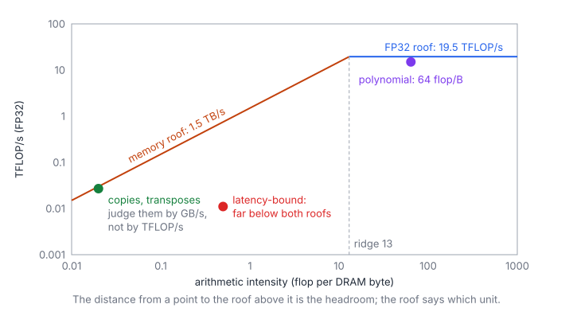
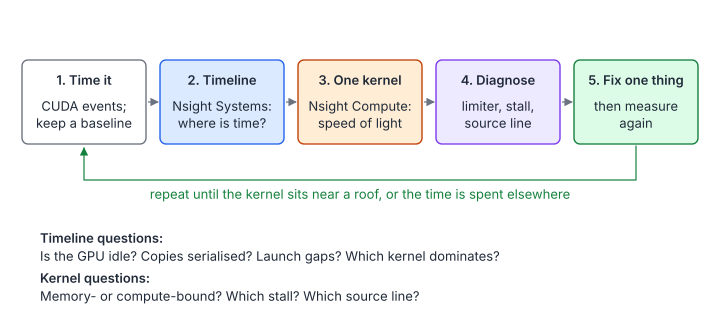
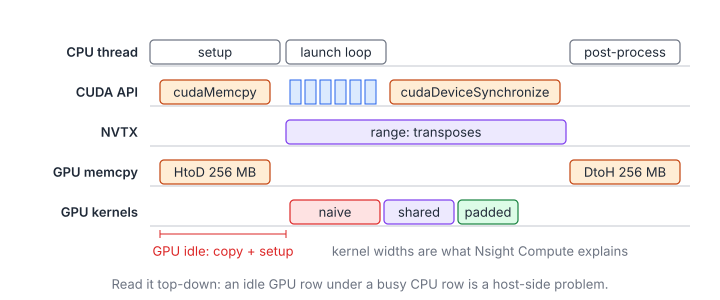
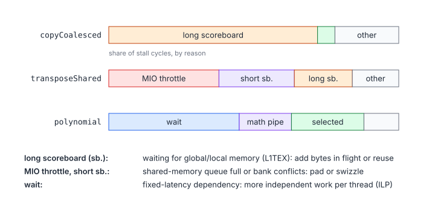

# 09 – Profiling and Performance Analysis

> **Part I · CUDA Foundations** · Prerequisites: [00](00-getting-started.md) (roofline),
> [01](01-execution-model.md), [02](02-memory-hierarchy.md) ·
> Program: [`examples/09-profile-targets.cu`](examples/09-profile-targets.cu) ·
> Next: [10 – Warp-Level Primitives](10-warp-primitives.md) (Part II)

Chapters 00–03 predicted how fast a kernel *should* be. This chapter is
about finding out why it *is not*. A profiler turns a single number (the
kernel time) into an explanation: which unit is saturated, which one is
idle, what the warps are waiting for, and which source line makes them
wait. The skill is less about the tools than about asking them the right
question in the right order.

**You will learn**

- how to time GPU code correctly, and what to compare the time with;
- the profiling loop: whole program first (Nsight Systems), then one
  kernel (Nsight Compute), then one change at a time;
- how to read the speed-of-light, memory, occupancy and warp-state
  sections, and the metric names behind them;
- how the stall reasons map to fixes;
- four small kernel pairs whose profiles differ in exactly one metric;
- the correctness tools (`compute-sanitizer`) and the AMD equivalents
  (`rocprofv3`, `rocprof-compute`).

## 1. Measure Before You Profile

### 1.1 Timing GPU Work

Kernel launches are asynchronous: `kernel<<<...>>>()` returns as soon as
the launch is queued. A host timer around the launch measures the launch
overhead, not the kernel. Time on the GPU's own stream with events, after
a warm-up call (the first launch also pays for module loading and caches):

```cpp
cudaEventRecord(start_event);
for (int r = 0; r < reps; ++r) kernel<<<grid, block>>>(args...);
cudaEventRecord(stop_event);
cudaEventSynchronize(stop_event);
cudaEventElapsedTime(&ms, start_event, stop_event);   // total for `reps` launches
```

This is `ex::timeMs` in [`examples/check.cuh`](examples/check.cuh), used by
every example program's `--bench` mode. Three rules keep the numbers
honest:

1. **Repeat and warm up.** A single launch of a short kernel is dominated
   by noise; average over tens of launches after one warm-up.
2. **Beware of caches.** Back-to-back launches on a 16 MB input find it in
   L2 (40–50 MB on A100/H100); a benchmark that should measure DRAM must
   use inputs several times larger than L2.
3. **Fix the clocks or report them.** GPUs boost and throttle with
   temperature and power. Nsight Compute locks clocks to base by default
   (`--clock-control base`), which is why its durations are often longer
   than your benchmark's.

### 1.2 What to Compare With

A time means nothing without a bound. For a memory-bound kernel convert it
into an effective bandwidth; for a compute-bound one into FLOP/s:

$$
\beta_{\text{eff}} = \frac{Q}{t}, \qquad F_{\text{eff}} = \frac{W}{t}, \qquad
\eta = \frac{T_{\min}}{t} = \frac{\max(W/F,\ Q/\beta)}{t}
$$

| Symbol | Meaning |
|---|---|
| $Q$ | Compulsory bytes moved to and from DRAM (each input read once, each output written once) |
| $W$ | Floating-point operations (an FMA counts as 2) |
| $t$ | Measured kernel time |
| $\beta,\ F$ | Peak DRAM bandwidth and peak compute throughput (chapter 00, section 7) |
| $T_{\min}$ | The roofline bound on the time |
| $\eta$ | Fraction of the roofline bound achieved |

When $\eta$ is above ~80 %, stop: the profiler can only tell you that the
roof has been reached. Below that, the profiler tells you why not.



### 1.3 The Example Program

[`examples/09-profile-targets.cu`](examples/09-profile-targets.cu) contains
four groups of kernels. Within a group the kernels do the same work and
differ in one property, so exactly one family of metrics explains the
difference:

| Group | Kernels | The property | Where to look |
|---|---|---|---|
| Coalescing | `copyCoalesced`, `copyStrided` | Addresses of a warp's loads | Sectors per request, DRAM bytes |
| Transpose | `transposeNaive`, `transposeShared`, `transposePadded` | Store pattern; shared-memory banks | Sectors per request, bank conflicts, MIO stalls |
| Divergence | `scaleDivergent`, `scaleUniform` | Whether a branch splits warps | Active threads per instruction |
| Compute | `polynomial` | 256 dependent FMAs per element | FMA pipe utilisation, "wait" stalls, occupancy |

`./profile_targets` runs the correctness checks (this is what CI does on
the CPU emulator); `./profile_targets --bench` then times every kernel on
256 MB arrays, which is the run to profile.

## 2. The Toolbox

| Tool | Question it answers | Typical command |
|---|---|---|
| Nsight Systems (`nsys`) | Where does the program's time go? CPU, API calls, copies, kernels, gaps | `nsys profile --trace=cuda,nvtx ./app` |
| Nsight Compute (`ncu`) | Why is this one kernel as slow as it is? | `ncu --set full -k regex:name -o report ./app` |
| NVTX | Names regions of your program on the timeline | `nvtxRangePushA("name")` / `nvtxRangePop()` |
| `compute-sanitizer` | Is the kernel correct? Out-of-bounds, races, uninitialised reads | `compute-sanitizer --tool racecheck ./app` |
| `rocprofv3` (AMD) | Traces and counters on ROCm | `rocprofv3 --kernel-trace --stats -- ./app` |
| `rocprof-compute` (AMD) | Per-kernel analysis and roofline on Instinct GPUs | `rocprof-compute profile -n run -- ./app` |

Two build flags matter:

- **`-lineinfo`** records the source line of every instruction, so Nsight
  Compute can attribute stalls to lines of your `.cu` file. It does not
  change the generated code (unlike `-G`, which disables optimisation and
  must never be used for performance work).
- **`-DUSE_NVTX`** in the example program turns on the NVTX ranges (NVTX 3
  is header-only and ships with the toolkit).

## 3. The Profiling Loop



Profiling top-down avoids the most common waste of time: optimising a
kernel that takes 5 % of the run while the GPU sits idle waiting for the
host. The loop has five steps:

1. **Time it.** Record the end-to-end time and the time of each kernel;
   this is the baseline every change is compared with.
2. **Timeline.** Nsight Systems shows whether the GPU is busy at all and
   which kernels dominate.
3. **One kernel.** Nsight Compute on the dominant kernel: how close is it
   to a roof, and which one?
4. **Diagnose.** Follow the limiter down: memory or compute, then the stall
   reason, then the source line.
5. **Change one thing** and measure again. Two changes at once make it
   impossible to tell which one helped (or which one hurt).

## 4. Nsight Systems: the Whole Program

### 4.1 Reading a Timeline

```bash
nsys profile --trace=cuda,nvtx -o timeline ./profile_targets --bench
nsys stats --report cuda_gpu_kern_sum,cuda_gpu_mem_time_sum timeline.nsys-rep
```

The first command records a report you open in the Nsight Systems GUI;
the second prints per-kernel and per-copy summaries in the terminal (total
time, instances, average, min and max), which is often all you need.



Read it top-down:

| Pattern on the timeline | Meaning | Usual fix |
|---|---|---|
| Gaps in the GPU rows while the CPU is busy | The host is the bottleneck | Move the work to the GPU, or overlap it with streams |
| Many short kernels with gaps between them | Launch overhead (a few µs per launch) dominates | Fuse kernels; CUDA Graphs |
| `cudaMemcpy` from pageable memory | Staging through a bounce buffer, no overlap | Pinned memory (`cudaMallocHost`) and `cudaMemcpyAsync` |
| Copies and kernels never overlap | Everything is on one stream | Split into chunks on several streams |
| Long `cudaDeviceSynchronize` or `cudaMalloc` | Synchronisation or allocation in the loop | Allocate once; synchronise only where results are needed |
| One kernel covers most of the GPU row | The kernel is the bottleneck | Go to Nsight Compute |

### 4.2 NVTX Ranges

NVTX ranges put your program's own phases on the timeline, so that "the
third kernel after the second copy" becomes "the `transposes` range". The
example program wraps them in an RAII type that compiles to nothing
without `-DUSE_NVTX`:

```cpp
struct NvtxRange {
    explicit NvtxRange(const char* name) { nvtxRangePushA(name); }
    ~NvtxRange() { nvtxRangePop(); }
};

{
    NvtxRange range("transposes");
    // ... launches ...
}
```

`nsys profile --capture-range=nvtx --nvtx-capture=transposes` records only
that range, which keeps reports of long runs small.

## 5. Nsight Compute: One Kernel

### 5.1 Collecting a Report

```bash
ncu --set full -k regex:transpose -c 3 -o transpose ./profile_targets --bench
ncu --import transpose.ncu-rep --page details     # or open it in the GUI
```

| Option | Effect |
|---|---|
| `-k regex:NAME` | Profile only kernels whose name matches |
| `-c N`, `--launch-skip N` | Profile at most N launches, after skipping N |
| `--set full` | Collect every section (slow: dozens of replays per kernel) |
| `--section NAME` | Collect only some sections, e.g. `SpeedOfLight` |
| `--metrics a,b,c` | Collect exactly these metrics |
| `--replay-mode application` | Re-run the whole program per pass instead of saving and restoring memory per kernel |
| `--clock-control none` | Do not lock clocks (durations then match your benchmark better) |

Nsight Compute **replays** each kernel many times, because the hardware
can count only a few metrics per pass. It saves and restores the memory
the kernel writes between passes, so the results are consistent, but a
profiled run takes seconds to minutes per kernel. Profile a few launches,
not the whole benchmark.

### 5.2 The Sections

| Section | What it shows |
|---|---|
| GPU Speed Of Light | Achieved compute and memory throughput as % of peak; the one-line verdict |
| Memory Workload Analysis | Traffic at every level (L1, L2, DRAM), hit rates, sectors per request, bank conflicts |
| Compute Workload Analysis | Utilisation of each pipe (FMA, ALU, tensor, LSU …) |
| Launch Statistics | Grid and block size, registers per thread, shared memory per block, waves |
| Occupancy | Theoretical and achieved occupancy, and what limits it |
| Scheduler Statistics | Eligible and issued warps per cycle per scheduler |
| Warp State Statistics | Average cycles a warp spends in each stall reason per instruction issued |
| Source Counters | Per-line and per-instruction samples, branch efficiency, uncoalesced accesses |

### 5.3 Speed of Light: the First Verdict

The Speed Of Light section reports two numbers: **SM throughput** (the
busiest compute unit, as % of its peak) and **memory throughput** (the
busiest memory unit: DRAM, L2 or L1). They classify the kernel:

| SM % | Memory % | Verdict | Next step |
|---|---|---|---|
| Low | High (> 60 %) | Memory-bound | Memory Workload Analysis: are the bytes necessary? |
| High | Low | Compute-bound | Compute Workload Analysis: which pipe, and is it the right one? |
| High | High | Well balanced | Only algorithmic changes help |
| Low | Low | Latency-bound | Occupancy, then Warp State: why are warps not issuing? |

"Memory throughput" names the busiest *unit*, not necessarily DRAM: a
kernel at 90 % L1 throughput and 20 % DRAM throughput is bound by shared
memory or L1, which is the typical situation of a badly tiled GEMM.

### 5.4 Metric Names

Every number in a section is a metric with a structured name,
`unit__counter.rollup.submetric`. Knowing a handful lets you collect
exactly what you need with `--metrics`:

| Metric | Meaning |
|---|---|
| `gpu__time_duration.sum` | Kernel duration |
| `dram__bytes_read.sum`, `dram__bytes_write.sum` | DRAM traffic, to compare with $Q$ |
| `dram__throughput.avg.pct_of_peak_sustained_elapsed` | DRAM bandwidth as % of peak |
| `sm__throughput.avg.pct_of_peak_sustained_elapsed` | SM throughput as % of peak |
| `l1tex__t_sectors_pipe_lsu_mem_global_op_ld.sum` | 32-byte sectors requested by global loads |
| `l1tex__t_requests_pipe_lsu_mem_global_op_ld.sum` | Global load requests (one per warp instruction) |
| `l1tex__data_bank_conflicts_pipe_lsu_mem_shared_op_ld.sum` | Extra shared-memory wavefronts caused by bank conflicts (loads; `op_st` for stores) |
| `sm__warps_active.avg.pct_of_peak_sustained_active` | Achieved occupancy |
| `smsp__thread_inst_executed_per_inst_executed.ratio` | Average active threads per executed instruction (32 = no divergence) |
| `sm__pipe_fma_cycles_active.avg.pct_of_peak_sustained_active` | FMA pipe utilisation |

The rollups are `.sum`, `.avg`, `.min`, `.max` over units (SMs, memory
partitions); the submetrics such as `.pct_of_peak_sustained_elapsed`
normalise by the peak. Names vary slightly between architectures;
`ncu --query-metrics` lists the ones your GPU supports.

Two derived ratios are worth computing by hand:

$$
\text{sectors per request} = \frac{N_{\text{sectors}}}{N_{\text{requests}}},
\qquad
\text{traffic ratio} = \frac{Q_{\text{read}} + Q_{\text{write}}}{Q}
$$

| Symbol | Meaning |
|---|---|
| $N_{\text{sectors}},\ N_{\text{requests}}$ | The two `l1tex__t_…_op_ld.sum` metrics above |
| $Q_{\text{read}},\ Q_{\text{write}}$ | `dram__bytes_read.sum` and `dram__bytes_write.sum` |
| Sectors per request | 4 for a warp reading 32 consecutive floats (128 B); up to 32 when every lane hits a different sector |
| Traffic ratio | 1 means only compulsory traffic; above 1, bytes are fetched more than once (poor coalescing or cache reuse) |

### 5.5 Warp State: Why Warps Wait

When the scheduler has no eligible warp in a cycle, that cycle is lost.
The Warp State section attributes every warp's cycles to a **stall
reason**. The reason with the largest share is the one to attack.



| Stall reason | The warp is waiting for | Typical fix |
|---|---|---|
| Long scoreboard | A global, local or texture load (L1TEX) | More bytes in flight (vector loads, more warps, ILP); better reuse; check for register spills (local memory) |
| Short scoreboard | A shared-memory load or a special function (MUFU: `exp`, `rsqrt`) | Remove bank conflicts; fewer MUFU operations |
| MIO throttle | The memory-input/output queue is full (shared memory, shuffles, special functions) | Fewer, wider shared-memory accesses; remove conflicts |
| LG throttle | The local/global queue is full | Wider loads (`float4`), fewer instructions per byte |
| Wait | A fixed-latency dependency (e.g. an FMA result, ~4 cycles) | More independent instructions per thread (ILP) or more warps |
| Math pipe throttle | The pipe it needs is busy | Nothing (the pipe is saturated), or use another pipe (tensor cores) |
| Barrier | Other warps of the block at `__syncthreads()` | Balance work between warps; fewer barriers |
| Membar | A memory fence | Fewer fences; narrower scope |
| Branch resolving | A branch target | Fewer or more uniform branches |
| Not selected | Nothing: it was eligible but another warp issued | None needed (a sign of plenty of parallelism) |
| Selected | Nothing: it issued this cycle | None needed |

A stall reason is a symptom, not a cause. "Long scoreboard" in a kernel
at 90 % DRAM throughput is simply what a memory-bound kernel looks like;
in a kernel at 30 % it means too few bytes in flight, which Little's law
(chapter 01, section 5.2) quantifies.

### 5.6 Occupancy and Waves

Occupancy is the number of warps resident on an SM, divided by the
maximum (64 on A100 and H100). The Occupancy section reports the
*theoretical* value (limited by registers, shared memory and block size)
and the *achieved* one (what the SM actually held, averaged over time).

$$
\text{warps per SM} = \min\left(
\left\lfloor \frac{R_{\text{SM}}}{r \cdot 32} \right\rfloor,\
\left\lfloor \frac{S_{\text{SM}}}{s} \right\rfloor \cdot w,\
b_{\max} \cdot w,\ 64 \right), \qquad
\text{waves} = \frac{\text{blocks}}{N_{\text{SM}} \cdot \text{blocks per SM}}
$$

| Symbol | Meaning |
|---|---|
| $R_{\text{SM}}$ | Registers per SM (65 536) |
| $r$ | Registers per thread (from `ptxas -v` or Launch Statistics); allocated in units of 8 per thread, per warp |
| $S_{\text{SM}},\ s$ | Shared memory per SM and per block |
| $w$ | Warps per block |
| $b_{\max}$ | Maximum resident blocks per SM (32 on recent GPUs) |
| $N_{\text{SM}}$ | Number of SMs (108 on A100, 132 on H100 SXM) |

The register term is a simplification: registers are allocated per warp
in chunks, so round $r$ up to a multiple of 8 first. The runtime computes
the exact value with `cudaOccupancyMaxActiveBlocksPerMultiprocessor`.

High occupancy is a means, not a goal. It hides latency by having other
warps to switch to; a kernel with enough ILP (such as the register tiles in
Matrix Multiplication 1) runs at full speed with 25 % occupancy. Two
occupancy problems do matter:

- **Achieved far below theoretical** means the SMs are starved: too few
  blocks (a grid smaller than one wave), or blocks that finish at very
  different times.
- **The tail effect.** A grid of 1.1 waves runs the last 0.1 wave on a
  nearly empty GPU. When the kernel is long, choose the grid so the number
  of waves is close to an integer, or use a persistent grid (see Matrix
  Multiplication 7).

### 5.7 Source Counters

With `-lineinfo`, the Source page shows the CUDA source side by side with
the SASS, and per line: instructions executed, stall samples by reason,
sectors per request of each memory instruction, and the divergence of each
branch. It answers the last question in the loop, *which line*. Two
checks are always worth making there:

- search the SASS for `LDL`/`STL` (local memory): register spills, or an
  array indexed with a run-time index that the compiler could not keep in
  registers;
- check that the loads you expect to be wide are `LDG.E.128` (float4) and
  that shared loads in a hot loop are not doubled by bank conflicts.

## 6. Case Studies

The four groups of the example program, with the metrics that tell their
kernels apart. The ratios follow from the access patterns; exact times
depend on the GPU.

### 6.1 Coalescing

`copyCoalesced` reads 32 consecutive floats per warp: **4 sectors per
request**, and the DRAM traffic equals $Q$. `copyStrided` reads element
$33i \bmod n$: each lane of a warp hits a different sector, so a request
needs **32 sectors** and uses 4 of the 32 bytes of each. The other 28 bytes
are needed by other warps much later, after the 256 MB input has pushed
them out of L2, so the DRAM read traffic grows by up to 8×.

What to look for: sectors per request 4 vs ~32; `dram__bytes_read.sum`
about 268 MB vs up to ~2 GB; memory throughput high in both (the strided
copy is *busy*, just with useless bytes). Chapter 02, section 2 explains
the sector mechanics.

### 6.2 Transpose

`transposeNaive` reads rows (coalesced) and writes columns: the **store**
requests need 32 sectors each. `transposeShared` stages a 32 × 32 tile in
shared memory, so both global accesses are coalesced; but reading a column
of the tile, `tile[threadIdx.x][c]`, makes all 32 lanes hit the same bank:
a **32-way bank conflict**. `transposePadded` adds one column of padding,
which shifts each row by one bank and removes the conflicts.

| Kernel | Global store sectors per request | Shared load bank conflicts | Dominant stall |
|---|---|---|---|
| `transposeNaive` | ~32 | None (no shared memory) | Long scoreboard / LG throttle |
| `transposeShared` | 4 | 31 extra wavefronts per load instruction | MIO throttle, short scoreboard |
| `transposePadded` | 4 | 0 | Long scoreboard (as a copy should) |

The padded version should reach roughly the bandwidth of `copyCoalesced`;
that comparison, not the naive version, is the right yardstick. Chapter
02, sections 4 and 5, and Matrix Multiplication 6 (swizzling) cover the
banks in depth.

### 6.3 Divergence

`scaleDivergent` sends even and odd lanes down different 32-iteration
loops. A warp executes both paths one after the other with half its lanes
masked off, so it issues twice the instructions for the same results.
`scaleUniform` branches on the warp index instead: every warp takes one
path with all lanes active.

What to look for: `smsp__thread_inst_executed_per_inst_executed.ratio` is
~16 vs ~32, and the executed instruction count roughly doubles. Whether
the *time* doubles depends on whether the kernel is issue-bound: with 64
flops per element and 8 bytes of traffic, the uniform version sits at
8 flop/B, below the A100 ridge point, so part of the divergence cost hides
behind memory time. Divergence matters when it is inside the hot loop of a
compute-bound kernel.

### 6.4 A Compute-Bound Kernel

`polynomial` evaluates a degree-256 polynomial with Horner's rule: 256
FMAs (512 flops) per element for 8 bytes of traffic, 64 flop/B, far right
of the ridge point. Its SM throughput should be high and its memory
throughput low.

Each FMA depends on the previous one, so a single warp stalls ~4 cycles
("wait") per instruction. The kernel still reaches most of the FMA peak
because each scheduler has many warps to interleave: with 4 schedulers and
a 4-cycle latency, 4 eligible warps per scheduler keep the pipe full.
Halve the occupancy by forcing a large shared-memory allocation and the
FMA utilisation drops; give each thread two independent elements (ILP) and
it recovers. That is Little's law again, applied to the FMA pipe instead
of DRAM.

## 7. Correctness Tools

A kernel that is fast and wrong is not a result. `compute-sanitizer`
catches the errors the checks might miss:

| Tool | Finds |
|---|---|
| `--tool memcheck` (default) | Out-of-bounds and misaligned accesses, invalid frees |
| `--tool racecheck` | Shared-memory data races (e.g. a missing `__syncthreads()`) |
| `--tool initcheck` | Reads of uninitialised global memory |
| `--tool synccheck` | Invalid use of barriers and warp synchronisation (e.g. a wrong mask) |

Try it: delete the `__syncthreads()` in `transposeTiled` and run
`compute-sanitizer --tool racecheck ./profile_targets`. The checks may
still pass (the race depends on timing), but racecheck reports the
read-after-write hazard on `tile` with the two source lines involved.
Without a GPU, the CPU emulator makes the same bug deterministic: it runs
each thread up to the next barrier, so without the barrier threads read
tile entries that have not been written yet, and the transpose checks fail
(see [tools/cuemu](../tools/cuemu/README.md)).

## 8. Profiling on AMD GPUs

ROCm has the same two levels of tooling (chapter 05 covers the hardware):

| NVIDIA | AMD (ROCm) | Notes |
|---|---|---|
| `nsys` | `rocprofv3 --kernel-trace --memory-copy-trace`, `rocprof-sys` | Traces and timelines (Perfetto UI) |
| `ncu` | `rocprof-compute` (formerly Omniperf) | Speed of light, memory chart, roofline per kernel |
| `ncu --metrics` | `rocprofv3 --pmc SQ_WAVES FETCH_SIZE ...` | Raw hardware counters |
| NVTX | ROCTx (`roctxRangePush`) | Markers on the timeline |
| `compute-sanitizer` | AddressSanitizer for HIP (`-fsanitize=address`) | Memory errors |

Useful counters and derived metrics on CDNA: `FETCH_SIZE` and
`WRITE_SIZE` (KB moved to and from memory), `SQ_WAVES` (wavefronts
launched), VALU utilisation, and `SQ_LDS_BANK_CONFLICT` (LDS bank
conflicts, the analogue of shared-memory conflicts). `rocprofv3 --stats`
prints per-kernel totals like `nsys stats`.

## 9. A Checklist

1. Is the GPU busy? (timeline) If not, fix the host side first.
2. Which kernel dominates? Profile that one.
3. How far is it from its roofline bound ($\eta$)? Above ~80 %: stop.
4. Speed of light: memory-, compute- or latency-bound?
5. Memory-bound: is DRAM traffic close to $Q$? Are sectors per request 4
   (for 4-byte elements)? Any bank conflicts?
6. Compute-bound: is the busy pipe the right one (FMA or tensor, not ALU
   for index math or MUFU for divisions)?
7. Latency-bound: achieved occupancy, waves, and the dominant stall reason.
8. Find the line (Source page), change one thing, and go back to step 1.

## Key Takeaways

1. Time GPU work with events after a warm-up, and always convert the time
   into a fraction of the roofline bound.
2. Profile top-down: Nsight Systems for the program, Nsight Compute for one
   kernel, then the source line.
3. Speed of light gives the verdict: memory-, compute- or latency-bound;
   "memory" may mean L1 or shared memory, not DRAM.
4. Sectors per request, DRAM bytes vs $Q$, bank conflicts and active
   threads per instruction explain most memory and divergence problems.
5. The dominant stall reason points at the fix, but only in the context of
   the throughput numbers.
6. Occupancy is a means of hiding latency; ILP is the other one.
7. Run `compute-sanitizer` whenever a kernel uses shared memory or warp
   primitives.

## Exercises

1. A kernel reads and writes 1 GiB in total and takes 0.9 ms on an A100
   (1.55 TB/s). What is $\eta$? Is it worth profiling?

    <details markdown="1"><summary>Answer</summary>

    $Q = 2^{30}$ B, $T_{\min} = 2^{30} / 1.55\times10^{12} = 0.69$ ms, so
    $\eta = 0.69 / 0.9 \approx 77$ %. It is close to the practical ceiling
    (~90 % of datasheet bandwidth); a profile could find the last 10–15 %,
    for example from a partial last wave or a few uncoalesced accesses, but
    larger wins are more likely elsewhere.

    </details>

2. Nsight Compute reports 16 sectors per request for the loads of a kernel
   that reads `float` values with `in[threadIdx.x * 4]`. Explain the number.
   What would it be for `in[threadIdx.x * 8]`?

    <details markdown="1"><summary>Answer</summary>

    Lanes are 16 bytes apart, so a warp spans 512 bytes: 16 sectors of 32
    bytes, 4 useful bytes in each. With a stride of 8 floats (32 bytes)
    every lane hits its own sector: 32 sectors per request.

    </details>

3. A kernel uses 96 registers per thread and 256 threads per block with
   no shared memory. What is its theoretical occupancy on an A100? What
   happens at 128 registers?

    <details markdown="1"><summary>Answer</summary>

    A block needs $96 \times 256 = 24\,576$ registers, so
    $\lfloor 65\,536 / 24\,576 \rfloor = 2$ blocks fit: 16 warps of 64, 25 %.
    At 128 registers a block needs 32 768: still 2 blocks, 25 %. At 64
    registers it would be 4 blocks, 50 %.

    </details>

4. The dominant stall reason of a reduction kernel is "barrier". What does
   it mean, and what change from chapter 03 addresses it?

    <details markdown="1"><summary>Answer</summary>

    Warps spend their time waiting at `__syncthreads()` for the rest of the
    block, typically in the last steps of a shared-memory tree where only a
    few warps still work. Chapter 03's warp-shuffle version finishes the
    last 32 values inside one warp without barriers, and the two-level
    version needs a single barrier per block.

    </details>

5. Why does Nsight Compute sometimes report a longer kernel duration than
   your `--bench` run, and how can you make them agree?

    <details markdown="1"><summary>Answer</summary>

    It locks the clocks to the base frequency (`--clock-control base`) to
    make runs reproducible, while the benchmark runs at boost clocks. Use
    `--clock-control none` to compare, or compare ratios between kernels
    rather than absolute times. Cache flushing between replays
    (`--cache-control all`, the default) can also make short kernels slower
    than in a loop that finds its data in L2.

    </details>

6. Profile the example program on a GPU and fill in the table of section
   6.2 with your own numbers. Which kernel's bandwidth is closest to
   `copyCoalesced`?

## Practice

- [LeetGPU – Matrix Transpose](../leetgpu/003-matrix-transpose/) (the transpose of section 6.2)
- [LeetGPU – Matrix Copy](../leetgpu/031-matrix-copy/), [LeetGPU – Vector Addition](../leetgpu/001-vector-add/) (bandwidth-bound baselines)
- [LeetGPU – ReLU](../leetgpu/021-relu/) (compare with the roofline bound of chapter 00)
