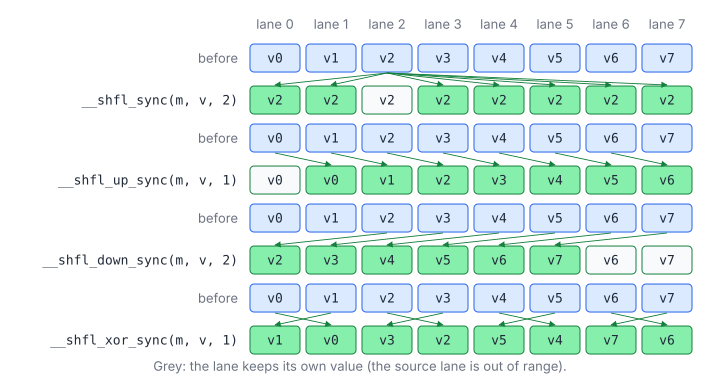
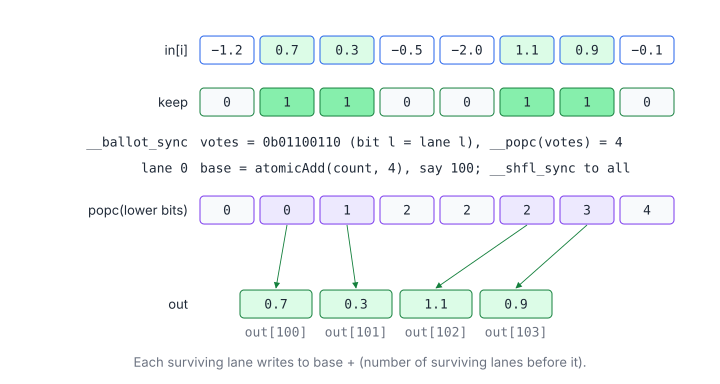
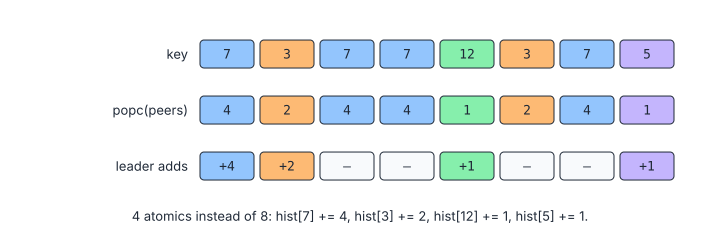
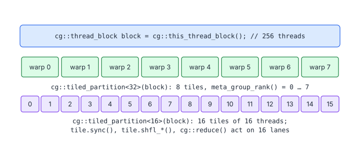

# 10 – Warp-Level Primitives and Cooperative Groups

> **Part II · Parallel Patterns** · Prerequisites: [01](01-execution-model.md), [03](03-parallel-reduction.md) ·
> Program: [`examples/10-warp-primitives.cu`](examples/10-warp-primitives.cu) ·
> Next: [11 – Scan](11-scan.md)

The 32 lanes of a warp can exchange registers directly, vote, and find
lanes with equal values, all in single instructions, without shared memory
and without `__syncthreads()`. These *warp-level primitives* are the
fastest communication a GPU offers, and they are the building blocks of
reductions, scans, compaction, histograms and sorting. Cooperative groups
wrap them (and more) in a typed, composable API.

**You will learn**

- the rules every `*_sync` primitive follows: masks, convergence and
  independent thread scheduling;
- the four shuffles, the votes (`__ballot_sync`, `__any_sync`,
  `__all_sync`), `__match_any_sync` and the `__reduce_*_sync` family;
- warp patterns: all-reduce and broadcast, stream compaction with
  warp-aggregated atomics, conflict-free histograms;
- cooperative groups: thread blocks, tiles of 1–32 threads, `cg::reduce`,
  `cg::inclusive_scan`, and the grid and cluster groups;
- how to test warp-level code without a GPU.

## 1. Why Warp-Level Programming

### 1.1 Communication Costs by Scope

| Scope | Mechanism | Cost of one exchange |
|---|---|---|
| Warp | Shuffle / vote | One instruction; no memory, no barrier |
| Block | Shared memory + `__syncthreads()` | A store, a barrier, a load; the barrier waits for the slowest warp |
| Grid | Global memory + atomics or a second kernel | Hundreds of cycles, or a kernel launch |

A block reduction written with shared memory needs $\log_2 B$ barriers
(chapter 03, section 2); with shuffles it needs one. The less a pattern
communicates beyond the warp, the faster it is.

### 1.2 What a Shuffle Moves

A shuffle moves one 32-bit register per lane. 64-bit values (`double`,
`long long`) take two shuffles, which the intrinsics do for you; structs
need one shuffle per 32-bit field (chapter 03 shuffles a `Moments` struct
field by field).

## 2. The Primitives

### 2.1 Masks and Convergence

Since Volta, the lanes of a warp can be at different instructions
(independent thread scheduling, chapter 01, section 1.4). Every warp-level
primitive therefore takes an explicit `mask` naming the lanes that take part:

1. Every lane named in the mask must execute the same `*_sync` call (the same
   instruction, not just the same function); the hardware waits for them.
2. A lane that is not in the mask must not call it with that mask.
3. `0xffffffff` names the whole warp. It is correct only when all 32 lanes
   are active: in a block whose size is a multiple of 32, and outside any
   branch that some lanes skip.

The common mistake is an early exit:

```cpp
if (i >= n) return;                                   // WRONG: the last warp may lose lanes
float v = __shfl_down_sync(0xffffffff, x, 1);         // ... which the full mask still names
```

Keep every lane alive, give out-of-range lanes the identity value, and
guard only the loads and stores (the program's `subtractWarpMax` does this).

### 2.2 Shuffles



| Intrinsic | Lane $\ell$ receives the value of lane | Typical use |
|---|---|---|
| `__shfl_sync(m, v, src)` | `src` | Broadcast, arbitrary permutation |
| `__shfl_up_sync(m, v, d)` | $\ell - d$ (own value if $\ell < d$) | Inclusive scan (chapter 11) |
| `__shfl_down_sync(m, v, d)` | $\ell + d$ (own value past the end) | Reduction into lane 0 |
| `__shfl_xor_sync(m, v, x)` | $\ell \oplus x$ | Butterfly all-reduce, transposes |

The optional last argument `width` (a power of two ≤ 32) splits the warp
into independent segments of `width` lanes: lane numbers and the "past the
end" rules then apply within each segment.

### 2.3 Votes

| Intrinsic | Returns (to every participating lane) |
|---|---|
| `__ballot_sync(m, p)` | A 32-bit mask with bit $\ell$ set if lane $\ell$'s predicate is true |
| `__any_sync(m, p)` | Non-zero if any lane's predicate is true |
| `__all_sync(m, p)` | Non-zero if every lane's predicate is true |
| `__activemask()` | The mask of lanes currently executing this instruction (not a synchronization) |

Combined with bit tricks, a ballot answers "how many lanes before me have
the property?" in two instructions:

$$
\text{rank}(\ell) = \operatorname{popc}\bigl(\text{votes} \mathbin{\&} (2^{\ell} - 1)\bigr), \qquad
\text{total} = \operatorname{popc}(\text{votes})
$$

| Symbol | Meaning |
|---|---|
| votes | The ballot mask |
| $2^{\ell} - 1$ | The "lanes below me" mask (`(1u << lane) - 1`) |
| popc | Population count, `__popc` |
| $\text{rank}(\ell)$ | How many lanes below $\ell$ voted true: lane $\ell$'s slot among the survivors |

### 2.4 Matching and Reducing

- `__match_any_sync(m, v)` returns, to each lane, the mask of lanes whose
  value equals its own (sm_70+). `__match_all_sync` tells whether all
  values are equal.
- `__reduce_add_sync`, `__reduce_min_sync`, `__reduce_max_sync`,
  `__reduce_and_sync`, `__reduce_or_sync`, `__reduce_xor_sync` reduce
  32-bit **integers** across the warp in one instruction (sm_80+). Floating
  point still needs the shuffle loop.
- `__syncwarp(m)` is a barrier for the lanes in `m` and orders their
  shared-memory accesses; use it when lanes of one warp communicate through
  shared memory.

## 3. Patterns

### 3.1 All-Reduce and Broadcast

```cpp
__device__ float warpAllReduceMax(float v) {
    for (int lane_mask = 16; lane_mask > 0; lane_mask >>= 1) v = fmaxf(v, __shfl_xor_sync(kFullMask, v, lane_mask));
    return v;
}
```

After the butterfly every lane holds the result, which saves the broadcast
(`__shfl_sync(m, v, 0)`) that a `__shfl_down_sync` reduction needs when all
lanes must use it, as in softmax (chapter 13).

### 3.2 Stream Compaction

Copy the elements that satisfy a predicate, densely. Each warp votes,
reserves space for all its survivors with **one** atomic, and each
surviving lane computes its own slot:



```cpp
__global__ void compactPositive(const float* in, float* out, int* count, int n) {
    const int i = blockIdx.x * blockDim.x + threadIdx.x;
    const int lane = threadIdx.x % 32;
    const bool keep = i < n && in[i] > 0.0f;
    const unsigned votes = __ballot_sync(kFullMask, keep);   // bit l: lane l keeps its element
    int base = 0;
    if (lane == 0 && votes != 0) base = atomicAdd(count, __popc(votes));
    base = __shfl_sync(kFullMask, base, 0);                    // broadcast the warp's base
    const unsigned lanes_before = votes & ((1u << lane) - 1u);  // survivors in lanes < mine
    if (keep) out[base + __popc(lanes_before)] = in[i];
}
```

The naive version, `out[atomicAdd(count, 1)] = in[i]`, issues one atomic per
survivor, all on the same address, so they serialize in the L2: with half
the elements surviving, $n/2$ atomics instead of $n/32$. This
**warp-aggregated atomic** pattern applies whenever many threads increment
one counter (queues, allocators, BFS frontiers).

The output order inside a warp is preserved; across warps it depends on the
order of the atomics. When a stable order is required, compute the slots
with a scan instead (chapter 11), which is how
[LeetGPU – Stream Compaction](../leetgpu/072-stream-compaction/) should be
approached for large inputs.

### 3.3 Histograms with `__match_any_sync`

Shared-memory atomics conflict when many lanes hit the same bin, which is
exactly what skewed data does. Lanes with equal keys can combine first:



```cpp
const int key = i < n ? keys[i] : -1;                    // -1: "no element"
const unsigned peers = __match_any_sync(kFullMask, key);  // lanes holding the same key
const int leader = __ffs(peers) - 1;                      // lowest lane of the group
if (key >= 0 && lane == leader) atomicAdd(&local[key], __popc(peers));
```

A block first builds its histogram in shared memory (`local`), then adds it
to the global histogram with one atomic per non-empty bin. With uniform keys
most groups have one lane and nothing is gained; with skewed keys (text,
images with large uniform regions) the number of conflicting atomics drops
by up to 32×.

### 3.4 A Warp Scan

`__shfl_up_sync` with offsets 1, 2, 4, 8, 16 computes a prefix sum across
the warp in 5 steps. It is the basis of every block and device scan, and
chapter 11 develops it.

## 4. Cooperative Groups

### 4.1 Why a Group Abstraction

Raw intrinsics work on "the warp" and "the block", with masks computed by
hand. Cooperative groups (`#include <cooperative_groups.h>`) make the set
of participating threads an object you can pass to functions, partition,
and synchronize:



| Group | Created with | Size | Synchronizes with |
|---|---|---|---|
| `thread_block` | `cg::this_thread_block()` | The block | `block.sync()` (= `__syncthreads()`) |
| `thread_block_tile<N>` | `cg::tiled_partition<N>(block)` | $N \in \{1, 2, 4, \dots, 32\}$ | `tile.sync()` (= `__syncwarp(mask)`) |
| `coalesced_group` | `cg::coalesced_threads()` | Lanes active at this point | `g.sync()` |
| `grid_group` | `cg::this_grid()` | All threads of a cooperative launch | `grid.sync()` |
| `cluster_group` (sm_90) | `cg::this_cluster()` | The blocks of a thread block cluster | `cluster.sync()` |

### 4.2 Tiles

A `thread_block_tile<N>` has the warp intrinsics as members, with the mask
and width filled in: `tile.shfl_down(v, d)`, `tile.ballot(p)`,
`tile.any(p)`, `tile.thread_rank()` (0 … N−1), `tile.meta_group_rank()`
(which tile of the block it is) and `tile.meta_group_size()`. Tiles smaller
than a warp are how one warp processes several small independent problems:

```cpp
// in is rows x 16; each 16-lane tile reduces one row. Two rows per warp, no shared memory.
__global__ void rowSums16(const float* in, float* out, int rows) {
    const cg::thread_block_tile<16> tile = cg::tiled_partition<16>(cg::this_thread_block());
    const int row = (blockIdx.x * blockDim.x + threadIdx.x) / 16;
    float v = row < rows ? in[static_cast<size_t>(row) * 16 + tile.thread_rank()] : 0.0f;
    v = cg::reduce(tile, v, cg::plus<float>());
    if (row < rows && tile.thread_rank() == 0) out[row] = v;
}
```

### 4.3 Collectives

`<cooperative_groups/reduce.h>` and `<cooperative_groups/scan.h>` provide
`cg::reduce(tile, v, op)`, `cg::inclusive_scan(tile, v, op)` and
`cg::exclusive_scan(tile, v, op)` with `cg::plus`, `cg::less`,
`cg::greater`, `cg::bit_and`, … They pick the best instruction sequence
(for integer sums on sm_80+, the one-instruction `redux.sync`). The block
reduction of chapter 03 becomes:

```cpp
__global__ void blockSumCg(const float* in, float* block_sums, int n) {
    cg::thread_block block = cg::this_thread_block();
    cg::thread_block_tile<32> warp = cg::tiled_partition<32>(block);
    __shared__ float warp_sums[32];

    float v = 0.0f;
    for (int i = blockIdx.x * blockDim.x + threadIdx.x; i < n; i += gridDim.x * blockDim.x) v += in[i];
    v = cg::reduce(warp, v, cg::plus<float>());                  // every lane gets the warp sum
    if (warp.thread_rank() == 0) warp_sums[warp.meta_group_rank()] = v;
    block.sync();
    if (warp.meta_group_rank() == 0) {
        v = warp.thread_rank() < warp.meta_group_size() ? warp_sums[warp.thread_rank()] : 0.0f;
        v = cg::reduce(warp, v, cg::plus<float>());
        if (warp.thread_rank() == 0) block_sums[blockIdx.x] = v;
    }
}
```

### 4.4 Groups Beyond the Block

- **Grid groups.** `cg::this_grid().sync()` is a barrier across the whole
  grid, legal only in a kernel launched with `cudaLaunchCooperativeKernel`
  and with no more blocks than can be resident at once (so that every
  block is running when the barrier is reached). It replaces "end the kernel
  and launch another" for iterative algorithms, at the cost of limiting the
  grid size.
- **Clusters (sm_90).** A thread block cluster is a group of blocks
  guaranteed to run at the same time on neighbouring SMs. They can read each
  other's shared memory (*distributed shared memory*,
  `cluster.map_shared_rank(ptr, rank)`) and synchronize with
  `cluster.sync()`. Hopper GEMMs use clusters to multicast TMA loads
  ([04.7](gemm/07-tensor-cores.md#6-hopper-wgmma-and-warp-specialization)).
- **Coalesced and labeled groups.** `cg::coalesced_threads()` is the set of
  lanes that reached this point together, handy for warp-aggregated atomics
  inside a divergent branch; `cg::labeled_partition(tile, label)` groups
  lanes by a value, like `__match_any_sync`.

## 5. Running and Testing the Program

```bash
cd tutorials/examples
nvcc -O3 -arch=sm_80 -std=c++17 10-warp-primitives.cu -o warp_primitives
./warp_primitives            # checks
./warp_primitives --bench    # also times naive vs warp-aggregated compaction
python3 ../../tools/cuemu/cuemu.py run 10-warp-primitives.cu   # the checks, on the CPU
```

cuemu makes every lane named in a mask rendezvous at each `*_sync` call, so
a lane that returned early, or a mask that names absent lanes, is reported
as a deadlock or an error instead of silently reading garbage. It
implements the block and tile groups of cooperative groups; grid and cluster
groups need a GPU.

## Key Takeaways

1. Every lane named in a `*_sync` mask must execute the call; keep lanes
   alive and feed them the identity instead of returning early.
2. Shuffles move registers between lanes; `xor` gives all-reduce, `down`
   gives reduce-to-lane-0, `up` gives scans.
3. `ballot` + `popc` turns per-lane predicates into ranks: the core of
   compaction and warp-aggregated atomics.
4. `__match_any_sync` combines equal keys before they hit an atomic.
5. Cooperative groups name the participating threads explicitly and give
   tiles, collectives and (with a cooperative launch or clusters) groups
   beyond the block.

## Exercises

1. Write `warpBroadcastMax` using `__shfl_down_sync` and one
   `__shfl_sync`. How many instructions does it take compared with the
   butterfly?

    <details markdown="1"><summary>Answer</summary>

    Five shuffles to get the maximum into lane 0, plus one broadcast: six
    shuffles instead of five, and the same number of `fmaxf`.

    </details>

2. Modify `compactPositive` so the output order is stable across warps
   within a block: compute a block-wide exclusive scan of the per-warp
   counts in shared memory, and do one atomic per block.

    <details markdown="1"><summary>Hint</summary>

    Lane 0 of each warp stores `__popc(votes)` to `counts[warp]`; after a
    barrier, warp 0 scans the counts; one thread does the block's
    `atomicAdd` and stores the base; after another barrier every lane writes
    to `base + scanned[warp] + rank`. Order across blocks still follows the
    atomics; chapter 11's decoupled look-back fixes that too.

    </details>

3. Why does `histogramMatch` pass `-1` as the key of lanes past the end
   instead of skipping `__match_any_sync` for them?

    <details markdown="1"><summary>Answer</summary>

    The full mask names all 32 lanes, so all of them must execute the call.
    `-1` groups the out-of-range lanes with each other, and the `key >= 0`
    test keeps their group from adding anything.

    </details>

4. Replace `cg::reduce` in `rowSums16` by explicit `tile.shfl_down` calls.
   What `width` do the underlying `__shfl_down_sync` calls use?

## Practice

- [LeetGPU – Histogramming](../leetgpu/013-histogramming/), [Tensara – Histogram](../tensara/histogram/)
- [LeetGPU – Stream Compaction](../leetgpu/072-stream-compaction/)
- [LeetGPU – Count Array Element](../leetgpu/043-count-array-element/) (a ballot-and-popc count)
- [LeetGPU – Top-k Selection](../leetgpu/029-top-k-selection/)
