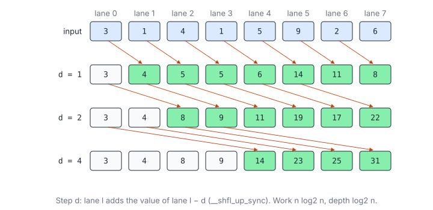
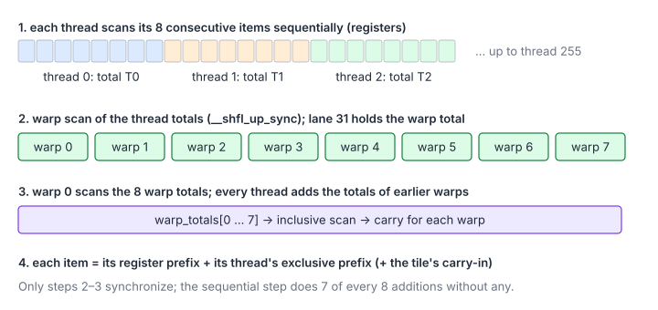
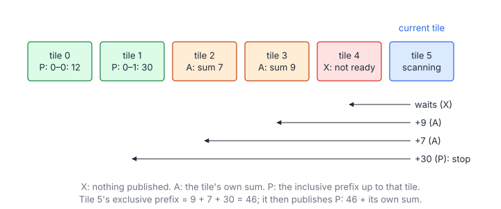

# 11 – Scan (Prefix Sum)

> **Part II · Parallel Patterns** · Prerequisites: [03](03-parallel-reduction.md), [10](10-warp-primitives.md) ·
> Program: [`examples/11-scan.cu`](examples/11-scan.cu) ·
> Next: [12 – Convolution and Stencils](12-convolution-stencils.md)

A scan computes every prefix of a sequence: $y_i = x_0 + x_1 + \dots + x_i$.
It looks inherently sequential (each output depends on the previous one),
yet it parallelizes almost as well as a reduction, and it is the hidden
workhorse of GPU algorithms: stream compaction, radix sort, histogram
offsets, sparse-matrix row pointers, and linear recurrences such as the
state-space models of modern sequence networks all reduce to scans.

**You will learn**

- inclusive and exclusive scans, and what they are used for;
- the work–depth trade-off between Kogge-Stone and work-efficient scans,
  and the GPU compromise (sequential in registers, parallel across
  threads);
- a warp scan with shuffles, a block scan, and a 2048-item tile scan;
- two device-wide strategies: reduce-then-scan (three kernels) and a
  single pass with decoupled look-back, which runs at the speed of a copy;
- scans with other associative operators: segmented scans and linear
  recurrences.

## 1. Definitions and Uses

### 1.1 Inclusive and Exclusive

$$
\text{inclusive: } y_i = \bigoplus_{j=0}^{i} x_j, \qquad
\text{exclusive: } z_i = \bigoplus_{j=0}^{i-1} x_j = y_i \ominus x_i, \quad z_0 = e
$$

| Symbol | Meaning |
|---|---|
| $x_i$ | Input element $i$ |
| $\oplus$ | An associative operator (addition unless stated), with identity $e$ |
| $y_i, z_i$ | Inclusive and exclusive prefixes |
| $\ominus$ | The inverse of $\oplus$, when it has one (subtraction for sums) |

### 1.2 What Scans Are For

| Application | Scan of | Result used as |
|---|---|---|
| Stream compaction | Keep flags (0/1) | Exclusive scan = output index of each kept element |
| Radix sort | Per-digit counts | Exclusive scan = where each bucket starts |
| CSR sparse matrices | Non-zeros per row | Exclusive scan = row pointer array |
| Running sums (cumsum) | The data | The answer |
| Linear recurrences, SSMs | Affine maps $(a_t, b_t)$ | Each state $h_t$ (section 6.3) |

## 2. Work and Depth

A sequential scan does $n - 1$ additions in a chain of length $n - 1$.
Parallel scans trade extra work for depth:

$$
\text{Kogge-Stone: } W = n\log_2 n - n + 1,\ D = \log_2 n, \qquad
\text{Brent-Kung: } W \approx 2n,\ D \approx 2\log_2 n
$$

| Symbol | Meaning |
|---|---|
| $W$ | Additions performed |
| $D$ | Longest chain of dependent additions |
| $n$ | Number of elements |

Kogge-Stone is simple and has minimum depth, but for millions of elements
its $\log_2 n$ extra factor of work costs real bandwidth and instructions.
GPUs use a hybrid that follows Brent's bound (chapter 03, section 1): **each
thread scans a few items sequentially** (work-efficient, no
synchronization), and only the per-thread totals, a small array, are
scanned in parallel with the minimum-depth method. For warps of 32 lanes the
Kogge-Stone overhead is small and the shuffles make it cheap.

## 3. A Warp Scan



```cpp
// After step d, lane l holds x[l-2d+1 .. l]: 5 steps for 32 lanes (Kogge-Stone / Hillis-Steele).
__device__ int warpInclusiveScan(int v) {
    const int lane = threadIdx.x % 32;
    for (int d = 1; d < 32; d <<= 1) {
        const int u = __shfl_up_sync(kFullMask, v, d);
        if (lane >= d) v += u;
    }
    return v;
}
```

`__shfl_up_sync` gives lanes $\ell < d$ their own value back, so the
`if (lane >= d)` guard is what keeps them from double-counting. The
exclusive scan is `inclusive - x` (or a `__shfl_up_sync` by one, with lane 0
set to the identity).

## 4. Block and Tile Scans

### 4.1 A Block Scan

The block scan applies the same idea one level up: every warp scans its 32
values, lane 31 of each warp publishes the warp total, warp 0 scans those
totals, and every thread adds the totals of the warps before its own:

```cpp
__device__ int blockInclusiveScan(int v, int* total) {
    __shared__ int warp_totals[32];
    const int lane = threadIdx.x % 32, warp = threadIdx.x / 32;
    const int num_warps = blockDim.x / 32;
    v = warpInclusiveScan(v);
    if (lane == 31) warp_totals[warp] = v;          // each warp's total
    __syncthreads();
    if (warp == 0) {                                // warp 0 scans the (at most 32) totals
        const int t = lane < num_warps ? warp_totals[lane] : 0;
        warp_totals[lane] = warpInclusiveScan(t);
    }
    __syncthreads();
    if (warp > 0) v += warp_totals[warp - 1];       // add the totals of the warps before
    *total = warp_totals[num_warps - 1];
    __syncthreads();                                // warp_totals may be reused by the caller
    return v;
}
```

Two barriers per block scan, whatever the block size.

### 4.2 Many Items per Thread

One item per thread would spend most of the time in shuffles and barriers.
Instead each thread owns 8 consecutive items, so a block of 256 threads
scans a **tile** of 2048 items:



```cpp
for (int i = threadIdx.x; i < kTile; i += blockDim.x)   // coalesced: consecutive threads, consecutive items
    tile[padded(i)] = offset + i < n ? in[offset + i] : 0;
__syncthreads();
int items[kItems];
int running = 0;
for (int j = 0; j < kItems; ++j) {                       // sequential inclusive scan in registers
    running += tile[padded(threadIdx.x * kItems + j)];
    items[j] = running;
}
int total = 0;
const int thread_inclusive = blockInclusiveScan(running, &total);
const int carry = thread_inclusive - running;            // exclusive prefix of this thread
for (int j = 0; j < kItems; ++j) tile[padded(threadIdx.x * kItems + j)] = items[j] + carry;
```

Two details:

- **Coalescing vs ownership.** Global memory is read with consecutive
  threads on consecutive items (coalesced), but each thread then needs 8
  *consecutive* items. Shared memory converts between the two layouts.
- **Bank conflicts.** Thread $t$ reading item $8t + j$ is a stride-8 access:
  an 8-way conflict. One padding word every 32 items
  (`padded(i) = i + i / 32`) spreads the 32 lanes over 32 banks.

$$
\operatorname{bank}\bigl(8t + j + \lfloor (8t + j)/32 \rfloor\bigr) = \bigl(8\,(t \bmod 4) + j + \lfloor t/4 \rfloor\bigr) \bmod 32
$$

| Symbol | Meaning |
|---|---|
| $t$ | Lane index, 0–31 |
| $j$ | Item index inside the thread, 0–7 (fixed for one instruction) |

For fixed $j$, $8(t \bmod 4) + \lfloor t/4 \rfloor$ takes 32 distinct values
as $t$ runs over the warp: conflict-free.

## 5. Scanning a Whole Array

The tiles are independent except for one number: each tile needs the sum
of all tiles before it (its **carry-in**).

### 5.1 Reduce-Then-Scan

Three kernels:

1. `tileSums`: every block sums its tile.
2. `scanSums`: one block turns the tile sums into exclusive prefixes.
3. `scanTiles`: every block scans its tile again, adding its prefix.

```cpp
void scanReduceThenScan(const int* in, int* out, int* sums, int n) {
    const int tiles = ex::ceilDiv(n, kTile);
    tileSums<<<tiles, kThreads>>>(in, sums, n);
    scanSums<<<1, 1024>>>(sums, tiles);
    scanTiles<<<tiles, kThreads>>>(in, out, sums, n);
}
```

It reads the input twice:

$$
Q_{\text{RTS}} = 4n\,(2 + 1) = 12n\ \text{bytes}, \qquad
Q_{\min} = 4n\,(1 + 1) = 8n\ \text{bytes}
$$

| Symbol | Meaning |
|---|---|
| $Q_{\text{RTS}}$ | DRAM traffic of reduce-then-scan (int32): two reads and one write |
| $Q_{\min}$ | Compulsory traffic: one read and one write, the same as a copy |

so it can reach at most $8/12 = 67\%$ of the speed of a copy (less if the
input does not stay in L2 between the passes).

### 5.2 Single Pass with Decoupled Look-Back

Merrill and Garland's single-pass scan (the algorithm behind CUB's
`DeviceScan`) reads the input once. Each tile publishes a **status** as soon
as it can, and looks back at its predecessors' statuses instead of waiting
for a global pass:



| Status | Meaning |
|---|---|
| X (not ready) | Nothing published yet |
| A (aggregate) | The sum of this tile alone |
| P (prefix) | The inclusive prefix: the sum of all tiles up to and including this one |

A tile (1) scans itself locally, (2) publishes A with its own sum, (3)
walks backwards over predecessors, adding their A values and stopping at the
first P, (4) publishes P, and (5) writes its output with the exclusive
prefix it found:

```cpp
if (threadIdx.x == 0) {
    volatile unsigned long long* vstatus = status;
    if (t == 0) {
        atomicExch(&status[0], packStatus(kPrefix, total));
        s_exclusive = 0;
    } else {
        atomicExch(&status[t], packStatus(kAggregate, total));   // let successors start early
        int prefix = 0;
        for (int p = t - 1; p >= 0; --p) {                       // look back
            unsigned long long s;
            do {
                s = vstatus[p];
            } while ((s >> 32) == kNotReady);
            prefix += static_cast<int>(static_cast<unsigned>(s));
            if ((s >> 32) == kPrefix) break;                     // everything before p is included
        }
        atomicExch(&status[t], packStatus(kPrefix, prefix + total));
        s_exclusive = prefix;
    }
}
```

Why it is correct and cannot hang:

- **Flag and value travel together.** Both live in one 64-bit word written
  with a single atomic, so a reader never sees a flag without its value (no
  fence is needed between them).
- **Tiles are numbered in start order.** A block takes its tile number from
  an atomic counter, not from `blockIdx.x`. The hardware does not promise to
  start blocks in `blockIdx` order, but with the counter every predecessor of
  a tile has already started, so it will eventually publish; the spin-wait
  always ends.
- **Look-back is short.** A tile usually finds a P within a few steps,
  because predecessors publish A early and P soon after. CUB makes a whole
  warp look back at 32 predecessors at once (a warp reduction over their
  statuses); the single-thread loop here is the same protocol, written for
  clarity.

Traffic is $8n$ bytes, the same as a copy; in practice a good single-pass
scan runs at 85–95 % of `cudaMemcpy` bandwidth. The program's `--bench` mode
compares all three.

## 6. Other Operators

### 6.1 Any Monoid

Nothing above used the fact that $\oplus$ is addition, only that it is
associative with an identity: the monoids of chapter 03 (max, min, products,
softmax statistics) scan with the same code.

### 6.2 Segmented Scans

A segmented scan restarts at segment boundaries (flags $f_i = 1$ at the
first element of each segment). It is an ordinary scan over pairs:

$$
(f_a, x_a) \oplus (f_b, x_b) = \bigl(f_a \lor f_b,\ f_b\ ?\ x_b : x_a + x_b\bigr)
$$

| Symbol | Meaning |
|---|---|
| $f$ | Segment-start flag (1 = a new segment starts here) |
| $x$ | Running value |

The operator is associative, so the warp, block and look-back scans work
unchanged with a pair as the value type.

### 6.3 Linear Recurrences

A first-order recurrence $h_t = a_t h_{t-1} + b_t$ looks sequential, but the
maps $h \mapsto a h + b$ compose associatively:

$$
(a_1, b_1) \oplus (a_2, b_2) = (a_1 a_2,\ a_2 b_1 + b_2), \qquad
h_t = A_t h_{-1} + B_t, \quad (A_t, B_t) = \bigoplus_{s=0}^{t} (a_s, b_s)
$$

| Symbol | Meaning |
|---|---|
| $a_t, b_t$ | Coefficients of step $t$ |
| $(A_t, B_t)$ | The composed map from the initial state to $h_t$ |
| $h_{-1}$ | The initial state |

This is how selective state-space models (Mamba) and exponential moving
averages run in parallel over the sequence
([LeetGPU – Linear Recurrence](../leetgpu/082-linear-recurrence/),
[LeetGPU – SSM Selective Scan](../leetgpu/094-ssm-selective-scan/)).

## 7. Libraries

- **CUB**: `cub::WarpScan`, `cub::BlockScan` and `cub::DeviceScan`
  (single-pass, decoupled look-back); the reference implementation.
- **Thrust**: `thrust::inclusive_scan`, `thrust::exclusive_scan_by_key`
  (segmented).
- **PyTorch**: `torch.cumsum`, `torch.cumprod`.

Write your own when the scan is fused with something else (compaction,
sorting passes, an SSM) so that the data is read once.

## Key Takeaways

1. A scan is as parallel as a reduction: sequential within a thread,
   Kogge-Stone across a warp, warp totals across a block.
2. Stage tiles through shared memory to combine coalesced loads with
   per-thread consecutive items; pad to avoid stride conflicts.
3. Reduce-then-scan is simple but reads the input twice; decoupled
   look-back reads it once and reaches copy bandwidth.
4. Cross-block protocols need a single-word status (flag + value), tile
   numbers taken in start order, and loads that bypass stale caches
   (`volatile` or atomics).
5. Any associative operator scans: segmented scans and linear recurrences
   are scans over pairs.

## Exercises

1. Turn `warpInclusiveScan` into an exclusive scan without the subtraction.

    <details markdown="1"><summary>Answer</summary>

    After the inclusive scan, `int e = __shfl_up_sync(kFullMask, v, 1);`
    and set `e = 0` in lane 0.

    </details>

2. How many additions does `blockInclusiveScan` perform for 256 threads,
   and how does that compare with a Kogge-Stone scan over all 2048 items of
   a tile?

    <details markdown="1"><summary>Answer</summary>

    Per warp, $\sum_{d} (32 - d) = 31 + 30 + 28 + 24 + 16 = 129$; 8 warps
    plus warp 0's second scan: about $9 \times 129 \approx 1161$, plus 224
    adds of the warp carries. The tile scan adds 7 sequential additions per
    thread (1792) and 8 carry additions per thread. A Kogge-Stone scan of
    2048 items would do $2048\cdot11 - 2047 \approx 20\,500$.

    </details>

3. Write the pair operator for a segmented *max* scan, and check that it is
   associative on three example pairs.

4. Use the scan program to implement a stable stream compaction: scan the
   keep flags, then write each kept element to its exclusive prefix.

    <details markdown="1"><summary>Hint</summary>

    Fuse it into `scanTileInShared`: scan flags instead of values, keep the
    values in registers, and in `storeTile` write `x` to `out[prefix]` only
    where the flag is 1. The total number of kept elements is the inclusive
    prefix of the last element.

    </details>

## Practice

- [LeetGPU – Prefix Sum](../leetgpu/016-prefix-sum/), [Tensara – Cumsum](../tensara/cumsum/),
  [Tensara – Running Sum 1D](../tensara/running-sum-1d/)
- [LeetGPU – Segmented Prefix Sum](../leetgpu/070-segmented-prefix-sum/)
- [LeetGPU – Stream Compaction](../leetgpu/072-stream-compaction/), [LeetGPU – Radix Sort](../leetgpu/036-radix-sort/)
- [Tensara – Cumprod](../tensara/cumprod/), [LeetGPU – Linear Recurrence](../leetgpu/082-linear-recurrence/),
  [LeetGPU – GAE Reverse Scan](../leetgpu/110-gae-reverse-scan/)
