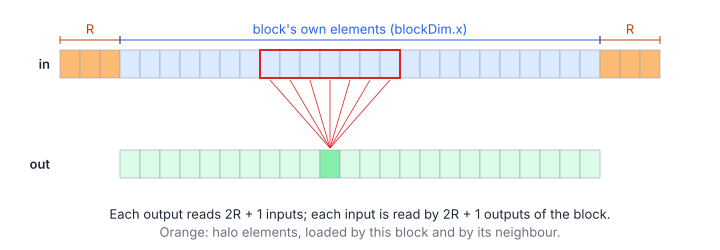
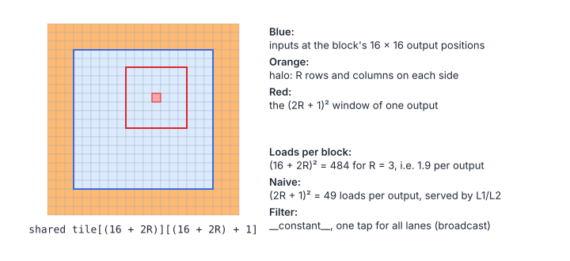
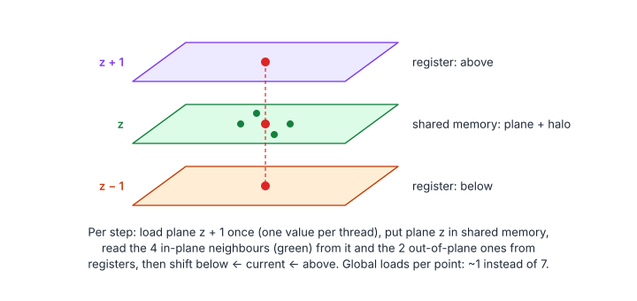

# 12 – Convolution and Stencils

> **Part II · Parallel Patterns** · Prerequisites: [02](02-memory-hierarchy.md) ·
> Program: [`examples/12-convolution-stencil.cu`](examples/12-convolution-stencil.cu) ·
> Next: [13 – Softmax, LayerNorm and FlashAttention](13-softmax-attention.md)

A convolution computes every output from a small window of neighbouring
inputs, weighted by a filter; a stencil does the same with fixed weights,
usually applied over and over (a simulation time step). Neighbouring outputs
share almost all of their inputs, so the whole question is how to load each
input once and reuse it for every output that needs it.

**You will learn**

- the definitions (1-D, 2-D, 3-D), boundary conditions, and the cost model
  of a convolution;
- why the filter belongs in `__constant__` memory;
- tiling with halos: 1-D and 2-D kernels, and how large the halo overhead is;
- separable filters and multiple outputs per thread;
- stencils: a 3-D 7-point Jacobi step, naive and with 2.5-D blocking;
- when to use im2col + GEMM, FFTs or Winograd instead.

## 1. Definitions

### 1.1 Convolution

$$
y_i = \sum_{k=-R}^{R} f_k\,x_{i+k}, \qquad
y_{r,c} = \sum_{a=-R}^{R}\sum_{b=-R}^{R} f_{a,b}\,x_{r+a,\,c+b}
$$

| Symbol | Meaning |
|---|---|
| $x, y$ | Input and output signal (or image) |
| $f$ | Filter (kernel) of $2R + 1$ taps per dimension |
| $R$ | Filter radius |
| $i$; $r, c$ | Output position: index; row and column |

Strictly this is a *correlation* (a convolution flips the filter); deep
learning uses the unflipped form and calls it convolution, and so do these
notes.

### 1.2 Boundaries

Outputs near the edge need inputs that do not exist. The usual choices:

| Mode | Output size | Missing inputs |
|---|---|---|
| "Same", zero padding (the program) | Same as the input | Read as 0 |
| "Valid" | $n - 2R$ | Only outputs whose window fits are computed |
| Replicate / reflect | Same as the input | Clamp or mirror the index |

The LeetGPU and Tensara problems specify which; the code differs only in the
index test when loading.

### 1.3 Stencils

A stencil updates every point of a grid from its neighbours with fixed
weights. The 3-D 7-point Jacobi step for a heat equation or a Poisson solver:

$$
u^{(t+1)}_{x,y,z} = c_0\,u^{(t)}_{x,y,z} + c_1\left(u^{(t)}_{x\pm1,y,z} + u^{(t)}_{x,y\pm1,z} + u^{(t)}_{x,y,z\pm1}\right)
$$

| Symbol | Meaning |
|---|---|
| $u^{(t)}$ | Grid values at time step $t$ |
| $c_0, c_1$ | Weights of the centre and of the 6 face neighbours |
| $x\pm1$ | Both neighbours along $x$ (and likewise for $y$, $z$) |

Boundary cells are held fixed (Dirichlet conditions). Two buffers are
swapped between steps ("ping-pong"), because every point must read the old
values of its neighbours.

## 2. Cost Model

Per output, a $d$-dimensional convolution does $(2R + 1)^d$ multiply-adds.
Each input and output is compulsory once:

$$
I = \frac{2\,(2R + 1)^d}{8}\ \frac{\text{flop}}{\text{byte}}, \qquad
\text{loads per output: naive } (2R + 1)^d, \quad \text{tiled } \frac{(T + 2R)^d}{T^d}
$$

| Symbol | Meaning |
|---|---|
| $I$ | Arithmetic intensity (FP32 in and out: 8 bytes per output) |
| $d$ | Number of dimensions |
| $T$ | Output tile width per block |

A $3\times3$ filter has $I = 2.25$, a $7\times7$ one $I = 12.25$ flop/B: small
filters are memory-bound, large ones approach the ridge point (chapter 00),
so for both the goal is to load each input from DRAM once. The naive kernel
issues $(2R + 1)^d$ loads per output and relies on L1/L2 to absorb them; the
tiled kernel issues about one per output.

## 3. The Filter in Constant Memory

```cpp
__constant__ float c_filter2d[(2 * kMaxRadius2d + 1) * (2 * kMaxRadius2d + 1)];
...
cudaMemcpyToSymbol(c_filter2d, host_filter.data(), taps * sizeof(float));
```

In the inner loop every lane of a warp reads the **same** tap at the same
time, which is exactly the access constant memory broadcasts in one cycle
(chapter 02, section 1.6). The filter is also read-only and tiny (64 KB
limit). A filter that differs per output channel (as in a CNN) is instead
kept in shared memory or registers.

## 4. 1-D Tiling with Halos

A block of 256 threads computes 256 consecutive outputs. Together they need
the 256 inputs at the same positions plus $R$ inputs on each side, the
**halo**:



```cpp
__global__ void conv1dTiled(const float* in, float* out, int n, int radius) {
    __shared__ float tile[kThreads1d + 2 * kMaxRadius1d];
    const int base = blockIdx.x * kThreads1d;
    for (int i = threadIdx.x; i < kThreads1d + 2 * radius; i += blockDim.x) {
        const int g = base - radius + i;
        tile[i] = (g >= 0 && g < n) ? in[g] : 0.0f;          // zero padding outside the input
    }
    __syncthreads();
    const int o = base + threadIdx.x;
    if (o >= n) return;                                      // no barrier below: safe
    float acc = 0.0f;
    for (int k = -radius; k <= radius; ++k)                  // all lanes read the same c_filter1d[k]: broadcast
        acc = fmaf(c_filter1d[k + radius], tile[threadIdx.x + radius + k], acc);
    out[o] = acc;
}
```

- The load loop covers $256 + 2R$ elements with 256 threads (some threads load
  two). The reads are coalesced.
- In the inner loop, lanes read consecutive shared words (`tile[t + k]`):
  conflict-free.
- The early `return` is after the only barrier, so it is safe.

## 5. 2-D Tiling

### 5.1 The Tile



```cpp
__global__ void conv2dTiled(const float* in, float* out, int height, int width, int radius) {
    constexpr int kSide = kTile2d + 2 * kMaxRadius2d;
    __shared__ float tile[kSide][kSide + 1];                 // +1: column reads of the halo are conflict-free
    const int x0 = blockIdx.x * kTile2d - radius;            // input coordinates of tile[0][0]
    const int y0 = blockIdx.y * kTile2d - radius;
    const int side = kTile2d + 2 * radius;
    for (int i = threadIdx.y * kTile2d + threadIdx.x; i < side * side; i += kTile2d * kTile2d) {
        const int ty = i / side, tx = i % side;
        const int yy = y0 + ty, xx = x0 + tx;
        tile[ty][tx] = (yy >= 0 && yy < height && xx >= 0 && xx < width) ? in[yy * width + xx] : 0.0f;
    }
    __syncthreads();
    ...
    for (int dy = 0; dy < fside; ++dy)
        for (int dx = 0; dx < fside; ++dx)
            acc = fmaf(c_filter2d[dy * fside + dx], tile[threadIdx.y + dy][threadIdx.x + dx], acc);
```

### 5.2 How Much the Halo Costs

The halo is loaded by every block that touches it, so the load overhead is
the ratio of input tile to output tile:

$$
\text{overhead} = \frac{(T + 2R)^2}{T^2}
$$

| Symbol | Meaning |
|---|---|
| $T$ | Output tile width (16 here) |
| $R$ | Filter radius |

| $T$ | $R = 1$ | $R = 3$ | $R = 4$ |
|---|---|---|---|
| 8 | 1.56 | 3.06 | 4.0 |
| 16 | 1.27 | 1.89 | 2.25 |
| 32 | 1.13 | 1.41 | 1.56 |

Larger tiles amortize the halo but need more shared memory and threads.
A common compromise is a $32\times8$ block in which each thread computes
several outputs along $y$ (register blocking): the tile is $32\times32$ with
256 threads, and each input row loaded into registers serves several
outputs.

### 5.3 Separable Filters

Many filters (Gaussian, box, Sobel's components) are an outer product
$f_{a,b} = g_a h_b$. Then the 2-D convolution is two 1-D passes:

$$
y = g * (h * x), \qquad \text{MACs per output: } (2R + 1)^2 \ \to\ 2\,(2R + 1)
$$

| Symbol | Meaning |
|---|---|
| $g, h$ | The column and row factors of the filter |
| $*$ | 1-D convolution along columns ($g$) or rows ($h$) |

For $R = 3$ that is 14 instead of 49 multiply-adds, at the cost of writing
and re-reading an intermediate image (or keeping it in shared memory).

## 6. Stencils

### 6.1 The Naive Kernel

```cpp
const size_t plane = static_cast<size_t>(nx) * ny;
out[i] = c0 * in[i] + c1 * (in[i - 1] + in[i + 1] + in[i - nx] + in[i + nx] + in[i - plane] + in[i + plane]);
```

Seven loads per point. The $x$ neighbours hit the same cache lines as the
point itself, and the $y$ neighbours were probably loaded by the adjacent
warp; the $z$ neighbours are a whole plane away and survive in L2 only if
$n_x n_y$ planes fit.

### 6.2 2.5-D Blocking

A block owns a $32\times8$ column of the domain and walks it along $z$.
Each thread keeps its own column's values for planes $z-1$, $z$ and $z+1$ in
registers, and the current plane goes to shared memory so that neighbours in
$x$ and $y$ can read it:



```cpp
float below = load(x, y, 0);                             // registers: planes z-1, z, z+1 of my column
float cur = load(x, y, 1);
for (int z = 1; z < nz - 1; ++z) {
    const float above = load(x, y, z + 1);
    __syncthreads();                                     // everyone is done reading the previous plane
    plane[ty + 1][tx + 1] = cur;
    if (tx == 0) plane[ty + 1][0] = load(x - 1, y, z);   // halo columns and rows of plane z
    if (tx == kBx - 1) plane[ty + 1][kBx + 1] = load(x + 1, y, z);
    if (ty == 0) plane[0][tx + 1] = load(x, y - 1, z);
    if (ty == kBy - 1) plane[kBy + 1][tx + 1] = load(x, y + 1, z);
    __syncthreads();
    if (inside) {
        const float neighbours = plane[ty + 1][tx] + plane[ty + 1][tx + 2] + plane[ty][tx + 1] +
                                 plane[ty + 2][tx + 1] + below + above;
        out[at(x, y, z, nx, ny)] = boundary_xy ? cur : c0 * cur + c1 * neighbours;
    }
    below = cur;
    cur = above;
}
```

- **Global loads**: one per point (the plane above), plus the halo
  ($2 \cdot 32 + 2 \cdot 8 = 80$ per $32\times8$ plane, 31 %).
- **Two barriers per plane**, for the two hazards of chapter 04
  (section 3.3): the plane is fully written before anyone reads it, and fully
  read before the next plane overwrites it. Removing the first one makes the
  program's checks fail.
- **Parallelism**: only $\frac{n_x}{32}\cdot\frac{n_y}{8}$ blocks. For a
  $512\times512$ cross-section that is 1024 blocks, enough; for thin domains,
  split $z$ into a few chunks, each with its own halo planes.

### 6.3 Temporal Blocking

A single step of the 7-point stencil does 8 flops (2 multiplications, 6
additions) per point and moves at least 8 bytes (read and write one float):
about 1 flop/B, memory-bound however well it is tiled. Doing $k$ time steps per
pass over a tile (keeping intermediate steps in shared memory, with a halo
$k$ cells wide) divides DRAM traffic by roughly $k$. The halo grows with $k$,
so $k$ is usually 2–4 on GPUs.

## 7. Beyond Direct Convolution

| Method | Idea | When |
|---|---|---|
| im2col + GEMM | Copy every input window into a column of a matrix; one large GEMM applies all filters | CNN layers with many channels (cuDNN, CUTLASS implicit GEMM, which skips the explicit copy) |
| FFT | Convolution is a pointwise product in frequency space | Large filters ($R$ in the tens or more) |
| Winograd | Fewer multiplications for small tiles and $3\times3$ filters | $3\times3$ CNN layers |
| Depthwise | One filter per channel, no reduction over channels | Memory-bound; the tiling of this chapter applies directly |

## Key Takeaways

1. Neighbouring outputs share inputs: load a tile plus its halo once into
   shared memory and reuse it $(2R + 1)^d$ times.
2. Put a filter that all threads read in the same order in `__constant__`
   memory.
3. The halo overhead is $(T + 2R)^d / T^d$; bigger tiles (or register
   blocking) amortize it.
4. Separable filters turn $(2R + 1)^2$ work into $2(2R + 1)$.
5. For 3-D stencils, march along one axis and keep the planes in registers
   and shared memory (2.5-D blocking); for more reuse, block in time.

## Exercises

1. Compute the halo overhead of `conv2dTiled` for $R = 4$, and of a
   $32\times32$ output tile computed by $32\times8$ threads (4 outputs per
   thread along $y$).

    <details markdown="1"><summary>Answer</summary>

    $(16 + 8)^2 / 16^2 = 2.25$; $(32 + 8)^2 / 32^2 = 1.5625$.

    </details>

2. Change `conv1dTiled` to "valid" mode (output length $n - 2R$). What
   changes in the load loop, and what in the output index?

    <details markdown="1"><summary>Answer</summary>

    Output $o$ reads inputs $o \dots o + 2R$, so the tile starts at
    `base` (no left shift) and no zero padding is needed except past the end
    of the input; the output condition becomes `o < n - 2 * radius`.

    </details>

3. Implement a separable Gaussian blur as two passes of `conv1dTiled`, one
   along rows and one along columns (hint: for the column pass, transpose,
   or give each block a tile that is tall rather than wide). Compare its time
   with `conv2dTiled` for $R = 4$.

4. In `stencil3d25D`, which loads are *not* coalesced, and how could they be
   avoided?

    <details markdown="1"><summary>Answer</summary>

    The left and right halo columns: 8 threads each load one element 32
    floats apart. Loading them with a whole warp (e.g. warp 0 loads the 16
    halo values of both columns) or reading the halo from a wider aligned
    row segment makes them cheaper; they are only 16 of 336 loads per plane.

    </details>

## Practice

- [LeetGPU – 1D Convolution](../leetgpu/009-1d-convolution/), [Tensara – Conv 1D](../tensara/conv-1d/)
- [LeetGPU – 2D Convolution](../leetgpu/010-2d-convolution/), [Tensara – Conv 2D](../tensara/conv-2d/),
  [LeetGPU – Gaussian Blur](../leetgpu/028-gaussian-blur/)
- [LeetGPU – 3D Convolution](../leetgpu/011-3d-convolution/), [Tensara – Conv Square 3D](../tensara/conv-square-3d/)
- [LeetGPU – Jacobi Stencil 2D](../leetgpu/069-jacobi-stencil-2d/), [Tensara – Box Blur](../tensara/box-blur/),
  [LeetGPU – Causal Depthwise Conv1D](../leetgpu/090-causal-depthwise-conv1d/)
