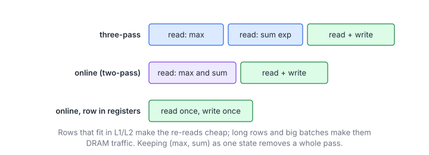
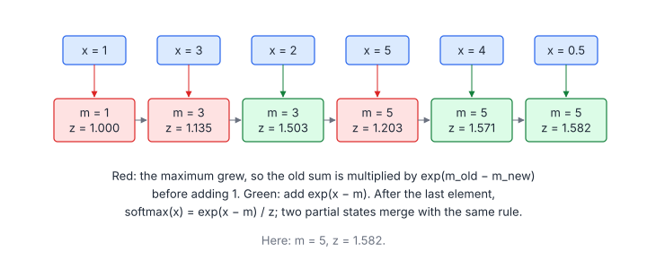
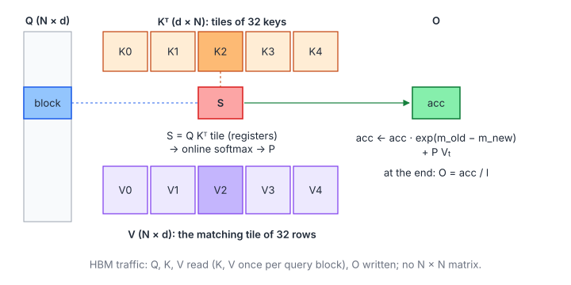

# 13 – Softmax, LayerNorm and FlashAttention

> **Part II · Parallel Patterns** · Prerequisites: [03](03-parallel-reduction.md), [10](10-warp-primitives.md);
> section 5 also uses the tiling of [04](04-tiled-matmul.md) ·
> Program: [`examples/13-softmax-attention.cu`](examples/13-softmax-attention.cu) ·
> Next: [04 – Tiled Matrix Multiplication](04-tiled-matmul.md) (Part III)

Transformers spend most of their non-GEMM time in three operations: softmax,
normalization (LayerNorm, RMSNorm) and attention, which combines two GEMMs
with a softmax in between. All three are row-wise reductions followed by an
elementwise pass, and all three become fast for the same reason: an
**online** formulation that carries a small state through the data in one
pass, and merges states with an associative operator.

**You will learn**

- numerically stable softmax, and how many passes over memory it needs;
- online softmax: the rescaling trick, and why its state is a monoid;
- one-pass LayerNorm with Welford/Chan statistics, and RMSNorm;
- why naive attention is memory-bound on its $N\times N$ score matrix;
- FlashAttention: tiling attention so that scores never leave the chip,
  with a complete, tested FP32 kernel (causal mask included);
- what production attention kernels add (tensor cores, FA2/FA3, split-KV
  decoding).

## 1. Softmax

### 1.1 Definition and Stability

$$
\operatorname{softmax}(x)_i = \frac{e^{x_i}}{\sum_j e^{x_j}} = \frac{e^{x_i - m}}{\sum_j e^{x_j - m}}, \qquad m = \max_j x_j
$$

| Symbol | Meaning |
|---|---|
| $x$ | One row of logits |
| $m$ | The row maximum |

The two forms are equal, but only the second is safe: $e^{x}$ overflows FP32
for $x > 88.7$, and subtracting the maximum makes every exponent $\le 0$ and
the largest term exactly 1.

### 1.2 Three Passes

The direct implementation reads the row three times: once for $m$, once for
$z = \sum_j e^{x_j - m}$, and once to write $e^{x_i - m}/z$:

```cpp
__global__ void softmaxThreePass(const float* in, float* out, int cols) {
    const float* x = in + static_cast<size_t>(blockIdx.x) * cols;
    float* y = out + static_cast<size_t>(blockIdx.x) * cols;
    float m = -INFINITY;
    for (int c = threadIdx.x; c < cols; c += blockDim.x) m = fmaxf(m, x[c]);   // pass 1
    m = blockAllReduce<true>(m);
    float z = 0.0f;
    for (int c = threadIdx.x; c < cols; c += blockDim.x) z += __expf(x[c] - m);   // pass 2
    z = blockAllReduce<false>(z);
    const float inv = 1.0f / z;
    for (int c = threadIdx.x; c < cols; c += blockDim.x) y[c] = __expf(x[c] - m) * inv;   // pass 3
}
```

Softmax does a handful of flops per element, so it is memory-bound, and its
time is proportional to the number of passes that actually reach DRAM:



## 2. Online Softmax

### 2.1 The Rescaling Trick

Carry the running maximum $m$ and the running sum $z$ **relative to that
maximum**. When a new element $x$ arrives:

$$
m' = \max(m, x), \qquad z' = z\,e^{m - m'} + e^{x - m'}
$$

| Symbol | Meaning |
|---|---|
| $m, z$ | State before $x$: maximum so far, and $\sum e^{x_j - m}$ over the elements so far |
| $m', z'$ | State after $x$ |

If $x$ does not raise the maximum, $e^{m - m'} = 1$ and this is just
$z + e^{x - m}$; if it does, the old sum is rescaled to the new maximum.



### 2.2 A Monoid

Two partial states merge with the same rule, which is associative with the
identity $(-\infty, 0)$ (chapter 03, section 8):

$$
(m_a, z_a) \oplus (m_b, z_b) = \bigl(M,\ z_a e^{m_a - M} + z_b e^{m_b - M}\bigr), \qquad M = \max(m_a, m_b)
$$

| Symbol | Meaning |
|---|---|
| $(m_a, z_a), (m_b, z_b)$ | Softmax states of two disjoint parts of the row |
| $M$ | The combined maximum |

So each lane can process its part of the row, and the lanes merge their
states with a butterfly of shuffles, exactly like a sum:

```cpp
MaxSum s{-INFINITY, 0.0f};
for (int c = lane; c < cols; c += 32) {               // pass 1: max and sum together
    const float v = x[c];
    if (v > s.m) {
        s.z = s.z * __expf(s.m - v) + 1.0f;           // rescale the old sum to the new max
        s.m = v;
    } else {
        s.z += __expf(v - s.m);
    }
}
for (int d = 16; d > 0; d >>= 1) {                    // combine the 32 lanes' states (butterfly)
    const MaxSum o{__shfl_xor_sync(kFullMask, s.m, d), __shfl_xor_sync(kFullMask, s.z, d)};
    s = combine(s, o);
}
const float inv = 1.0f / s.z;
for (int c = lane; c < cols; c += 32) y[c] = __expf(x[c] - s.m) * inv;   // pass 2
```

`combine` must handle the empty state: when both maxima are $-\infty$,
$e^{m - M}$ would be $e^{-\infty + \infty} = \text{NaN}$, so it returns the
empty state directly.

### 2.3 Choosing the Mapping

As for any row reduction (chapter 03, section 6): one warp per row for rows
up to a few thousand elements, one block per row beyond that. When the row
fits in the registers of its warp or block (for example 32 lanes × 32
values = 1024 elements), keep it there after the first pass: the second pass
then reads registers, and the kernel moves the compulsory 8 bytes per
element only.

## 3. Normalization

### 3.1 LayerNorm

$$
y_i = \frac{x_i - \mu}{\sqrt{\sigma^2 + \epsilon}}\,\gamma_i + \beta_i, \qquad
\mu = \frac{1}{n}\sum_i x_i, \qquad \sigma^2 = \frac{1}{n}\sum_i (x_i - \mu)^2
$$

| Symbol | Meaning |
|---|---|
| $x, y$ | One row (a token's hidden vector), input and output |
| $\mu, \sigma^2$ | Mean and (biased) variance of the row |
| $\gamma, \beta$ | Learned scale and shift, one per column |
| $\epsilon$ | Small constant (e.g. $10^{-5}$) |

The tempting single-pass formula $\sigma^2 = \overline{x^2} - \mu^2$
subtracts two large, nearly equal numbers when $|\mu| \gg \sigma$. The
program's test uses rows with mean ~1000 and spread ~1: in FP32 that formula
loses almost all digits, while Welford's update does not.

### 3.2 One Pass with Welford and Chan

Each thread runs Welford's update over its elements, and the partial
$(n, \mu, M_2)$ states merge with Chan's formula (chapter 03, section 8.2),
first across the warp with shuffles, then across warps through shared memory:

```cpp
Moments acc{0.0f, 0.0f, 0.0f};
for (int c = threadIdx.x; c < cols; c += blockDim.x) {   // Welford update, one element at a time
    acc.n += 1.0f;
    const float delta = x[c] - acc.mean;
    acc.mean += delta / acc.n;
    acc.m2 += delta * (x[c] - acc.mean);
}
acc = warpAllReduceMoments(acc);
```

The row is then read a second time to write $y$ (or kept in registers, as for
softmax).

### 3.3 RMSNorm and Fusion

RMSNorm drops the mean: $y_i = x_i \gamma_i / \sqrt{\tfrac{1}{n}\sum_j x_j^2 + \epsilon}$.
It needs only a sum of squares, and has no cancellation problem. In
transformer blocks it is usually fused with the residual addition that
precedes it ($x \leftarrow x + \text{sublayer}(x)$, then normalize), which
saves writing and re-reading $x$
([LeetGPU – Fused Residual Add + RMSNorm](../leetgpu/083-fused-residual-add-rms-norm/)).

## 4. Attention and Its Memory Problem

### 4.1 Definition

$$
O = \operatorname{softmax}\!\left(\frac{QK^{\mathsf T}}{\sqrt{d}} + M\right) V
$$

| Symbol | Meaning |
|---|---|
| $Q, K, V$ | Queries, keys, values: $N\times d$ each (one head) |
| $d$ | Head dimension (64 or 128 typically) |
| $N$ | Sequence length |
| $M$ | Mask: 0, or $-\infty$ where a query may not see a key ($j > i$ for causal attention) |
| $O$ | Output, $N\times d$ |
| softmax | Applied to each row of the $N\times N$ score matrix |

### 4.2 The Naive Cost

The textbook implementation writes $S = QK^{\mathsf T}/\sqrt{d}$ ($N\times N$),
reads it back for the softmax, writes $P$, and reads $P$ again for $PV$:

$$
W = 4N^2 d, \qquad Q_{\text{naive}} \approx 4\,(4Nd + 4N^2)\ \text{bytes}
$$

| Symbol | Meaning |
|---|---|
| $W$ | Flops of the two matrix products |
| $Q_{\text{naive}}$ | DRAM traffic: $Q, K, V, O$ plus $S$ and $P$ written and read (FP32) |

For $N = 4096$, $d = 64$ the score traffic is $16N^2 = 268$ MB against
$16Nd = 4$ MB for the inputs and output: the $N^2$ terms dominate, the
intensity is only about $4N^2d / 16N^2 = d/4 = 16$ flop/B, and the memory
grows quadratically with the sequence length.

## 5. FlashAttention

### 5.1 The Idea

Process the keys in tiles, and treat each query row's softmax as an online
softmax over the tiles (section 2). For a query row, after key tile $t$:

$$
m_t = \max\bigl(m_{t-1}, \max_j s_j\bigr), \qquad
\ell_t = \ell_{t-1}\,e^{m_{t-1} - m_t} + \sum_j e^{s_j - m_t}, \qquad
\mathbf{o}_t = \mathbf{o}_{t-1}\,e^{m_{t-1} - m_t} + \sum_j e^{s_j - m_t}\,\mathbf{v}_j
$$

| Symbol | Meaning |
|---|---|
| $s_j$ | Scores of the row against the keys $j$ of tile $t$ |
| $m_t, \ell_t$ | Running maximum and running softmax denominator |
| $\mathbf{o}_t$ | Running, unnormalized output row ($d$ values) |
| $\mathbf{v}_j$ | Value rows of tile $t$ |

At the end, $O_i = \mathbf{o}_T / \ell_T$. The scores of a tile live only in
registers; nothing of size $N\times N$ is ever stored.



### 5.2 The Kernel

The program's kernel is written for clarity on CUDA cores (FP32, $d = 64$):

| Choice | Value | Why |
|---|---|---|
| Queries per block | 16 (4 warps × 4 rows) | Each K/V tile loaded to shared memory is reused by 16 rows |
| Keys per tile | 32 | One key per lane: a score is one lane's dot product |
| Output ownership | Lane $\ell$ holds dimensions $\ell$ and $\ell + 32$ | The $PV$ product is spread over the warp |

```cpp
for (int kv0 = 0; kv0 < kv_end; kv0 += kBlockKv) {
    __syncthreads();                                  // previous tile fully used (and q_s written)
    // ... load K and V tile kv0 into k_s, v_s (zeros past the end) ...
    __syncthreads();
    for (int r = 0; r < kRowsPerWarp; ++r) {
        const int qr = warp * kRowsPerWarp + r;       // row inside the block
        const int qi = q0 + qr;                       // global query index
        const int kj = kv0 + lane;                    // this lane's key
        float s = 0.0f;
        for (int c = 0; c < kHeadDim; ++c) s = fmaf(q_s[qr][c], k_s[lane][c], s);
        if (kj >= n || (causal && kj > qi)) s = -INFINITY;
        const float m_new = fmaxf(m[r], warpMax(s));
        if (m_new == -INFINITY) continue;             // nothing visible yet for this row
        const float p = __expf(s - m_new);            // this lane's unnormalized probability
        const float rescale = __expf(m[r] - m_new);
        l[r] = l[r] * rescale + warpSum(p);
        m[r] = m_new;
        for (int e = 0; e < kDimsPerLane; ++e) acc[r][e] *= rescale;
        for (int j = 0; j < kBlockKv; ++j) {
            const float pj = __shfl_sync(kFullMask, p, j);
            for (int e = 0; e < kDimsPerLane; ++e) acc[r][e] = fmaf(pj, v_s[j][lane + 32 * e], acc[r][e]);
        }
    }
}
```

Details that matter:

- **The scale** $1/\sqrt{d}$ is folded into $Q$ once, when it is loaded.
- **Bank conflicts.** Lane $j$ reads row $j$ of `k_s`; with rows of 64
  floats all 32 lanes would hit the same bank. Padding rows to 65 words makes
  the access conflict-free (chapter 02, section 4.3). `q_s[qr][c]` is a
  broadcast, and `v_s[j][lane + 32e]` reads consecutive words.
- **Causal masking.** Keys after the query get $-\infty$, and key tiles that
  start after the block's last query are skipped entirely (`kv_end`): half of
  the work disappears.
- **The empty state.** For the first tiles of a row, all scores could be
  masked; `m_new == -INFINITY` skips the update instead of computing
  $e^{-\infty + \infty}$.
- **Registers.** All loops over rows and dimensions are unrolled, so `m`,
  `l` and `acc` stay in registers (ptxas: 54 registers, no stack).

### 5.3 Traffic

Every block reads its queries once and the whole of $K$ and $V$ once:

$$
Q_{\text{flash}} = 4\left(2Nd + 2Nd\left\lceil \frac{N}{B_q} \right\rceil\right), \qquad
\frac{Q_{\text{naive}}}{Q_{\text{flash}}} \approx \frac{16N^2}{8N^2d/B_q} = \frac{2B_q}{d}
$$

| Symbol | Meaning |
|---|---|
| $B_q$ | Query rows per block (16 here; 64–128 in production kernels) |
| $Q_{\text{flash}}$ | DRAM traffic, with $K$ and $V$ re-read by every query block (L2 absorbs much of it in practice) |

The memory needed is $O(Nd)$ instead of $O(N^2)$, which is what allows long
contexts at all. Larger $B_q$ reduces the $K/V$ re-reads further, at the cost
of shared memory and registers.

### 5.4 What Production Kernels Add

| Feature | Idea |
|---|---|
| Tensor cores | $S = QK^{\mathsf T}$ and $O \mathrel{+}= PV$ as `mma.sync` / `wgmma` tiles in FP16/BF16 ([04.7](gemm/07-tensor-cores.md)); the softmax runs on the accumulator fragments in registers |
| FlashAttention-2 | Parallelize over query blocks *and* heads/batch; warps split queries rather than keys, so no inter-warp reduction is needed |
| FlashAttention-3 (Hopper) | TMA loads and asynchronous `wgmma`, producer/consumer warps, softmax of one tile overlapped with the GEMM of the next |
| Backward pass | Recompute $S$ and $P$ tile by tile from $Q$, $K$ and the saved $(m, \ell)$ instead of storing $P$ |
| Split-KV decoding | With one query per sequence (decoding), split the *keys* across blocks and merge the partial $(m, \ell, \mathbf{o})$ states with the monoid of section 2.2 |
| GQA / MQA, paged KV | Several query heads share one K/V head; the K/V cache is stored in fixed-size pages addressed through a table |

## Key Takeaways

1. Subtract the row maximum before exponentiating; count the passes over
   memory, because softmax and normalization are memory-bound.
2. Online softmax carries $(m, z)$ and rescales on a new maximum; the states
   form a monoid, so they reduce across lanes, warps and blocks.
3. Compute variance with Welford/Chan, not $\overline{x^2} - \mu^2$.
4. Naive attention is dominated by $N\times N$ score traffic; FlashAttention
   streams K/V tiles and applies online softmax per query row, so the scores
   never leave the chip and memory is $O(Nd)$.
5. Production kernels keep the same algorithm and move the two products to
   tensor cores, with more parallelism and asynchronous loads.

## Exercises

1. Show that the combine of section 2.2 is associative.

    <details markdown="1"><summary>Answer</summary>

    Write each state as $(m, z) \sim z e^{m}$: combine maps to adding
    $z_a e^{m_a} + z_b e^{m_b}$, re-expressed relative to the larger
    maximum. Addition is associative, so is the combine (and the maximum is
    associative too).

    </details>

2. For $N = 8192$, $d = 128$ and $B_q = 64$, compare $Q_{\text{naive}}$ and
   $Q_{\text{flash}}$.

    <details markdown="1"><summary>Answer</summary>

    Naive: $4(4\cdot8192\cdot128 + 4\cdot8192^2) \approx 1.09$ GB, almost all
    of it scores. Flash: $4(2\cdot8192\cdot128 + 2\cdot8192\cdot128\cdot128)
    \approx 1.08$ GB before L2 reuse: the same order! The difference in
    practice is that the $K/V$ re-reads hit L2 (they are the same few MB for
    every block), while the naive $S$ and $P$ traffic cannot. A larger
    $B_q$ or splitting the query blocks across heads that share K/V improves
    it further.

    </details>

3. Modify `softmaxOnline` for rows of at most 1024 elements so that each lane
   keeps its 32 values in registers, and the row is read from memory once.

4. Add a sliding-window mask (a query sees only the $w$ previous keys) to
   `flashAttention`. Which key tiles can be skipped?

    <details markdown="1"><summary>Answer</summary>

    Key $j$ is visible to query $i$ when $i - w < j \le i$. A block with
    queries $[q_0, q_0 + B_q)$ needs keys in $(q_0 - w, q_0 + B_q)$: start
    the loop at the tile containing $\max(0, q_0 - w + 1)$ and stop at
    `kv_end`.

    </details>

## Practice

- [LeetGPU – Softmax](../leetgpu/005-softmax/), [Tensara – Softmax](../tensara/softmax/),
  [Tensara – Log Softmax](../tensara/log-softmax/)
- [LeetGPU – Layer Normalization](../leetgpu/113-layer-normalization/), [Tensara – Layer Norm](../tensara/layer-norm/),
  [LeetGPU – RMS Normalization](../leetgpu/050-rms-normalization/), [Tensara – RMS Norm](../tensara/rms-norm/)
- [LeetGPU – Softmax Attention](../leetgpu/006-softmax-attention/),
  [Tensara – Scaled Dot-Product Attention](../tensara/scaled-dot-attention/)
- [LeetGPU – Causal Attention](../leetgpu/053-casual-attention/),
  [LeetGPU – Sliding Window Attention](../leetgpu/059-sliding-window-attn/),
  [LeetGPU – Grouped Query Attention](../leetgpu/080-grouped-query-attention/)
