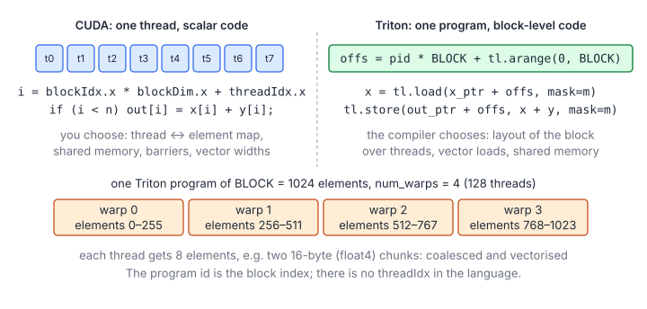
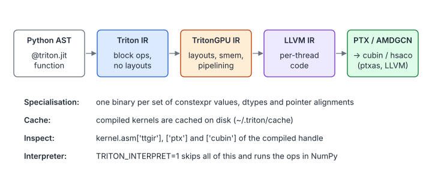

# 14 – Triton – From First Kernel to Production

> **Part IV · Triton** · A standalone, beginner-to-advanced guide ·
> Programs and tests: [`examples/14-triton/`](examples/14-triton/test_kernels.py)

Triton is a Python language and compiler for writing GPU kernels. You describe
the work of one **program instance** over vectors or tiles; the compiler maps
that work onto GPU threads, vector loads, shared memory and accelerator
instructions. No CUDA experience is required for this chapter. When CUDA terms
help, a Triton program instance is roughly a CUDA thread block, a grid is the
set of blocks, and a block value is a compile-time-shaped tensor distributed
over the threads.

That higher level does not remove performance engineering. You still choose
the decomposition, grid, tile sizes, masks, traversal order, fusion boundaries
and launch parameters. Triton takes responsibility for much of the mechanical
thread mapping and lowering.

**You will learn**

- the Triton programming model: programs, blocks, masks and pointer
  tiles;
- six complete kernels: vector addition, fused softmax, fused LayerNorm,
  matrix multiplication with grouped ordering and autotuning,
  FlashAttention, and an atomic histogram;
- which matrix-multiplication optimisations the compiler performs and which
  remain yours;
- loops, atomics, scans, persistent scheduling, compiler layouts and
  portability across NVIDIA and AMD;
- how a Triton kernel is compiled, specialised, cached, inspected,
  debugged in the interpreter, benchmarked and profiled;
- when to choose Triton, CUDA or a library.

## 1. Why a Block-Level Language

### 1.1 What Moves From You to the Compiler

| Concern | CUDA | Triton |
|---|---|---|
| Unit of the program | One thread | One program instance (a block of threads) |
| Data | Scalars in registers | Compile-time-shaped block tensors |
| Thread ↔ element mapping | You | Compiler (a *layout*) |
| Coalescing, vector width | You | Compiler, from the pointer pattern and alignment |
| Shared memory, barriers | You | Compiler |
| Bank-conflict swizzles | You | Compiler |
| Multi-stage load pipeline | You | Compiler, influenced by `num_stages` |
| Tensor-core instructions | You | Compiler, from `tl.dot` |
| Tile sizes, grid, tile order | You | You |
| Fusion (what one kernel does) | You | You |

The trade: low-level per-thread control is deliberately limited, while kernels
are often much shorter and can target both NVIDIA and AMD GPUs. Portability is
not automatic performance parity: each backend still needs representative
testing and tuning.



### 1.2 Setup

```bash
pip install torch triton          # Triton ships with PyTorch's CUDA wheels too
cd tutorials/examples/14-triton
python3 test_kernels.py           # checks all six kernels against PyTorch
python3 test_kernels.py --bench   # and times them (GPU only)
```

Without a GPU, `test_kernels.py` sets `TRITON_INTERPRET=1` before
importing Triton. The **interpreter** runs each program instance
sequentially with NumPy: slow, but it executes the same indexing, masks and
arithmetic, so it is the Triton counterpart of this repository's CUDA
emulator. On ROCm, the same source can run with compatible ROCm builds of
PyTorch and Triton; section 10 covers the backend-specific caveats.

## 2. The Programming Model

### 2.1 Programs and the Grid

A Triton kernel is a Python function decorated with `@triton.jit`. It is
launched on a grid of **program instances**, `kernel[grid](arg0, arg1, ...)`, where
`grid` is a tuple of up to three sizes, or a function of the kernel's
compile-time parameters:

```python
grid = lambda meta: (triton.cdiv(n, meta["BLOCK"]),)
kernel[grid](x, y, out, n, BLOCK=1024)
```

Inside the kernel, `tl.program_id(axis)` is the program's index (CUDA's
`blockIdx`) and `tl.num_programs(axis)` the grid size (`gridDim`). There is
no `threadIdx`: a program is one block, and how many threads execute it is
a launch option, `num_warps` (default 4).

### 2.2 Blocks and Shape Constraints

Values inside a kernel are scalars or **blocks**: tensors whose shape is
known at compile time. `tl.arange(0, BLOCK)` creates the vector
`[0, 1, …, BLOCK−1]`; for this form, `BLOCK` must be a `tl.constexpr` and
the interval length must be a power of two.
Operations are element-wise with NumPy broadcasting (`x[:, None]`,
`y[None, :]`); reductions take an axis (`tl.sum`, `tl.max`, `tl.argmax`);
`tl.dot` multiplies two 2-D blocks.

Every distinct value of a `constexpr` compiles a separate kernel, which is
why sizes are passed as keywords: `BLOCK=1024`.

Run-time sizes such as `n`, `M` and `N` may be arbitrary. Round the tile up
to a legal compile-time shape and mask lanes that fall outside the run-time
shape. Operations also impose their own constraints: for example, efficient
`tl.dot` tiles use dimensions compatible with the backend's matrix
instructions. Static shape errors are compile-time errors, not conditions a
kernel can branch around.

### 2.3 Pointers, Loads, Stores and Masks

Tensor arguments arrive as pointers to their first element. Adding a block
of offsets to a pointer gives a **block of pointers**, and
`tl.load`/`tl.store` read and write all of them at once:

```python
offs = pid * BLOCK + tl.arange(0, BLOCK)
mask = offs < n                               # the tail guard, for the whole block
x = tl.load(x_ptr + offs, mask=mask, other=0.0)
tl.store(out_ptr + offs, x, mask=mask)
```

Masked-off lanes neither read nor write; `other` is the value a masked
load returns (choose the identity of what follows: 0 for a sum, −∞ for a
maximum).

Offsets are in *elements*: Triton multiplies by the element size itself.
They are 32-bit integers unless an argument makes them 64-bit; for tensors
of more than $2^{31}$ elements, cast with `pid.to(tl.int64)` first.

### 2.4 Two-Dimensional Tiles

A 2-D tile of pointers is the broadcast sum of a column of row offsets and
a row of column offsets:

![rows[:, None] * S plus cols[None, :] broadcasts to a BLOCK_M × BLOCK_N tile of addresses; masks are built the same way](figures/ch14-pointer-block.svg)

$$
\text{ptr}_{rq} = \text{base} + \text{row}_r \cdot s_0 + \text{col}_q \cdot s_1,
\qquad r < B_M,\ q < B_N
$$

| Symbol | Meaning |
|---|---|
| $\text{base}$ | Pointer to element (0, 0) of the matrix |
| $\text{row}_r,\ \text{col}_q$ | The r-th entry of `rows` and the q-th entry of `cols` |
| $s_0,\ s_1$ | Row and column strides of the matrix, in elements (`x.stride(0)`, `x.stride(1)`) |
| $B_M,\ B_N$ | Tile shape (`BLOCK_M`, `BLOCK_N`) |

Passing both strides makes the same kernel work for row-major, transposed
and sliced matrices. The compiler emits vectorised loads only along a
dimension it can prove contiguous and aligned; it learns this from the
access pattern and from specialising on argument values (section 7.1).
When a stride is always 1, leaving it out of the signature, as the
softmax kernel does, makes the contiguity explicit.

### 2.5 Block Pointers and Tensor Descriptors

Explicit pointer tensors are the most general addressing form. A
**block pointer** packages the same base, shape, strides, offsets and tile
shape, and lets `tl.load` generate boundary checks:

```python
x_block = tl.make_block_ptr(
    base=x_ptr, shape=(M, N), strides=(stride_m, stride_n),
    offsets=(pid_m * BLOCK_M, pid_n * BLOCK_N),
    block_shape=(BLOCK_M, BLOCK_N), order=(1, 0),
)
x = tl.load(x_block, boundary_check=(0, 1), padding_option="zero")
x_block = tl.advance(x_block, (0, BLOCK_N))
```

Use pointer tensors when each lane needs a different predicate or irregular
address. Use block pointers for regular strided tiles: the intent is clearer,
but `boundary_check` replaces only rectangular edge masks, not an arbitrary
causal or sparse mask.

A **tensor descriptor** goes further by describing a global tensor and moving
tiles through descriptor operations:

```python
desc = tl.make_tensor_descriptor(
    x_ptr, shape=[M, N], strides=[stride_m, stride_n],
    block_shape=[BLOCK_M, BLOCK_N],
)
x = desc.load([pid_m * BLOCK_M, pid_n * BLOCK_N])
desc.store([pid_m * BLOCK_M, pid_n * BLOCK_N], x)
```

Descriptors allow backends with descriptor-driven transfers, such as NVIDIA
TMA, to use them. They carry stricter alignment, tile-shape and target
requirements than ordinary pointers, and support differs by backend. Keep a
pointer-based path unless deployment hardware is fixed, and validate the
actual Triton release and device rather than assuming that a descriptor
guarantees a particular instruction.

### 2.6 What Is Not in the Language

- **No shared memory or barriers** in normal code: data exchange inside a
  program happens through block operations (`tl.sum`, `tl.dot`,
  `tl.trans`, reshapes), which the compiler implements with shuffles or
  shared memory as needed.
- **No communication between programs** except through global memory and
  atomics (`tl.atomic_add`, `tl.atomic_cas`, …), as in CUDA.
- **No dynamic shapes** inside a kernel: a row of run-time length is
  handled with a power-of-two block and a mask, or a loop over blocks.

## 3. Elementwise Work and Fusion: Vector Addition

[`vector_add.py`](examples/14-triton/vector_add.py) is the whole model in
ten lines:

```python
@triton.jit
def add_kernel(x_ptr, y_ptr, out_ptr, n, BLOCK: tl.constexpr):
    pid = tl.program_id(axis=0)                  # blockIdx.x
    offsets = pid * BLOCK + tl.arange(0, BLOCK)  # a vector of BLOCK indices
    mask = offsets < n
    x = tl.load(x_ptr + offsets, mask=mask)
    y = tl.load(y_ptr + offsets, mask=mask)
    tl.store(out_ptr + offsets, x + y, mask=mask)
```

The grid has $\lceil n / B \rceil$ programs. With `BLOCK = 1024` and
`num_warps = 4`, each of the 128 threads owns 8 elements, which the
compiler can lower to wide, coalesced accesses when alignment permits. The
kernel's minimum memory traffic is $12n$ bytes for FP32: two 4-byte reads
and one 4-byte write per element.

### 3.1 Fusion Is a Memory-Traffic Decision

Elementwise operations compose naturally because every intermediate remains
in a block value:

```python
x = tl.load(x_ptr + offsets, mask=mask, other=0.0)
y = tl.load(y_ptr + offsets, mask=mask, other=0.0)
out = tl.maximum(x + y, 0.0) * scale
tl.store(out_ptr + offsets, out, mask=mask)
```

As separate kernels, add, ReLU and scale would repeatedly write and read the
same vector. Fused, they use the same two input reads and one output write as
addition alone. Fusion is not unlimited: too many live block values increase
register pressure, lower occupancy and may spill to local memory. Fuse a
producer-consumer chain when it removes meaningful traffic, then inspect
register use and benchmark it.

## 4. Reductions and Normalization: Fused Softmax and LayerNorm

[`softmax.py`](examples/14-triton/softmax.py) computes a row-wise softmax
with one program per row:

```python
@triton.jit
def softmax_kernel(in_ptr, out_ptr, n_cols, in_stride, out_stride, BLOCK: tl.constexpr):
    row = tl.program_id(0)
    cols = tl.arange(0, BLOCK)
    mask = cols < n_cols
    x = tl.load(in_ptr + row * in_stride + cols, mask=mask, other=-float("inf"))
    x = x - tl.max(x, axis=0)
    e = tl.exp(x)
    tl.store(out_ptr + row * out_stride + cols, e / tl.sum(e, axis=0), mask=mask)
```

### 4.1 What the Compiler Generates

`tl.max(x, axis=0)` is the block reduction of chapter 03: per-thread
partial maxima, a warp shuffle tree, and a shared-memory exchange between
the warps, all derived from one call. The masked lanes load −∞, so they
neither change the maximum nor (since $e^{-\infty} = 0$) the sum.

### 4.2 Why It Is Fast

The row is read once into registers and written once: $2 \cdot 4 \cdot n$
bytes per row, the minimum. A decomposed max/exponentiate/sum design would
re-read or materialise intermediates. The fused kernel's advantage is not
Triton-specific, but Triton makes this fusion the natural expression.

### 4.3 Limits

`BLOCK = next_power_of_2(n_cols)` must fit in registers. The wrapper uses
more warps for longer rows so each thread holds at most ~32 values up to
16 384 columns;
beyond a few tens of thousands of columns the kernel spills. The fix is
online softmax: loop over the row in blocks, keeping
$(m, z)$ as the state (exercise 3).

### 4.4 Kernel 3: Fused LayerNorm

[`layer_norm.py`](examples/14-triton/layer_norm.py) demonstrates multiple
reductions followed by an elementwise affine transform:

$$
\mu={1\over C}\sum_j x_j,\qquad
\sigma^2={1\over C}\sum_j(x_j-\mu)^2,\qquad
y_j={x_j-\mu\over\sqrt{\sigma^2+\epsilon}}\,w_j+b_j.
$$

```python
x = tl.load(x_ptr + row * x_stride + cols, mask=mask, other=0.0).to(tl.float32)
mean = tl.sum(x, axis=0) / n_cols
centered = tl.where(mask, x - mean, 0.0)
variance = tl.sum(centered * centered, axis=0) / n_cols
y = centered * tl.rsqrt(variance + eps)
y = y * tl.load(weight_ptr + cols, mask=mask, other=0.0)
y += tl.load(bias_ptr + cols, mask=mask, other=0.0)
tl.store(out_ptr + row * out_stride + cols, y, mask=mask)
```

The second `tl.where` is essential: a masked load contributes zero to the
mean, but `0 - mean` would still contribute to the variance. The kernel reads
the input, weight and bias once and writes the result once; it never
materialises mean, variance or normalized activations. Accumulation is FP32.
For very wide rows, use tiled Welford states `(count, mean, M2)` or a
multi-kernel reduction instead of retaining the full row.

## 5. Matrix Multiplication and Autotuning

[`matmul.py`](examples/14-triton/matmul.py) computes $C = AB$ with one
program per $B_M \times B_N$ tile of $C$:

```python
acc = tl.zeros((BLOCK_M, BLOCK_N), dtype=tl.float32)
for k0 in range(0, K, BLOCK_K):
    a = tl.load(a_ptrs, mask=(rows[:, None] < M) & (ks[None, :] + k0 < K), other=0.0)
    b = tl.load(b_ptrs, mask=(ks[:, None] + k0 < K) & (cols[None, :] < N), other=0.0)
    acc = tl.dot(a, b, acc)                    # acc += a @ b on tensor cores
    a_ptrs += BLOCK_K * stride_ak
    b_ptrs += BLOCK_K * stride_bk
```

This is the standard tiled matrix-multiplication structure. The difference
from a low-level implementation is what the compiler does with it.

### 5.1 The Matrix Multiplication Ladder in Triton

| Technique | In Triton |
|---|---|
| [Matrix Multiplication 2 – Vectorized Loads](gemm/01-vectorized-loads.md) | Automatic when strides and alignment allow |
| [Matrix Multiplication 3 – Double Buffering](gemm/02-double-buffering.md) | Automatic pipelining, influenced by `num_stages` |
| [Matrix Multiplication 4 – Async Copies](gemm/03-async-copies.md) | Backend/compiler selected; descriptors can expose TMA-capable movement |
| [Matrix Multiplication 5 – Warp Tiling](gemm/04-warp-tiling.md) | The `tl.dot` layout distributes the tile over `num_warps` warps |
| [Matrix Multiplication 6 – Tile Swizzling](gemm/05-tile-swizzling.md) | Shared-memory swizzles are automatic; output tile order is yours (`GROUP_M`) |
| [Matrix Multiplication 7 – Split-K and Stream-K](gemm/06-split-k-stream-k.md) | Yours: add work over K, then reduce or use atomics |
| [Matrix Multiplication 8 – Tensor Cores](gemm/07-tensor-cores.md) | Automatic when a supported `tl.dot` shape and dtype are used |

### 5.2 Grouped Tile Ordering

Programs run roughly in the order of their ids. With a row-major order,
the programs in flight at any moment cover one or two rows of tiles and
therefore *all* tile columns of $B$, so $B$ is read from DRAM repeatedly.
Grouping $G$ tile rows together makes the programs in flight cover a
square-ish patch of $C$ instead:

$$
g = \left\lfloor \frac{p}{G\,T_N} \right\rfloor, \quad
G' = \min(T_M - gG,\ G), \quad
m = gG + \big(p \bmod G T_N\big) \bmod G', \quad
n = \left\lfloor \frac{p \bmod G T_N}{G'} \right\rfloor
$$

| Symbol | Meaning |
|---|---|
| $p$ | Program id |
| $T_M,\ T_N$ | Number of tile rows and tile columns of $C$ |
| $G$ | `GROUP_M`, tile rows per group |
| $g$ | The group of program $p$ |
| $G'$ | Tile rows in this group (the last group may be shorter) |
| $m,\ n$ | The tile of $C$ that program $p$ computes |

With $T_N = 32$ and 64 programs in flight, row-major order touches 2 row
strips of $A$ and 32 column strips of $B$ (34 strips); with $G = 8$ it
touches 8 of $A$ and 8 of $B$ (16 strips), so about half the L2 footprint
and correspondingly more L2 hits. This is the same idea as the tile-order
swizzle in
[Matrix Multiplication 6 – Tile Swizzling](gemm/05-tile-swizzling.md).

### 5.3 Autotuning

The best tile shape depends on the GPU, the data type and the matrix
sizes. `triton.autotune` compiles the kernel for a list of configurations,
times each the first time a new `key` is seen, and caches the winner:

```python
CONFIGS = [
    triton.Config({"BLOCK_M": 128, "BLOCK_N": 128, "BLOCK_K": 32, "GROUP_M": 8}, num_warps=8, num_stages=3),
    triton.Config({"BLOCK_M": 64, "BLOCK_N": 64, "BLOCK_K": 64, "GROUP_M": 8}, num_warps=4, num_stages=3),
    ...
]
matmul_kernel_tuned = triton.autotune(configs=CONFIGS, key=["M", "N", "K"])(matmul_kernel)
```

| Parameter | Trade-off |
|---|---|
| `BLOCK_M`, `BLOCK_N` | Larger tiles: more reuse per byte loaded, more registers, fewer programs |
| `BLOCK_K` | Larger: fewer loop iterations, more shared memory per stage |
| `num_stages` | More stages hide more latency, and cost `num_stages` × tile bytes of shared memory |
| `num_warps` | More warps per program: smaller per-warp tiles, more latency hiding, less ILP |

The shared memory per program is about
$\text{num\_stages} \cdot (B_M + B_N) \cdot B_K \cdot \text{sizeof}$; a
configuration that exceeds the SM's capacity fails to compile and is
skipped.

### 5.4 Precision

For `float32` inputs, `tl.dot` uses TF32 tensor cores by default on
Ampere and later (a 10-bit mantissa, relative error ~$10^{-3}$); the test
script loosens its tolerance on a GPU for that reason. `tl.dot(a, b, acc,
input_precision="ieee")` forces full FP32 at a large cost in speed. For
`float16`/`bfloat16` inputs the accumulator stays `float32`, and the
epilogue (`acc.to(c_ptr.dtype.element_ty)`) converts once at the end.

### 5.5 Epilogue Fusion

Anything element-wise on `acc` before the store is free in memory traffic:
a bias add, an activation (`tl.where(acc > 0, acc, 0.0)`), a scale, a
conversion to FP8. This is where a hand-written Triton GEMM most often
beats a library call followed by separate element-wise kernels.

## 6. Attention and Online Softmax: FlashAttention

[`flash_attention.py`](examples/14-triton/flash_attention.py) implements
a one-head forward pass. Each program owns
`BLOCK_Q` query rows and streams $K$ and $V$ past them:

```python
for start in range(0, kv_end, BLOCK_KV):
    k = tl.load(k_ptr + kv_rows[:, None] * stride_k + dims[None, :], ...)
    v = tl.load(v_ptr + kv_rows[:, None] * stride_v + dims[None, :], ...)
    s = tl.dot(q, tl.trans(k))                         # scores, on-chip
    s = tl.where(valid, s, -float("inf"))              # padding and causal mask
    m_new = tl.maximum(m, tl.max(s, axis=1))
    m_safe = tl.where(m_new == -float("inf"), 0.0, m_new)
    p = tl.exp(s - m_safe[:, None])
    alpha = tl.exp(m - m_safe)
    l = l * alpha + tl.sum(p, axis=1)
    acc = acc * alpha[:, None] + tl.dot(p.to(v.dtype), v)
    m = m_new
```

Line by line, this is the online-softmax recurrence:

| Line | Meaning |
|---|---|
| `s = tl.dot(q, tl.trans(k))` | $S = Q K^\top$ for one tile, scale folded into $Q$ |
| `m_new`, `alpha` | The new running maximum and the rescaling factor $e^{m_{\text{old}} - m_{\text{new}}}$ |
| `m_safe` | The guard for rows that have seen only masked keys ($-\infty - (-\infty)$) |
| `l`, `acc` | The running sum and the unnormalised output, rescaled, then updated |
| `acc / l[:, None]` (after the loop) | The final normalisation |

In a low-level implementation, much of the code distributes tiles over lanes
and stages $K$ and $V$ through shared memory; here `tl.dot` expresses both
matrix products and the compiler chooses the lowering. Production
kernels add a backward pass, multiple heads and batches as extra grid
axes, and on Hopper warp specialisation, but the core is this loop.

For the causal case, `kv_end` stops the loop at the last key the block's
queries can see, which halves the work, exactly as in the CUDA kernel.

## 7. Loops, Atomics and Scans

### 7.1 Loops

The matmul and attention kernels already use loops. A loop with entirely
compile-time bounds may be unrolled; a loop whose bound depends on `K` or `n`
remains a loop in generated code. `tl.range` exposes loop attributes such as
software-pipeline staging:

```python
for k0 in tl.range(0, K, BLOCK_K, num_stages=3):
    ...
```

Unrolling short loops can expose instruction-level parallelism, but unrolling
a long loop inflates code and live ranges. Use a run-time loop for data-sized
work and specialize only when a small set of fixed sizes is genuinely common.

### 7.2 Kernel 6: Atomic Histogram

Programs cannot synchronize with each other inside a normal launch. Atomics
are the safe way to update shared global state. The complete
[`histogram.py`](examples/14-triton/histogram.py) handles an odd tail and
ignores values outside the bin range:

```python
offsets = tl.program_id(0) * BLOCK + tl.arange(0, BLOCK)
in_bounds = offsets < n
values = tl.load(values_ptr + offsets, mask=in_bounds, other=-1)
valid = in_bounds & (values >= 0) & (values < n_bins)
bins = tl.where(valid, values, 0)  # masked pointer arithmetic stays in range
tl.atomic_add(histogram_ptr + bins, 1, mask=valid)
```

The result is deterministic for integer addition, but performance is not:
many values in one bin serialize at one address. A production histogram often
builds one private histogram per program and merges those histograms in a
second kernel. Triton also provides compare-and-swap, exchange, min, max and
bitwise atomics; supported dtypes and memory semantics depend on the target.

### 7.3 Scans

A reduction maps a block to one value; a **scan** returns every prefix.
`tl.cumsum(x, axis=0)` is an inclusive sum scan, while
`tl.associative_scan` supports an associative combine operation. They are
block-local: a scan longer than one program's tile needs a hierarchical
algorithm:

1. scan each tile and store its total;
2. scan the tile totals;
3. add the preceding tile total to each tile.

There is no grid-wide barrier between those phases, so use separate launches
unless an explicitly persistent design provides a safe protocol.

## 8. Persistent Kernels and Grouped Scheduling

Grouped scheduling changes **order**: section 5.2 maps adjacent program IDs to
a cache-friendly patch of output tiles. A persistent kernel changes
**lifetime**: it launches approximately one resident program per compute unit,
then each program processes multiple logical tiles:

```python
pid = tl.program_id(0)
for tile_id in tl.range(pid, n_tiles, tl.num_programs(0)):
    # map tile_id to coordinates, load, compute, store
    ...
```

The host might launch `grid=(min(NUM_SMS, n_tiles),)`, where `NUM_SMS` comes
from device properties. This removes waves of launch scheduling and lets one
program retain reusable state. It is useful for small-tile workloads,
stream-K designs and fused pipelines, but it is not a universal speedup:

- one persistent program must not consume so many registers or so much shared
  memory that too few programs can reside;
- static round-robin assignment can load-balance poorly when tiles differ;
- an atomic work queue balances irregular work but adds contention;
- a spin-waiting protocol can deadlock if it waits for a program that cannot
  be scheduled; never assume all logical programs are simultaneously resident;
- tune the resident grid separately for each backend and architecture.

Start with ordinary grouped scheduling. Move to persistence only when profiles
show launch, tail-wave or cache-residency costs that persistence addresses.

## 9. Compiler Stages, Layouts and Warp Specialization

### 9.1 From Python to Machine Code



The first launch with a new combination of constexpr values, argument
dtypes and **specialisations** (among others, Triton checks whether
pointers and integer arguments are divisible by 16, which lets it prove
alignment for vectorised loads) compiles the kernel; later launches hit an in-memory and on-disk cache. The
launch returns a handle whose `asm` dictionary holds every stage:

```python
handle = add_kernel[grid](x, y, out, n, BLOCK=1024)
print(handle.asm["ttgir"])    # layouts chosen by the compiler
print(handle.asm["ptx"])      # look for ld.global.v4.f32 (vectorised loads)
```

The TritonGPU IR is where performance questions are answered: it shows
the layout of every tensor (`#blocked`, `#mma`, `#shared`), where shared
memory is allocated, and how many pipeline stages were created.

### 9.2 Layouts and Warp Specialization

A **layout** says which lanes and warps own which elements of a block value.
Blocked layouts serve ordinary elementwise work, dot-operand and MMA layouts
feed matrix units, and shared layouts describe staged data. Layout conversions
can require shuffles or shared-memory round trips, so inspect TritonGPU IR
when a harmless-looking transpose or reshape causes a regression.

`num_warps` controls how many warps cooperate on one program; it does not
manually assign a tensor slice to each warp. The compiler chooses that mapping
from layouts. **Warp specialization** instead gives different warp groups
different roles, such as producer warps moving tiles while consumer warps run
matrix instructions. On supporting Triton targets, selected pipelined loops
can request it with the `warp_specialize` option to `tl.range`. This is an
advanced, target-dependent optimization: availability and legal layouts
change across Triton versions, and NVIDIA-specific warp-group machinery does
not translate directly to AMD wavefronts. Keep a non-specialized
configuration and select only a measured winner.

## 10. CUDA and ROCm Portability

The same pointer arithmetic, masks, reductions and most `tl.dot` code can
compile for both CUDA and ROCm backends. The performance model is portable;
the best constants usually are not.

| Concern | Portability rule |
|---|---|
| Warp/wave width | Do not encode lane-level assumptions of 32; express work as blocks and reductions |
| Matrix instructions | Use supported dtypes and benchmark backend-appropriate `BLOCK_K` and tile shapes |
| Shared memory/LDS | Capacity, bank behavior and occupancy differ; retune `num_stages` and `num_warps` |
| Descriptors and async copies | Treat TMA and other target-specific paths as optional fast paths |
| Atomics | Verify dtype and operation support, especially low-precision and 64-bit cases |
| Math | Approximate `exp`, division and TF32 behavior can require backend-specific tolerances |
| Profilers | Use Nsight Systems/Compute on CUDA and `rocprof`/Omniperf on ROCm |

Keep algorithmic code shared and choose a small backend-specific configuration
set in the Python wrapper. Test both backends in their real compiled modes:
the interpreter verifies indexing semantics, not target code generation,
matrix-instruction selection or asynchronous pipelines.

## 11. Testing, Interpreter, Debugging and Profiling

[`test_kernels.py`](examples/14-triton/test_kernels.py) compares all six
kernels with PyTorch. Its cases include empty inputs where the wrappers return
without launching, singleton shapes, odd tails, dimensions just over tile
boundaries, causal masks, out-of-range histogram bins and heavy atomic
collisions. A production suite should also cover every supported dtype,
non-contiguous layouts promised by the API, extreme values, NaN/Inf policy,
multiple seeds and each deployed backend.

Set `TRITON_INTERPRET=1` **before importing Triton** to execute program
instances with NumPy on the CPU. This is excellent for pointer arithmetic and
masks, and allows ordinary `print` and `pdb`. It does not model parallel races,
GPU floating-point details, layouts, occupancy, target instructions or
performance. A passing interpreter test is necessary evidence, not a GPU
validation.

### 11.1 Debugging

| Tool | Use |
|---|---|
| `TRITON_INTERPRET=1` | Run on the CPU with NumPy; `print()` and `pdb` work inside the kernel |
| `tl.device_print("x", x)` | Print from the compiled kernel (every program prints: restrict with a mask or a small grid) |
| `tl.static_print`, `tl.static_assert` | Print or check constexpr values at compile time |
| `tl.device_assert(cond, "msg")` | Run-time assertion (enabled with `TRITON_DEBUG=1`) |

The common errors are static: `arange` bounds that are not a power of two,
shapes that do not broadcast, a non-constexpr value where the compiler
needs a constant, and `tl.dot` operands smaller than 16 in some dimension.

For incorrect edge values, reduce the grid to one program and print offsets,
masks and loaded values. For a crash, first run a tiny odd shape under the
interpreter, then use the backend's memory checker on GPU. For a numerical
error, compare intermediate states in FP32 and decide explicitly whether the
difference comes from algorithm order, approximate math, TF32 or a bad mask.

### 11.2 Benchmarking and Profiling

`triton.testing.do_bench(fn)` times a callable with warm-up, repetitions
and an L2 flush between runs, and returns milliseconds;
`triton.testing.perf_report` sweeps sizes and plots the results. A Triton
kernel is an ordinary GPU kernel to Nsight Compute
(`ncu -k regex:matmul_kernel python3 test_kernels.py --bench`), and with
`-lineinfo`-style information enabled by default, source attribution
points at the Python lines.

Benchmark warmed kernels so compilation and autotuning are not included.
Report shape, dtype, strides, backend, GPU, Triton version and selected
configuration. Compare latency as well as derived bandwidth or FLOP/s, and
profile before changing tiles: low occupancy, spills, memory stalls, layout
conversions and launch gaps need different fixes.

## 12. Production Decision Checklist

| Situation | Choose |
|---|---|
| A standard GEMM, convolution or attention with standard shapes | A library (cuBLAS, cuDNN, hipBLASLt, FlashAttention) |
| A fused operation that no library has (GEMM + custom epilogue, a new attention variant, a fused norm) | Triton |
| Research code that must run on NVIDIA and AMD | Triton |
| The final architecture-specific margin needs custom synchronization or data movement | CUDA, HIP, CUTLASS or CuTe |
| Algorithms dominated by irregular per-thread control flow (sorting networks, graph traversal) | CUDA |

Before shipping a Triton kernel, answer all of these:

- **Value:** Does fusion, specialization or a new algorithm beat the best
  suitable library on representative production shapes?
- **Contract:** Are shape, dtype, stride, alignment, device, aliasing and empty
  input behavior checked by the wrapper?
- **Correctness:** Are odd tails, masked rows, extreme values, NaNs, atomics
  and numerical tolerances tested against a high-precision reference?
- **Coverage:** Is there a safe fallback for unsupported shapes, dtypes,
  backends and failed autotune configurations?
- **Tuning:** Are keys specific enough to avoid reusing a poor configuration,
  but bounded so first-use autotuning and cache growth stay acceptable?
- **Resources:** Do compiler output and profiles show acceptable registers,
  shared memory, occupancy and no accidental spills or layout conversions?
- **Operations:** Are compilation/autotune warm-up, cache behavior, Triton and
  driver versioning, observability and rollback handled?
- **Portability:** Has every advertised CUDA/ROCm architecture run correctness
  and performance tests in compiled mode?

Prefer a library until measurements show why a custom kernel is needed.
Prefer the simplest Triton design that meets the target, and keep a framework
or library fallback.

## Key Takeaways

1. A Triton kernel describes one program over compile-time-shaped blocks;
   the compiler maps those blocks to threads and target instructions.
2. Pointer blocks plus masks replace thread indexing and bounds checks;
   `other` supplies the identity for masked lanes.
3. Coalescing, vectorisation, shared-memory staging, pipelining, swizzles
   and tensor-core instructions come from the compiler; tile sizes, tile
   order and fusion remain your decisions.
4. `triton.autotune` searches tile shapes, `num_warps` and `num_stages` per
   problem size.
5. Loops express tiled algorithms; atomics communicate through global
   memory; scans are block-local and need hierarchy across blocks.
6. Persistent and warp-specialized kernels are measured, target-specific
   optimizations, not starting points.
7. The interpreter checks indexing semantics on a CPU; compiled GPU tests,
   IR inspection and backend profilers establish correctness and performance.

## Exercises

### Easy

1. **Masks and shapes.** In `add_kernel`, what happens if `BLOCK`
   is 1000? And if `mask` is
   omitted from the load?

    <details markdown="1"><summary>Answer</summary>

    `tl.arange(0, 1000)` fails to compile: block sizes must be powers of two.
    Without the mask, the last program reads past the end of `x` and `y`
    (undefined values; `compute-sanitizer` reports the out-of-bounds
    reads); the store would still be guarded by its own mask,
    so results may look right while the kernel is wrong.

    </details>

2. **Masked reductions.** In `layer_norm_kernel`, remove
   `tl.where(mask, x - mean, 0.0)` and use `x - mean` directly. Why do odd
   widths fail even though the input load uses `other=0.0`?

    <details markdown="1"><summary>Answer</summary>

    A padded lane loads zero, but after centering it contains `-mean`, not
    zero. Each padded lane therefore adds `mean²` to the variance. Reduction
    identities must be applied at the point of each reduction; the load's
    identity for the mean is not automatically an identity after subtraction.

    </details>

### Intermediate

3. **Online reduction.** Write a softmax kernel for rows too long for registers: loop over the
   row in blocks of `BLOCK` columns, keeping a running maximum and sum
   using the recurrence in section 6, then loop again to write the output.

    <details markdown="1"><summary>Hint</summary>

    Keep per-lane vectors `m` and `z` of shape `(BLOCK,)` across the first
    loop (`m_new = tl.maximum(m, x)`, `z = z * tl.exp(m - m_new) + tl.exp(x - m_new)`,
    with the −∞ guard), combine them at the end with
    `M = tl.max(m, 0)`, `Z = tl.sum(z * tl.exp(m - M), 0)`, and in the
    second loop store `tl.exp(x - M) / Z`. Two reads and one write, for any
    row length.

    </details>

4. **Resource accounting.** For $M = N = K = 4096$ in FP16 with `BLOCK_M = BLOCK_N = 128`,
   `BLOCK_K = 32` and `num_stages = 3`, how much shared memory does a
   program need? How many programs fit on an A100 SM (164 KB)?

    <details markdown="1"><summary>Answer</summary>

    $3 \cdot (128 + 128) \cdot 32 \cdot 2 = 49\,152$ bytes = 48 KB, so three
    programs fit by shared memory. With `num_warps = 8` (256 threads) and a
    128 × 128 FP32 accumulator (64 values per thread) plus operands, the
    register file usually limits it to one or two.

    </details>

5. **Epilogue fusion.** Add a fused ReLU epilogue to `matmul_kernel` behind a
   `RELU: tl.constexpr` flag, and test it against
   `torch.relu(a @ b)`. Why is a constexpr better than a run-time flag?

    <details markdown="1"><summary>Answer</summary>

    `if RELU: acc = tl.maximum(acc, 0.0)` before the store. As a constexpr,
    each value compiles its own kernel and the branch disappears; a run-time
    flag would keep a (uniform, cheap) branch in every program and prevent
    the compiler from specialising the epilogue.

    </details>

### Advanced

6. **Privatized atomics.** Change the histogram into two
   kernels: the first writes one private histogram per program and the second
   reduces those histograms. When should it outperform direct atomics?

    <details markdown="1"><summary>Hint and answer</summary>

    Give each program a row in a `(num_programs, n_bins)` temporary, accumulate
    locally (using atomics within that row if necessary), then sum each bin
    over program rows. This adds temporary traffic and another launch, so it
    wins only when collisions on the single global histogram serialize enough
    work to outweigh those costs. Benchmark skewed and uniform distributions;
    bin count and dtype materially change the crossover.

    </details>

7. **Masked attention.** `m_safe` matters only when a row has seen nothing but masked keys.
   Show that this cannot happen in `flash_attention` as written, and name
   a variant of attention in which it does.

    <details markdown="1"><summary>Answer</summary>

    The first tile always starts at key 0, which is valid for every query
    row: it exists ($n \ge 1$), and it is not in the future of any row
    under the causal mask (padding rows past $n$ also see it). So after the
    first tile every `m` is finite. It fails in sliding-window attention
    (row $r$ sees only keys $r - w, \dots, r$, so the early tiles are fully
    masked for late rows), with key-padding masks, or when tiles are visited
    in a different order (e.g. starting at the diagonal). There `s - m_new`
    would be $-\infty - (-\infty) = \text{NaN}$ without the guard.

    </details>

8. **A global scan.** Design a scan for an arbitrary-length
   vector. Why is replacing the three launches with a spin-waiting grid-wide
   barrier unsafe in an ordinary kernel?

    <details markdown="1"><summary>Answer</summary>

    Launch a block-local scan and save tile totals; recursively scan the
    totals; then launch a kernel that adds each preceding tile total. A
    spin-wait barrier can deadlock: resident programs may wait for logical
    programs that cannot be scheduled until the resident programs exit.
    Persistence makes a custom barrier possible only when the launch is
    deliberately bounded to simultaneously resident workers and the memory
    protocol is correct; separate launches are the safe default.

    </details>

## Practice

LeetGPU and Tensara accept Triton submissions; these problems are good
first ports of the kernels above:

- [LeetGPU – Vector Addition](../leetgpu/001-vector-add/)
- [LeetGPU – Softmax](../leetgpu/005-softmax/), [Tensara – Softmax](../tensara/softmax/)
- [LeetGPU – Matrix Multiplication](../leetgpu/002-matrix-multiplication/),
  [Tensara – Matrix Multiplication](../tensara/matrix-multiplication/)
- [LeetGPU – Softmax Attention](../leetgpu/006-softmax-attention/),
  [LeetGPU – Causal Attention](../leetgpu/053-casual-attention/)
- [Tensara – Layer Norm](../tensara/layer-norm/) (a fused reduction, like section 4)
