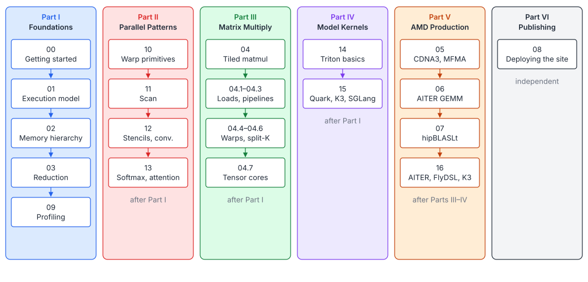

# GPU Programming Learning Paths

The tutorials are organised as seven focused learning paths. Start with Part I,
then choose parallel patterns, Matrix Multiplication 1–9, or the standalone
Triton chapter. The AMD path builds on the matrix path; the Kimi K3 case
studies combine Triton or FlyDSL with a serving framework. Publishing is
independent. The practical chapters include tested programs in
[`examples/`](examples/check.cuh).



## Part I · Foundations

How a GPU runs code and how to feed it data. Enough to write correct,
bandwidth-bound kernels for every elementwise, reduction and normalization
problem.

| # | Chapter | Main topics | Practice |
|---|---|---|---|
| 00 | [Getting Started](00-getting-started.md) | Toolchain (PTX, SASS), program life cycle, error checking, timing, roofline | Vector Addition, ReLU |
| 01 | [Execution Model](01-execution-model.md) | Grid/block/warp, indexing, divergence, latency hiding, occupancy, streams | Vector Addition, Matrix Addition |
| 02 | [Memory Hierarchy and Coalescing](02-memory-hierarchy.md) | Memory spaces, coalescing, layouts, `float4`, banks, swizzles, transpose | Matrix Transpose, Matrix Copy |
| 03 | [Parallel Reduction](03-parallel-reduction.md) | Work/depth, shuffles, cross-block patterns, row reductions, accuracy, monoids | Reduction, Softmax, Dot Product |
| 09 | [Profiling and Performance Analysis](09-profiling.md) | Timing, Nsight Systems and Compute, metrics, stall reasons, occupancy, sanitizers, rocprof | Matrix Transpose, Matrix Copy |

## Part II · Parallel Patterns

The building blocks beyond reduction: warp-level cooperation, scans,
neighbourhood operations and the online algorithms behind fused attention.
Each chapter has a tested example program.

| # | Chapter | Main topics | Program |
|---|---|---|---|
| 10 | [Warp-Level Primitives and Cooperative Groups](10-warp-primitives.md) | Shuffles, votes, `match_any`, warp-aggregated atomics, compaction, cooperative groups | [`10-warp-primitives.cu`](examples/10-warp-primitives.cu) |
| 11 | [Scan](11-scan.md) | Kogge-Stone and Brent-Kung, block scan, reduce-then-scan, decoupled look-back | [`11-scan.cu`](examples/11-scan.cu) |
| 12 | [Convolution and Stencils](12-convolution-stencils.md) | Halos, constant-memory filters, 2-D tiling, 2.5-D stencil blocking | [`12-convolution-stencil.cu`](examples/12-convolution-stencil.cu) |
| 13 | [Softmax, LayerNorm and FlashAttention](13-softmax-attention.md) | Online softmax, Welford, fused attention with tiles in registers | [`13-softmax-attention.cu`](examples/13-softmax-attention.cu) |

## Part III · Matrix Multiplication

This is a self-contained nine-step path from a naive loop to a production
dispatcher. Read it in order. Steps 2–8 each make one optimization and include
a complete tested program; step 9 connects the kernels to real workloads.

| Step | Chapter | Main topics | Program |
|---|---|---|---|
| 1 | [Foundations](04-tiled-matmul.md) | Cost model, naive GEMM, shared-memory and register tiling, epilogues | Inline kernels |
| 2 | [Vectorized Loads](gemm/01-vectorized-loads.md) | `LDG/LDS.128`, alignment, conflict-free fragment layout | [`01-vectorized.cu`](gemm/01-vectorized.cu) |
| 3 | [Double Buffering](gemm/02-double-buffering.md) | Overlap loads and math, one barrier per slice | [`02-double-buffering.cu`](gemm/02-double-buffering.cu) |
| 4 | [Async Copies](gemm/03-async-copies.md) | `cp.async` pipelines and TMA | [`03-cp-async.cu`](gemm/03-cp-async.cu) |
| 5 | [Warp Tiling](gemm/04-warp-tiling.md) | Block → warp → lane hierarchy | [`04-warp-tiling.cu`](gemm/04-warp-tiling.cu) |
| 6 | [Tile Swizzling](gemm/05-tile-swizzling.md) | Grouped launch order and L2 reuse | [`05-tile-swizzle.cu`](gemm/05-tile-swizzle.cu) |
| 7 | [Split-K and Stream-K](gemm/06-split-k-stream-k.md) | More parallelism, partial tiles and cross-block fix-up | [`06-split-k.cu`](gemm/06-split-k.cu), [`07-stream-k.cu`](gemm/07-stream-k.cu) |
| 8 | [Tensor Cores](gemm/07-tensor-cores.md) | WMMA, `ldmatrix`, `mma.sync`, shared-memory swizzles, `wgmma` | [`08-wmma.cu`](gemm/08-wmma.cu), [`09-mma-sync.cu`](gemm/09-mma-sync.cu) |
| 9 | [Production GEMM](gemm/08-production-gemm.md) | Persistent/grouped/batched GEMM, CUTLASS/CuTe, accuracy, tuning and dispatch | Design guide |

[Open the complete Matrix Multiplication 1–9 roadmap.](gemm/README.md)

## Part IV · Triton

One standalone chapter takes Triton from the first masked vector operation to
production kernels, with six tested examples and progressive exercises.

| # | Chapter | Main topics | Program |
|---|---|---|---|
| 14 | [Triton – From First Kernel to Production](14-triton.md) | Programs, masks, pointers/descriptors, fusion, reductions, LayerNorm, matmul, attention, atomics, scans, persistence, compiler layouts and profiling | [`14-triton/`](examples/14-triton/test_kernels.py) |

## Part V · AMD Architecture and Libraries

The same ideas on AMD's CDNA3 (MI300): first the hardware and instruction,
then a hand-written kernel, then the generator that produces thousands of
such kernels. This path assumes Matrix Multiplication 1 and ideally step 8.

| # | Chapter | Main topics | Practice |
|---|---|---|---|
| 05 | [CDNA3 and MFMA](05-amd-cdna3-mfma.md) | Vocabulary map, wave64, MFMA operand layout, a teaching kernel and its ISA | [`amd/mfma_gemm.hip`](amd/mfma_gemm.hip) |
| 06 | [Inside a Hand-Written AMD GEMM](06-aiter-asm-gemm.md) | AITER dispatch, one wave per SIMD, direct-to-LDS, interleaving, split-K | Disassemble AITER `.co` files |
| 07 | [hipBLASLt and TensileLite](07-hipblaslt-tensilelite.md) | Solution parameters, kernel names, selection, offline tuning | `hipblaslt-bench` |

## Part VI · Kimi K3 Framework Case Studies

These chapters trace real framework paths without blurring backend boundaries.

| # | Chapter | Main topics | Program |
|---|---|---|---|
| 15 | [Triton in SGLang – Serving Kimi K3](15-triton-model-systems.md) | SiTU, state caches, KDA decode/prefill/speculation, MLA, MoE, quantization, sampling and backend dispatch | [`15-triton-k3/`](examples/15-triton-k3/test_model_kernels.py) |
| 16 | [FlyDSL in AITER – Kimi K3 on AMD GPUs](16-aiter-flydsl-kimi-k3.md) | Layout/copy/MMA model, AITER dispatch, quantized two-stage MoE, MLA, communication and full recipe | AITER and FlyDSL tagged tests |

## Part VII · Publishing

| # | Chapter | Main topics | Program |
|---|---|---|---|
| 08 | [Deploying This Site](08-deploying-this-site.md) | Site builder, GitHub Pages, static hosts, EPUB/PDF, CI, figures | |

## How Every Chapter Is Organised

1. **Header**: its part, prerequisites and the next chapter.
2. **You will learn**: the goals, as a list.
3. **Numbered sections and subsections** (1, 1.1, 1.2, …), each deriving its
   formulas (every display formula is followed by a table of its symbols)
   and showing complete kernels.
4. **Key takeaways**: the few facts to remember.
5. **Exercises**, most with a collapsible hint or answer.
6. **Practice**: problem pages that exercise the chapter.

Each problem page has the same sections: *Problem*, *Formulation*,
*Approach*, *Cost analysis*, *Pitfalls*, *Verification*, *Related*, and then
the full solution source.

## The One Formula to Keep in Mind

Every chapter and every problem page comes back to the roofline bound
(chapter 00):

$$
T_{\min} = \max\left(\frac{W}{F},\ \frac{Q}{\beta}\right), \qquad I = \frac{W}{Q}, \qquad I^{\star} = \frac{F}{\beta}
$$

| Symbol | Meaning |
|---|---|
| $W$ | Useful flops of the kernel |
| $Q$ | Bytes it must move to and from DRAM |
| $F$ | Peak compute throughput |
| $\beta$ | Peak DRAM bandwidth |
| $T_{\min}$ | The best achievable time |
| $I, I^{\star}$ | Arithmetic intensity of the kernel, and the GPU's ridge point |

Parts I and II are about reaching $Q/\beta$ for kernels with $I < I^{\star}$
(almost all elementwise, reduction, scan, stencil and normalization
problems). Parts III and IV are about raising the *effective* $I$ of matrix multiplication at every
level of the memory hierarchy until $W/F$ is the bound.

## Running the Example Programs

```bash
make examples-test                     # every examples/*.cu on the CPU emulator
nvcc -O3 -arch=sm_80 -std=c++17 -lineinfo tutorials/examples/11-scan.cu -o scan && ./scan --bench
make triton-test                     # chapters 14-15 (interpreter without a GPU)
```

## Reading List

- *Programming Massively Parallel Processors* (Hwu, Kirk, El Hajj), 4th ed.
- [CUDA C++ Programming Guide](https://docs.nvidia.com/cuda/cuda-c-programming-guide/)
- [CUDA C++ Best Practices Guide](https://docs.nvidia.com/cuda/cuda-c-best-practices-guide/)
- Mark Harris, *Optimizing Parallel Reduction in CUDA*
- Simon Boehm, *How to Optimize a CUDA Matmul Kernel for cuBLAS-like Performance*
- AMD, *AMD Instinct MI300 ISA Reference Guide* (CDNA3)
- AMD, [Matrix Instruction Calculator](https://github.com/ROCm/amd_matrix_instruction_calculator)
- AITER, `docs/isa_kernel_optimization.md`
- Osama et al., *Stream-K: Work-centric Parallel Decomposition for Dense Matrix-Matrix Multiplication on the GPU* (2023)
