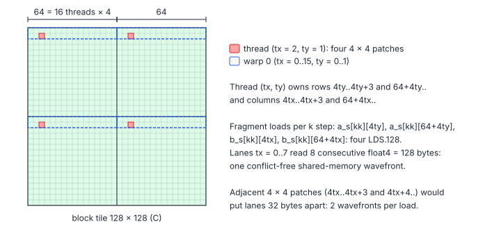
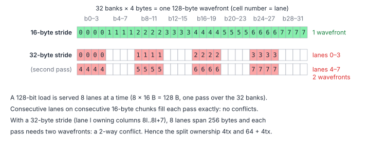

# 04.1 – Vectorized Loads and a Conflict-Free Fragment Layout

> **Part III · Matrix Multiplication · 04.x GEMM Deep Dive** ·
> Program: [`01-vectorized.cu`](01-vectorized.cu) · Builds on: [chapter 04, section 4](../04-tiled-matmul.md#4-register-tiling) ·
> Next: [04.2 – Double Buffering](02-double-buffering.md)

Chapter 04's $4\times4$ register-tiled kernel spends most of its issue slots
on memory instructions, not FMAs. This page grows the tile to
$128\times128$ per block and $8\times8$ per thread, and makes every memory
access 16 bytes wide:

- global loads of $A$ and $B$: `LDG.E.128`;
- shared-memory fragment loads: `LDS.128`, with a layout that is free of bank
  conflicts;
- stores of $C$: `STG.E.128`.

**You will learn**

- why instruction count, not just bytes, limits a register-tiled GEMM;
- how to assign outputs to threads so that 128-bit shared loads are conflict-free;
- how `LDS.128` is served by the 32 banks, 8 lanes at a time;
- why $A$ is transposed on its way into shared memory, and how padding keeps that conflict-free;
- how to keep vector accesses legal for any matrix shape (runtime alignment check, scalar fallback).

## 1. Why Instruction Count Matters

An SM sub-partition issues one warp instruction per cycle. For the inner
loop of a register-tiled GEMM, the useful instructions are FMAs; every load
takes a slot an FMA could have used. Per $k$ step, one thread with a
$t_M\times t_N$ tile does

$$
n_{\text{FMA}} = t_M t_N, \qquad
n_{\text{LDS}} = \frac{t_M + t_N}{v}, \qquad
\rho = \frac{n_{\text{FMA}}}{n_{\text{FMA}} + n_{\text{LDS}}}
$$

| Symbol | Meaning |
|---|---|
| $t_M, t_N$ | Outputs per thread along $M$ and $N$ |
| $v$ | Floats per shared-memory load instruction (1 for `LDS.32`, 4 for `LDS.128`) |
| $n_{\text{FMA}}, n_{\text{LDS}}$ | FMA and shared-load instructions per thread per $k$ step |
| $\rho$ | Fraction of the loop's instructions that are FMAs (ignoring address arithmetic) |

| Thread tile | $v$ | $n_{\text{FMA}}$ | $n_{\text{LDS}}$ | $\rho$ |
|---|---|---|---|---|
| $4\times4$ (chapter 04) | 1 | 16 | 8 | 67 % |
| $8\times8$ | 1 | 64 | 16 | 80 % |
| $8\times8$ | 4 | 64 | 4 | 94 % |

Growing the tile raises the reuse; widening the loads removes most of the
remaining load instructions. The cost is registers: 64 accumulators plus 16
fragment values plus staging, about 120 registers per thread (ptxas reports
117 for this kernel on sm_80), which limits the SM to two 256-thread blocks.
That is fine: each warp has 64 independent FMAs per $k$ step to hide
latency with (chapter 01, section 5).

## 2. Who Owns Which Outputs

The block has 256 threads as a $16\times16$ grid $(t_x, t_y)$. The obvious
mapping gives each thread an $8\times8$ square, but then lane $t_x$ reads
`b_s[kk][8 tx .. 8 tx + 7]`: consecutive lanes are 32 bytes apart. The
program instead splits each thread's rows and columns into two groups of 4,
64 apart:

$$
\text{rows}(t_y) = \{4t_y, \dots, 4t_y + 3\} \cup \{64 + 4t_y, \dots, 64 + 4t_y + 3\}, \qquad
\text{cols}(t_x) = \{4t_x, \dots, 4t_x + 3\} \cup \{64 + 4t_x, \dots, 64 + 4t_x + 3\}
$$

| Symbol | Meaning |
|---|---|
| $t_x, t_y$ | `threadIdx.x % 16` and `threadIdx.x / 16` |
| rows, cols | Block-tile rows and columns whose products the thread accumulates |



Now a `float4` fragment load by lane $t_x$ is at byte $16t_x$ (plus a
constant): consecutive lanes read consecutive 16-byte chunks.

## 3. How `LDS.128` Meets the 32 Banks

A shared-memory request is served in *wavefronts* of at most 128 bytes, one
4-byte word per bank. For 128-bit loads the hardware processes the warp 8
lanes at a time ($8\times16$ B = 128 B), so a 128-bit load is conflict-free
exactly when each group of 8 lanes covers 32 distinct banks:



For the $A$ fragments all lanes of a half-warp share $t_y$, so they read the
same address: a broadcast, which never conflicts.

## 4. The Loads, Stores and the Transposed $A$ Tile

Each $k$ slice of the block is a $128\times8$ tile of $A$ and an
$8\times128$ tile of $B$: 256 `float4`s each, one per thread.

```cpp
const int a_row = tid / 2, a_col = (tid % 2) * 4;   // A: 2 float4 per row of the slice
const int b_row = tid / 32, b_col = (tid % 32) * 4; // B: 32 float4 per row of the slice
...
const float4 av = load4<kVec>(a, m, k, row0 + a_row, k0 + a_col);
const float4 bv = load4<kVec>(b, k, n, k0 + b_row, col0 + b_col);
a_s[a_col + 0][a_row] = av.x;   // A is stored transposed: a_s[k][m]
a_s[a_col + 1][a_row] = av.y;
a_s[a_col + 2][a_row] = av.z;
a_s[a_col + 3][a_row] = av.w;
*reinterpret_cast<float4*>(&b_s[b_row][b_col]) = bv;
```

- **$B$** arrives as `float4` along a row and stays row-major, so its store
  is one `STS.128`.
- **$A$** is needed along a column ($t_M$ consecutive rows at the same
  $k$), so it is **transposed on the way into shared memory**. The four
  scalar stores `a_s[a_col + i][a_row]` are the price; in exchange every
  fragment load of $A$ is a `float4`.
- **Padding.** For a fixed `i`, the 32 lanes of a warp store rows
  `tid / 2` (16 distinct) at two values of `a_col`. Without padding the two
  $k$ rows are $4\times128$ words apart, a multiple of 32: a 2-way conflict.
  With rows of $128 + 4$ words they are 528 words apart, which is 16 banks
  away. The padding keeps each row a multiple of 16 bytes, so the
  `float4` reads stay aligned.
- **Edges.** `load4<kVec>` returns zeros outside the matrix, so the math
  loop needs no bounds checks. `kVec` (a template parameter) is true when
  $K$ and $N$ are multiples of 4: rows are then 16-byte aligned and a
  `float4` is either entirely inside or entirely outside the matrix.
  Otherwise the loads fall back to 4 scalar loads. The host picks the
  instantiation.

The inner loop is then four `LDS.128` and 64 FMAs:

```cpp
for (int kk = 0; kk < kBlockK; ++kk) {
    const float4 a_lo = *reinterpret_cast<const float4*>(&a_s[kk][4 * ty]);
    const float4 a_hi = *reinterpret_cast<const float4*>(&a_s[kk][64 + 4 * ty]);
    const float4 b_lo = *reinterpret_cast<const float4*>(&b_s[kk][4 * tx]);
    const float4 b_hi = *reinterpret_cast<const float4*>(&b_s[kk][64 + 4 * tx]);
    ...
    for (int i = 0; i < 8; ++i)
        for (int j = 0; j < 8; ++j) acc[i][j] = fmaf(a_frag[i], b_frag[j], acc[i][j]);
}
```

## 5. Traffic at Each Level

$$
I_{\text{L2}} = \frac{2B_MB_NB_K}{4B_K(B_M + B_N)} = \frac{B_MB_N}{2(B_M + B_N)} = 32\ \frac{\text{flop}}{\text{byte}}, \qquad
I_{\text{smem}} = \frac{2t_Mt_N}{4(t_M + t_N)} = 2\ \frac{\text{flop}}{\text{byte}}
$$

| Symbol | Meaning |
|---|---|
| $B_M, B_N, B_K$ | Block tile: 128, 128, 8 |
| $I_{\text{L2}}$ | Flops per byte loaded from L2/DRAM into shared memory |
| $I_{\text{smem}}$ | Flops per byte read from shared memory into registers ($t_M = t_N = 8$) |

$I_{\text{L2}} = 32$ flop/B is above the FP32 ridge point of every GPU in
the table of chapter 00, so with L2 absorbing the re-reads between blocks
the kernel is no longer bandwidth-bound; what remains is latency (next
page) and instruction overhead.

## 6. Pitfalls

- **Alignment.** `reinterpret_cast<const float4*>` on an address that is not
  16-byte aligned is undefined behaviour (a misaligned-address fault on the
  GPU). Always derive the vector path from a *runtime* check of the leading
  dimensions, as `launchVectorized` does.
- **Dynamic indexing of `acc`.** Every loop over `acc`, `a_frag` and
  `b_frag` must be fully unrolled; one non-constant index moves the array to
  local memory. `-Xptxas -v` reporting "bytes stack frame" is the symptom.
- **Register pressure.** 64 accumulators is about the limit for FP32 on one
  thread. Going to $16\times8$ doubles the accumulators and spills.

## Key Takeaways

1. Wide tiles raise reuse; wide (128-bit) loads cut the remaining load instructions by 4.
2. Conflict-free `LDS.128` needs each group of 8 lanes to cover 128 contiguous bytes: split ownership (4tx and 64 + 4tx) does that.
3. Transpose $A$ while storing it to shared memory so both fragments are row reads.
4. Vector accesses need 16-byte alignment: check it at run time and keep a scalar path.

## Exercises

1. Change the ownership to adjacent $8\times8$ squares (`8 * tx + j`) and
   count the wavefronts per `LDS.128` with Nsight Compute
   (`l1tex__data_bank_conflicts_pipe_lsu_mem_shared_op_ld`).

    <details markdown="1"><summary>Answer</summary>

    Lanes are then 32 bytes apart, so 8 lanes span 256 bytes and every
    `LDS.128` of B needs 8 wavefronts per warp instead of 4: a 2-way conflict.

    </details>
2. Remove the `+ 4` padding of `a_s` and measure the store conflicts.
3. Replace `kBlockK = 8` by 16. What happens to shared memory per block, and
   to the number of barriers per FMA?

    <details markdown="1"><summary>Answer</summary>

    Shared memory doubles to $16\times132\times4 + 16\times128\times4 = 16\,640$
    bytes, and the barriers per FMA halve (two per 16 $k$ steps instead of per
    8). The loader must also move two `float4` of each operand per thread.

    </details>
