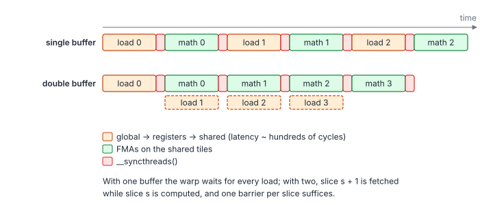
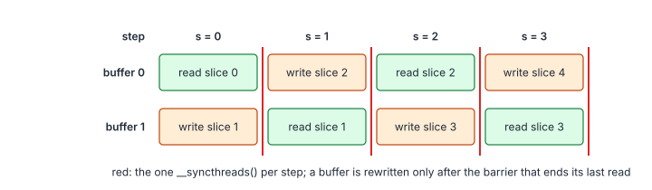

# 04.2 – Double Buffering

> **Part II · Matrix Multiplication · 04.x GEMM Deep Dive** ·
> Program: [`02-double-buffering.cu`](02-double-buffering.cu) · Builds on: [04.1](01-vectorized-loads.md) ·
> Next: [04.3 – Asynchronous Copies](03-async-copies.md)

In the kernel of 04.1 every $k$ slice goes through the same four phases:
issue the global loads, wait for them, store them to shared memory, compute.
While a warp waits for its loads it has nothing else to do, and the whole
block waits at the barrier for its slowest warp. Double buffering overlaps
the load of slice $s+1$ with the math of slice $s$.

**You will learn**

- how the load latency of each $k$ slice stalls a single-buffered kernel;
- how two shared-memory buffers overlap the next slice's loads with the current math;
- why one barrier per slice is enough with two buffers;
- the register cost of prefetching through registers, and the second (register-level) form of double buffering.

## 1. The Idea



With one buffer, the time per slice is the load latency plus the math; with
two, it is the larger of the two:

$$
t_{\text{single}} \approx S\,(L + C + 2\beta), \qquad
t_{\text{double}} \approx L + S\,(\max(L, C) + \beta)
$$

| Symbol | Meaning |
|---|---|
| $S$ | Number of $k$ slices, $\lceil K / B_K \rceil$ |
| $L$ | Latency of a slice's global loads as seen by the warp |
| $C$ | Math time of one slice: $B_K$ steps of 4 `LDS.128` and 64 FMAs per thread |
| $\beta$ | Cost of one `__syncthreads()` (including waiting for the slowest warp) |

Occupancy hides latency too (other warps compute while one waits), but at
~120 registers per thread only 16 warps fit on an SM, so the kernel has to
hide latency itself: this is *instruction-level* parallelism instead of
*thread-level* parallelism (chapter 01, section 5).

## 2. Two Buffers, One Barrier



```cpp
__shared__ __align__(16) float a_s[2][kBlockK][kBlockM + kPadA];
__shared__ __align__(16) float b_s[2][kBlockK][kBlockN];
...
storeSlice(0, load4<kVec>(a, ...), load4<kVec>(b, ...));   // prologue: slice 0
__syncthreads();

for (int s = 0; s < num_slices; ++s) {
    const int buf = s % 2;
    const bool has_next = s + 1 < num_slices;
    float4 a_next = ..., b_next = ...;
    if (has_next) {                                  // 1. issue loads of slice s+1
        a_next = load4<kVec>(a, m, k, row0 + a_row, k1 + a_col);
        b_next = load4<kVec>(b, k, n, k1 + b_row, col0 + b_col);
    }
    for (int kk = 0; kk < kBlockK; ++kk) { ... }     // 2. math on buffer buf
    if (has_next) storeSlice(buf ^ 1, a_next, b_next); // 3. registers -> other buffer
    __syncthreads();                                 // 4. one barrier per slice
}
```

Two facts make this correct with **one** barrier per slice:

1. **Writing buffer `buf ^ 1` during step $s$ is safe.** Its last readers were
   the math of step $s-1$, and step $s-1$ ended with a barrier that every
   thread passed before starting step $s$.
2. **Reading buffer `buf ^ 1` during step $s+1$ is safe.** Every thread wrote
   its part of slice $s+1$ before the barrier that ends step $s$.

The single-buffered kernel needs two barriers per slice: one after the store
(data ready) and one after the math (buffer free). Here the barrier at the
end of step $s$ does both jobs, for different buffers.

## 3. Why Issuing the Loads Early Is Enough

A global load does not block when it is issued. The warp stalls only at the
first instruction that *uses* the loaded register (the scoreboard wait).
Here that is `storeSlice`, after the 512 FMAs and 32 `LDS.128` of step $s$,
so as long as those take longer than the load latency, the warp never
stalls on global memory. The compiler must not move the loads after the
math; it will not, because they are independent and loads are scheduled
early, but `cuobjdump -sass` confirms it (the `LDG.E.128` appear before the
`FFMA` block).

The cost is 8 more registers per thread for `a_next` and `b_next` (ptxas:
127 instead of 117) and twice the shared memory (16.6 KB per block).

## 4. A Second Level: Registers

The same idea applies one level down. In the inner loop, the fragments for
$kk + 1$ can be loaded from shared memory while the FMAs of $kk$ run, with two
sets of `a_frag`/`b_frag` registers. With full unrolling the compiler usually
does this on its own (it hoists the `LDS.128` of the next iteration), which
is why the program does not spell it out; hand-written kernels
(chapter 06's `a[0:63]` / `a[64:127]` swap) must.

## 5. Pitfalls

- **The last slice.** `has_next` guards both the loads and the store. Loading
  past the end would read out of bounds (the zero-filling `load4` makes it
  harmless here, but it is wasted traffic).
- **Barrier count.** Moving the `__syncthreads()` inside `if (has_next)`
  would be a divergent barrier only if `has_next` differed between threads;
  it does not, but keep barriers unconditional anyway.
- **Testing.** On a GPU, a missing barrier corrupts results only under some
  timings. cuemu runs each thread until it blocks, so it fails
  deterministically, and `CUEMU_REVERSE=1` (threads in reverse order) catches
  the variants that the forward order happens to hide.

## Key Takeaways

1. Issue the global loads of slice $s+1$ before the math of slice $s$; the warp only stalls where the loaded registers are used.
2. With two buffers, the barrier at the end of step $s$ both publishes slice $s+1$ and frees buffer $s$.
3. Prefetching through registers costs registers and two instructions per element; `cp.async` (04.3) removes both.

## Exercises

1. Delete the final `__syncthreads()` and run `--test` in both thread orders.

    <details markdown="1"><summary>Answer</summary>

    Both orders fail: without the barrier, a fast warp starts step $s+1$ and
    reads buffer `buf ^ 1` before slower warps have stored their part of it, and
    it can also overwrite a buffer that others are still reading.

    </details>
2. Make it triple-buffered with registers. Why does it not help much, and
   what does [04.3](03-async-copies.md) do instead?

    <details markdown="1"><summary>Answer</summary>

    Each extra slice in flight costs 8 more staging registers per thread, and
    with 512 FMAs of work per slice the latency is usually hidden already.
    `cp.async` keeps several slices in flight without registers, in shared
    memory.

    </details>
