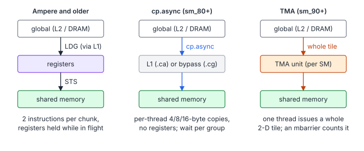
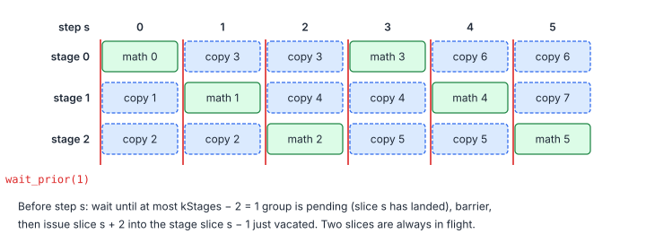

# Matrix Multiplication 4 – Async Copies

> **Part III · Matrix Multiplication** ·
> Program: [`03-cp-async.cu`](03-cp-async.cu) · Prerequisite: [Matrix Multiplication 3 – Double Buffering](02-double-buffering.md) ·
> Next: [Matrix Multiplication 5 – Warp Tiling](04-warp-tiling.md)

Double buffering through registers has two costs: the staged slice occupies
registers while it is in flight, and every element still needs two
instructions (a global load and a shared store). Ampere (sm_80) added
`cp.async`, a copy from global to shared memory that bypasses the register
file and does not block the thread. Hopper (sm_90) added the Tensor Memory
Accelerator (TMA), which copies a whole tile with one instruction.



**You will learn**

- the `cp.async` model: per-thread asynchronous copies, commit groups and waits;
- how to build a multi-stage pipeline and derive its wait count;
- why empty groups must be committed, and how the emulator catches wrong counts;
- how many stages you need, and what they cost in shared memory;
- how Hopper's TMA and mbarriers change the picture.

## 1. The `cp.async` Model

Each thread issues copies of 4, 8 or 16 bytes. Copies are grouped, and a
thread can wait until all but the $n$ most recent groups are complete:

| `<cuda_pipeline.h>` | PTX | Meaning |
|---|---|---|
| `__pipeline_memcpy_async(dst, src, 16, zfill)` | `cp.async.{ca,cg}.shared.global [dst], [src], 16, src_size` | Start a copy; the last `zfill` bytes are zeros |
| `__pipeline_commit()` | `cp.async.commit_group` | Close the current group |
| `__pipeline_wait_prior(n)` | `cp.async.wait_group n` | Wait until at most $n$ groups are pending |

Three properties drive the design:

1. **Waits are per thread.** `wait_group` covers only the copies *this
   thread* issued. Other threads' copies into the same tile need a
   `__syncthreads()` after the wait.
2. **Groups complete in order**, so "at most $n$ pending" means "everything
   except the newest $n$ has landed", exactly like AMD's
   `s_waitcnt vmcnt(n)` in [chapter 06](../06-aiter-asm-gemm.md).
3. **Out-of-bounds elements are free.** With `src_size = 0` (here
   `zfill = 16`) nothing is read and the destination is zero-filled, so edge
   tiles need no separate code path.

## 2. A Multi-Stage Pipeline

With $P$ stages (buffers), $P - 1$ slices are in flight while one is being
computed:



```cpp
// Prologue: slices 0 .. kStages-2, one group each (committed even when empty).
for (int s = 0; s < kStages - 1; ++s) {
    if (s < num_slices) issueSlice<kVec>(a_s[s], b_s[s], ..., s * kBlockK);
    __pipeline_commit();
}
for (int s = 0; s < num_slices; ++s) {
    __pipeline_wait_prior(kStages - 2);   // my copies of slice s have landed
    __syncthreads();                      // everyone's have; stage (s-1) % kStages is free
    const int next = s + kStages - 1;
    if (next < num_slices) issueSlice<kVec>(a_s[next % kStages], b_s[next % kStages], ..., next * kBlockK);
    __pipeline_commit();
    // ... compute on stage s % kStages ...
}
__pipeline_wait_prior(0);
```

The wait count follows from counting groups. Before the wait at step $s$,
groups $0, \dots, s + P - 2$ have been committed (group $j$ holds slice $j$):

$$
\text{committed} = s + P - 1, \qquad
\text{complete} \ \ge\ \text{committed} - (P - 2) = s + 1
\ \Rightarrow\ \text{slices } 0, \dots, s \text{ have landed}
$$

| Symbol | Meaning |
|---|---|
| $P$ | Number of stages (`kStages` = 3) |
| $s$ | Current step (slice being computed) |

That is why **empty groups are committed** near the end: without them the
count "group $j$ = slice $j$" breaks and the last slices would be computed
before they arrive. The emulator catches this: change the wait to
`kStages - 1` and `--test` fails, because cuemu delays every copy until the
matching wait.

How many stages? Enough that $P - 1$ slices of compute cover the load
latency:

$$
(P - 1)\,C \ \ge\ L \quad\Rightarrow\quad P \ \ge\ 1 + \left\lceil \frac{L}{C} \right\rceil, \qquad
\text{smem} = P\,(B_M + B_N)\,B_K \cdot 4\ \text{bytes}
$$

| Symbol | Meaning |
|---|---|
| $C$ | Compute time of one slice |
| $L$ | Global-load latency under load (often 500–1000 cycles) |
| smem | Shared memory per block (padding aside) |

Here $P = 3$ with $B_K = 8$ uses 30 KB. Tensor-core kernels, whose compute
per slice is much shorter, use 3–5 stages of larger slices, which is why
they need the opt-in shared-memory limit (`cudaFuncSetAttribute` with
`cudaFuncAttributeMaxDynamicSharedMemorySize`).

## 3. What Changed in the Kernel

- **No staging registers.** The copy goes straight to shared memory.
- **No transposition.** A copy moves bytes; it cannot scatter a `float4`
  into four rows. $A$ therefore stays row-major (`a_s[stage][m][k]`, rows
  padded to 12 floats so rows stay 16-byte aligned) and the $A$ fragments are
  read with scalar loads. They are broadcasts (a half-warp shares $t_y$), so
  they cost issue slots but no bank conflicts. Tensor-core kernels avoid the
  problem entirely: `ldmatrix` reads fragments in either orientation
  ([Matrix Multiplication 8 – Tensor Cores](07-tensor-cores.md)).
- **Unaligned shapes.** With $K$ or $N$ not a multiple of 4, rows are not
  16-byte aligned, so the kernel is instantiated with 4-byte copies
  (`kVec = 1`): four times as many copy instructions, same pipeline.

## 4. TMA on Hopper

TMA moves a whole multi-dimensional tile per instruction:

1. On the host, `cuTensorMapEncodeTiled` builds a **tensor map**: base
   address, sizes and strides of the matrix, the box (tile) size, and an
   optional shared-memory swizzle (the XOR pattern of
   [Tensor Cores](07-tensor-cores.md#4-swizzled-shared-memory), applied by hardware).
2. In the kernel, **one thread** issues
   `cp.async.bulk.tensor.2d.shared::cluster.global.mbarrier::complete_tx::bytes`
   with the tile coordinates. Out-of-bounds parts of the box are zero-filled.
3. Completion is tracked by an **mbarrier** in shared memory: the issuing
   thread announces how many bytes to expect (`mbarrier.arrive.expect_tx`),
   the TMA unit counts them down, and consumers wait on the barrier's phase.

This removes the address arithmetic and the per-thread copy instructions
from the main loop entirely, which matters when the math is a few
`wgmma` instructions per slice. Pipelines then use two mbarriers per stage
("full" and "empty") instead of `__syncthreads()`, and are usually
*warp-specialized*: a producer warp issues TMA copies while consumer
warpgroups run the MMAs
([Tensor Cores, section 6](07-tensor-cores.md#6-hopper-wgmma-and-warp-specialization)).
This repository has no Hopper example program; CUTLASS's `sm90` collective
mainloops are the reference implementation.

## 5. Pitfalls

- **Forgetting the barrier after the wait.** `wait_prior` only covers the
  calling thread's copies.
- **Refilling a stage too early.** The refill at step $s$ targets the stage
  of slice $s - 1$; it must come *after* the barrier of step $s$, which
  guarantees every warp finished computing on it.
- **Exiting with copies in flight.** `__pipeline_wait_prior(0)` before the
  epilogue (or before reusing shared memory for it).
- **Alignment.** 16-byte copies need 16-byte-aligned source and destination
  addresses; the emulator checks this, the GPU faults.

## Key Takeaways

1. `cp.async` copies global → shared without registers; waits are per thread and per group, so follow them with a barrier.
2. With $P$ stages, wait for all but $P-2$ groups, then refill the stage the previous slice vacated.
3. Commit a group every iteration, even an empty one, so that group $j$ is always slice $j$.
4. TMA moves whole tiles per instruction and signals completion through mbarriers, which enables warp-specialized pipelines.

## Exercises

1. Set `kStages = 2` and `4`. Which requires dynamic shared memory once
   $B_K = 16$?

    <details markdown="1"><summary>Answer</summary>

    One stage is $(128\times20 + 16\times128)\times4 = 18\,432$ bytes. Two
    stages (36 KB) fit in the 48 KB of static shared memory; three (54 KB) and
    four (72 KB) need dynamic shared memory and the opt-in attribute.

    </details>
2. Count instructions in the main loop (`cuobjdump -sass`) for the
   Double Buffering kernel and for this kernel. Where did the `STS` go?
3. Replace the scalar $A$ fragment loads by a transposed layout written with
   4-byte `cp.async` copies (`kVec = 1` for $A$ only). Is it faster?
