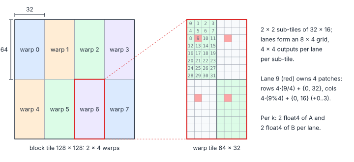

# Matrix Multiplication 5 – Warp Tiling

> **Part III · Matrix Multiplication** ·
> Program: [`04-warp-tiling.cu`](04-warp-tiling.cu) · Prerequisites: [Matrix Multiplication 2 – Vectorized Loads](01-vectorized-loads.md), [Matrix Multiplication 3 – Double Buffering](02-double-buffering.md) ·
> Next: [Matrix Multiplication 6 – Tile Swizzling](05-tile-swizzling.md)

[Matrix Multiplication 1 – Foundations](../04-tiled-matmul.md) tiled the output twice: into block tiles (shared memory) and
thread tiles (registers). Between those sits a level the hardware already
has: the warp. A warp issues one instruction for 32 lanes, and a shared-memory
instruction is served for the warp as a whole, so what matters for shared
memory is the set of addresses **the warp** touches. Warp tiling makes that
set small and regular by giving every warp a compact sub-tile of the block
tile.

**You will learn**

- why the warp, not the thread, is the unit that matters for shared-memory traffic;
- how to split a block tile into warp tiles, sub-tiles and lane patches;
- how to compute a warp's shared-memory footprint and choose the lane grid;
- why warp tiling is the bridge to tensor-core kernels.

## 1. The Three Levels



```cpp
constexpr int kWarpsM = 2, kWarpsN = 4;                  // 8 warps
constexpr int kWarpTileM = kBlockM / kWarpsM;            // 64
constexpr int kWarpTileN = kBlockN / kWarpsN;            // 32
constexpr int kLanesM = 8, kLanesN = 4;                  // lane grid inside a warp
constexpr int kThreadM = 4, kThreadN = 4;                // one patch per lane
constexpr int kIterM = kWarpTileM / (kLanesM * kThreadM);  // 2 sub-tiles along M
constexpr int kIterN = kWarpTileN / (kLanesN * kThreadN);  // 2 sub-tiles along N
```

Lane $\ell$ of warp $w$ owns element $(r, c)$ of the block tile for

$$
r = 64\left\lfloor \tfrac{w}{4} \right\rfloor + 32\,i_m + 4\left\lfloor \tfrac{\ell}{4} \right\rfloor + i, \qquad
c = 32\,(w \bmod 4) + 16\,i_n + 4\,(\ell \bmod 4) + j
$$

| Symbol | Meaning |
|---|---|
| $w, \ell$ | Warp index (0–7) and lane index (0–31) |
| $i_m, i_n$ | Sub-tile of the warp tile, 0–1 each |
| $i, j$ | Position inside the lane's $4\times4$ patch, 0–3 each |

Each lane still owns $2\cdot2\cdot4\cdot4 = 64$ outputs, as in the
Vectorized Loads kernel; only
*which* 64 changes.

## 2. What It Buys

Per $k$ step, the shared-memory data a warp needs is one column segment of
$A$ for its rows and one row segment of $B$ for its columns:

$$
Q_{\text{warp}} = W_M + W_N \quad \text{floats per } k, \qquad
\frac{\text{FMAs}}{\text{float read}} = \frac{W_M W_N}{W_M + W_N}
$$

| Symbol | Meaning |
|---|---|
| $W_M \times W_N$ | Rows and columns of the block tile covered by one warp |
| $Q_{\text{warp}}$ | Distinct floats the warp reads from shared memory per $k$ step |

| Layout | Warp covers | $Q_{\text{warp}}$ | FMAs per float |
|---|---|---|---|
| Vectorized Loads: $16\times2$ threads, split patches | $16\times128$ | 144 | 14.2 |
| Warp tiling: $8\times4$ lanes, $2\times2$ sub-tiles | $64\times32$ | 96 | 21.3 |

Both warps compute 2048 outputs per $k$, but the warp-tiled one reads a
third less from shared memory. On a GPU whose shared-memory bandwidth per
SM is 128 bytes per cycle, that is the difference between shared memory
being a co-bottleneck or not. The individual loads stay conflict-free:
lanes with the same $\lfloor \ell / 4 \rfloor$ read the same $A$ `float4`
(broadcast), and the 4 distinct $B$ `float4`s of a warp are contiguous.

Two further benefits:

- **It maps onto tensor cores.** A tensor-core instruction is issued by a
  warp for a fixed fragment shape. Replacing the lane's $4\times4$ outer
  product by a $16\times8$ MMA leaves the block and warp levels untouched
  ([Matrix Multiplication 8 – Tensor Cores](07-tensor-cores.md)).
- **It decouples the levels.** Block tile, warp tile and thread tile are
  independent parameters (subject to the divisibility constraints in the
  `constexpr` block), which is how CUTLASS and TensileLite
  ([chapter 07](../07-hipblaslt-tensilelite.md)) describe their kernels.

## 3. The Code

The global loads, the transposed $A$ store and double buffering are
unchanged from Double Buffering. The fragment loads become one `float4` per sub-tile:

```cpp
const int m_base = warp_m * kWarpTileM + lane_m * kThreadM;   // lane_m = lane / 4
const int n_base = warp_n * kWarpTileN + lane_n * kThreadN;   // lane_n = lane % 4
...
for (int im = 0; im < kIterM; ++im) {
    const float4 v = *reinterpret_cast<const float4*>(&a_s[buf][kk][m_base + im * kLanesM * kThreadM]);
    ...
}
for (int in = 0; in < kIterN; ++in) {
    const float4 v = *reinterpret_cast<const float4*>(&b_s[buf][kk][n_base + in * kLanesN * kThreadN]);
    ...
}
```

and the epilogue stores each $4$-wide row of a patch as one `float4`.

## 4. Choosing the Shapes

Constraints the `constexpr` values must satisfy:

$$
\frac{B_M}{W_M}\cdot\frac{B_N}{W_N} = \frac{\text{threads}}{32}, \qquad
\ell_M \ell_N = 32, \qquad
W_M = i_M\,\ell_M\,t_M, \qquad W_N = i_N\,\ell_N\,t_N
$$

| Symbol | Meaning |
|---|---|
| $B_M, B_N$ | Block tile (128, 128) |
| $W_M, W_N$ | Warp tile (64, 32) |
| $\ell_M, \ell_N$ | Lane grid inside the warp (8, 4) |
| $i_M, i_N$ | Sub-tiles per warp (2, 2) |
| $t_M, t_N$ | Lane patch (4, 4) |

Squarer warp tiles minimize $Q_{\text{warp}}$; the lane grid should make
each group of 8 lanes touch at most 128 contiguous bytes of $B$.

## Key Takeaways

1. Shared-memory traffic is set by the set of addresses a warp touches: give each warp a compact, square-ish tile.
2. Block tile, warp tile and lane tile are independent parameters subject to simple divisibility constraints.
3. The same hierarchy carries over unchanged to tensor cores, where the warp issues MMAs.

## Exercises

1. Try $W_M\times W_N = 32\times64$ (warps $4\times2$, lanes $4\times8$).
   Compute $Q_{\text{warp}}$ and check the bank behaviour of the $B$ loads.

    <details markdown="1"><summary>Answer</summary>

    $Q_{\text{warp}} = 32 + 64 = 96$ floats, the same. With 8 lanes along $N$,
    lanes 0–7 read 8 consecutive `float4` of B (128 bytes): one wavefront per
    group, conflict-free; A is a broadcast among lanes with equal
    $\lfloor \ell/8 \rfloor$.

    </details>
2. Replace the $8\times4$ lane grid by $4\times8$ while keeping the
   $64\times32$ warp tile. What happens to the $A$ broadcasts?

    <details markdown="1"><summary>Answer</summary>

    A sub-tile becomes $16\times32$, so each lane holds $4\times1$ sub-tiles:
    16 values of A and 4 of B per $k$ (20 loads for 64 FMAs instead of 16). Each
    A `float4` is shared by 8 lanes instead of 4, but the lane does more loads
    in total; the square-ish $2\times2$ arrangement is better.

    </details>
