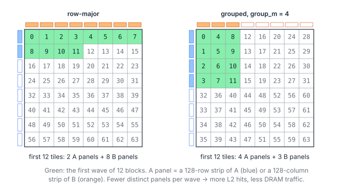

# 04.5 – Swizzled Tile Order for L2 Reuse

> **Part III · Matrix Multiplication · 04.x GEMM Deep Dive** ·
> Program: [`05-tile-swizzle.cu`](05-tile-swizzle.cu) · Builds on: [04.4](04-warp-tiling.md) ·
> Next: [04.6 – Split-K and Stream-K](06-split-k-stream-k.md)

Each block reads a full row panel of $A$ ($128\times K$) and a full column
panel of $B$ ($K\times128$). Across the grid every panel is read by many
blocks: $A$'s panel $i$ by all $\lceil N/128\rceil$ blocks of tile row $i$.
Whether those re-reads come from L2 or from DRAM depends on which blocks run
*at the same time*, and that is decided by the order in which tile indices
are handed out.

**You will learn**

- why the order in which output tiles are launched decides L2 reuse;
- the grouped (swizzled) mapping from launch index to tile, and why it is a bijection;
- how to estimate a wave's L2 footprint, and why the group must be tall enough;
- how this relates to TensileLite's `WorkGroupMapping` and MI300's per-XCD L2s.

## 1. Launch Order Is Tile Order

Blocks are dispatched roughly in order of their linear index
(`blockIdx.x` first). With the usual 2-D grid, block $p$ computes tile
$(p / t_N,\ p \bmod t_N)$: the first wave sweeps whole rows of tiles.



For a wave of $W$ concurrently running blocks covering an $h\times w$ box
of tiles, the data they need is

$$
F(h, w) = (h + w)\cdot B\,K \cdot 4\ \text{bytes}, \qquad hw \approx W
$$

| Symbol | Meaning |
|---|---|
| $W$ | Blocks resident at once (SMs × blocks per SM) |
| $h, w$ | Tile rows and tile columns covered by the wave |
| $B$ | Tile size (128); a panel holds $B\cdot K$ floats |
| $F$ | Footprint: distinct panel bytes the wave reads |

For fixed $hw$, $h + w$ is smallest for a square box. Row-major order gives
$h \approx W / t_N$ (thin and wide); grouped order gives $h = g$ (the group
height).

## 2. The Grouped Mapping

```cpp
__host__ __device__ inline void groupedTile(int pid, int tiles_m, int tiles_n, int group_m,
                                            int& tile_m, int& tile_n) {
    const int per_group = group_m * tiles_n;          // tiles in one group of tile rows
    const int first_m = (pid / per_group) * group_m;
    const int rows = tiles_m - first_m < group_m ? tiles_m - first_m : group_m;
    const int in_group = pid % per_group;
    tile_m = first_m + in_group % rows;               // walk down the group first...
    tile_n = in_group / rows;                         // ...then one tile column right
}
```

In formulas, with $s$ the launch index:

$$
m_0 = g\left\lfloor \frac{s}{g\,t_N} \right\rfloor, \qquad
h = \min(g,\ t_M - m_0), \qquad
\text{tile}_m = m_0 + (s \bmod g\,t_N) \bmod h, \qquad
\text{tile}_n = \left\lfloor \frac{s \bmod g\,t_N}{h} \right\rfloor
$$

| Symbol | Meaning |
|---|---|
| $s$ | Launch index (`blockIdx.x` of a 1-D grid) |
| $g$ | Group height in tile rows (`group_m`) |
| $t_M, t_N$ | Tiles along $M$ and $N$ |
| $m_0$ | First tile row of the group containing $s$ |
| $h$ | Rows in that group (the last group may be shorter) |

It is a bijection on $[0, t_Mt_N)$, so the kernel body is unchanged; only
`row0` and `col0` come from `groupedTile(blockIdx.x, ...)` instead of from
`blockIdx.y` and `blockIdx.x`. This is the same mapping as Triton's matmul
tutorial ("grouped ordering") and CUTLASS's threadblock swizzle, and the
idea behind TensileLite's `WorkGroupMapping` ([chapter 07](../07-hipblaslt-tensilelite.md#16-cache-aware-tile-order-wgm-wgmxcc-staggeru)).

## 3. How Much It Saves

`./tile_swizzle --footprint` counts the panels touched by the first 132
tiles (one block per SM on a 132-SM H100) of a $4096^3$ problem, where one
panel is 2 MiB:

| `group_m` | A panels | B panels | Footprint |
|---|---|---|---|
| 0 (row-major) | 5 | 32 | 74 MiB |
| 4 | 8 | 32 | 80 MiB |
| 8 | 8 | 17 | 50 MiB |
| 16 | 16 | 9 | 50 MiB |

Row-major order needs more than H100's 50 MB L2 for one wave; with groups of
8 or 16 it fits. Two lessons from the table:

1. **The group must be taller than the wave is.** With `group_m = 4`, 132
   tiles span 4 full groups of $4\times32$ tiles, so every $B$ panel is still
   needed. The group has to be large enough that one wave stays within a
   group or two.
2. **The benefit depends on the shape and the GPU.** When the whole of $A$
   and $B$ fits in L2 (small problems) the order hardly matters; for large
   $K$, panels grow and the order matters more. Libraries choose `group_m`
   per shape, and on AMD MI300 also remap across XCDs, which have separate
   L2s ([chapter 05](../05-amd-cdna3-mfma.md), `WGMXCC` in chapter 07).

The effect is largest on big GEMMs, where row-major order makes the kernel
re-fetch panels from DRAM; measure it on your GPU rather than trusting a
number from elsewhere.

## 4. Pitfalls

- **1-D grids have limits of their own.** `gridDim.x` can be up to
  $2^{31} - 1$, so a 1-D grid is fine; 2-D grids limit `gridDim.y` to 65535.
- **Dispatch order is not guaranteed** by the programming model. It is
  in-order in practice, which is all a cache optimization needs; correctness
  must never depend on it (compare the Stream-K fix-up in
  [04.6](06-split-k-stream-k.md)).

## Key Takeaways

1. Blocks that run at the same time should cover a compact box of $C$, so they share $A$ and $B$ panels in L2.
2. Grouped ordering changes only two lines of the kernel: `row0` and `col0` come from a remapped launch index.
3. Pick the group height from the wave size and the problem shape; a group that is too short does not help.

## Exercises

1. Extend `--footprint` to count, for each wave, how many panels were
   already used by the previous wave (a crude L2 hit estimate).
2. With `ncu --metrics lts__t_sector_hit_rate.pct`, compare L2 hit rates of
   04.4 and this program on a $8192\times8192\times8192$ problem.
