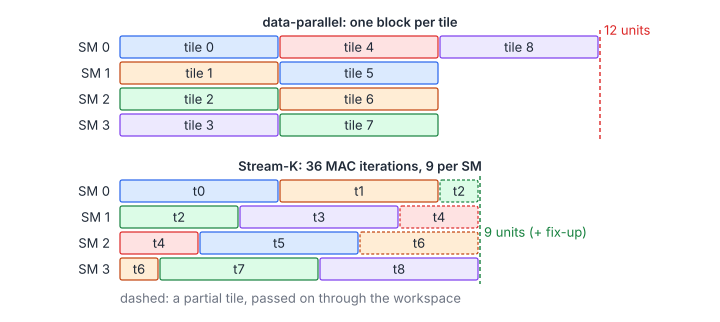
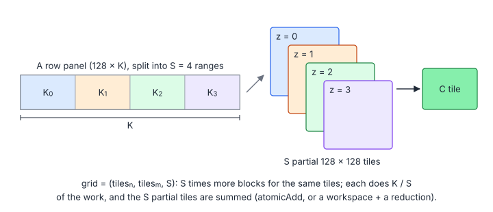
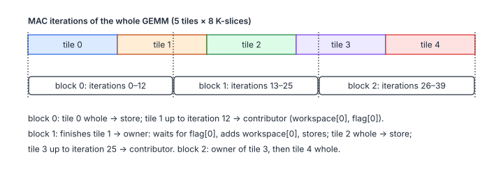

# 04.6 – Split-K and Stream-K

> **Part III · Matrix Multiplication · 04.x GEMM Deep Dive** ·
> Programs: [`06-split-k.cu`](06-split-k.cu), [`07-stream-k.cu`](07-stream-k.cu) · Builds on: [04.1](01-vectorized-loads.md) ·
> Next: [04.7 – Tensor Cores](07-tensor-cores.md)

Every kernel so far launches one block per output tile. That is only
efficient when there are many more tiles than SMs. For "skinny" GEMMs,
such as $M = N = 512$, $K = 16384$ (16 tiles of $128\times128$ on a GPU with
108–132 SMs), most of the GPU idles. Even with plenty of tiles, the last
wave is often partly empty. Both problems are solved by splitting the work
along $K$ as well.

**You will learn**

- how tile quantization wastes SMs, and how to compute the fill efficiency;
- split-K with atomics and with a deterministic workspace reduction, and how to choose the split factor;
- Stream-K: distributing MAC-loop iterations instead of tiles, with contributors and owners;
- the memory-ordering rules that make a cross-block fix-up correct, and why it cannot deadlock;
- how to test a cross-block protocol on the emulator.

## 1. Quantization: Tiles vs SMs

$$
T = \left\lceil \frac{M}{B_M} \right\rceil \left\lceil \frac{N}{B_N} \right\rceil, \qquad
\eta_{\text{tile}} = \frac{T}{P\,\lceil T / P \rceil}
$$

| Symbol | Meaning |
|---|---|
| $T$ | Output tiles (blocks, without splitting) |
| $P$ | Blocks that run at once: SMs × blocks per SM |
| $\eta_{\text{tile}}$ | Fraction of SM time that does useful work, if all tiles take equally long |

With $P = 132$: $T = 16$ gives $\eta = 12\%$; $T = 140$ gives two waves, the
second 6 % full, so $\eta = 53\%$.



## 2. Split-K

Split the reduction into $S$ ranges; block $(x, y, z)$ computes tile
$(y, x)$ over range $z$ only:

$$
C = \sum_{z=0}^{S-1} A_{:,\,\mathcal{K}_z}\,B_{\mathcal{K}_z,\,:}, \qquad
\mathcal{K}_z = \bigl[z\,c,\ \min(K, (z+1)\,c)\bigr), \qquad
c = B_K\left\lceil \frac{\lceil K / S \rceil}{B_K} \right\rceil
$$

| Symbol | Meaning |
|---|---|
| $S$ | Split factor (`gridDim.z`) |
| $\mathcal{K}_z$ | Range of $K$ handled by split $z$ |
| $c$ | Chunk length, rounded up to whole slices so that `float4` loads stay aligned |



The main loop of 04.1 simply runs from `k_begin` to `k_end`. The partial
tiles are combined in one of two ways (`./split_k --atomic` selects the
first):

| Mode | How | Extra traffic | Deterministic |
|---|---|---|---|
| Atomic | `cudaMemset(C, 0)`, then every split does `atomicAdd` per element | $S\cdot MN\cdot 4$ bytes of atomics (resolved in L2) | No: FP32 addition order varies |
| Workspace | Split $z$ writes its partial to `workspace[z]`; a second kernel sums $z = 0 \dots S-1$ | $2\,S\cdot MN\cdot 4$ bytes | Yes |

The program chooses $S$ so that $T\cdot S \approx 2P$ while keeping at least
4 slices of $K$ per split:

```cpp
int chooseSplits(int m, int n, int k, int num_sms) {
    const int tiles = gemm::ceilDiv(m, kBlockM) * gemm::ceilDiv(n, kBlockN);
    const int by_fill = gemm::ceilDiv(2 * num_sms, tiles);
    const int by_depth = std::max<int>(1, k / (4 * kBlockK));
    return std::max<int>(1, std::min<int>(by_fill, by_depth));
}
```

Split-K pays off when the reduction traffic is small next to the GEMM's own:
roughly when $K \gg S\cdot$ (a few hundred). It is the standard choice for
decode-time GEMMs in LLM inference ($M$ = batch, small) and is what AITER's
`splitk` kernels and TensileLite's `GlobalSplitU` do
([chapter 06, section 5](../06-aiter-asm-gemm.md#5-epilogue-split-k-and-bf16-rounding)).

## 3. Stream-K

Split-K still quantizes: $T\cdot S$ blocks of equal size on $P$ SMs.
Stream-K removes quantization altogether by distributing *MAC-loop
iterations* instead of tiles:

$$
L = T\left\lceil \frac{K}{B_K} \right\rceil, \qquad
\text{block } g \text{ runs iterations } \left[\left\lfloor \frac{gL}{G} \right\rfloor,\ \left\lfloor \frac{(g+1)L}{G} \right\rfloor\right), \qquad
\eta_{\text{SK}} = \frac{L}{G\,\lceil L/G \rceil} \approx 1
$$

| Symbol | Meaning |
|---|---|
| $L$ | Total MAC-loop iterations (one per $B_K$ slice of one tile) |
| $G$ | Persistent blocks, exactly as many as fit on the GPU at once |
| $\eta_{\text{SK}}$ | Fill efficiency; iterations differ by at most one between blocks |

A block's range crosses tile boundaries, so a tile can be computed by
several blocks:



For each tile segment in its range, block $g$ does one of three things:

1. **Whole tile** in range: compute and store, like a normal GEMM.
2. **Contributor** (the range ends inside the tile): store the partial tile
   to `workspace[g]`, `__threadfence()`, then set `flags[g]`.
3. **Owner** (the range ends at the tile's end, but the tile began in an
   earlier block's range): wait for the flags of those earlier blocks, add
   their partials in a fixed order, store.

```cpp
if (seg_end < tile_end) {                        // contributor
    for (...) slot[(8 * i + j) * kThreads + tid] = acc[i][j];
    __threadfence();
    __syncthreads();
    if (tid == 0) atomicExch(&flags[g], 1);
} else {
    if (it > tile_begin) {                       // owner of a shared tile
        for (int p = g - 1; p >= 0 && rangeStart(p + 1, total, gridDim.x) > tile_begin; --p) {
            if (tid == 0) {
                while (atomicAdd(&flags[p], 0) == 0) {}
                __threadfence();
            }
            __syncthreads();
            const volatile float* slot = workspace + p * kTileElems;   // not from a stale L1 line
            for (...) acc[i][j] += slot[(8 * i + j) * kThreads + tid];
        }
    }
    // store the finished tile
}
```

Details that make this correct:

- **Only the last segment of a range can be a contributor**, so one
  workspace slot per block is enough ($G\cdot B_MB_N\cdot4$ bytes: about
  8 MiB for $G = 132$).
- **Owners wait only for lower-numbered blocks, and all $G$ blocks are
  resident at once.** Launching $G$ = SMs × `cudaOccupancyMaxActiveBlocksPerMultiprocessor`
  guarantees the second. Without it (say $G$ larger than what fits), an owner
  could spin forever on a contributor that is waiting for an SM.
- **Memory ordering.** The contributor's `__threadfence()` orders its
  workspace stores before the flag; the owner's fence after observing the
  flag, and `volatile` loads of the workspace (which cannot hit a stale line
  in the SM's non-coherent L1), make the partials visible.
- **Determinism.** Partials are added in a fixed order, so results are
  bitwise reproducible, unlike atomics.
- **Flags are reset per launch** (`cudaMemsetAsync`).

The paper also describes *hybrid* schedules: full waves of whole tiles
first (no fix-up cost), Stream-K only for the remainder. hipBLASLt ships a
Stream-K kernel library of its own
([chapter 07](../07-hipblaslt-tensilelite.md#15-work-decomposition-gsu-and-stream-k)).

## 4. Testing a Cross-Block Protocol

The emulator runs blocks one at a time in index order, which is one valid
schedule: every contributor finishes before its owner starts. `--test`
therefore checks the arithmetic of the decomposition (ranges, owners,
workspace indexing) for many grid sizes:

```bash
for g in 1 3 7 13; do python3 tools/cuemu/cuemu.py run tutorials/gemm/07-stream-k.cu -- --blocks=$g --test; done
```

It cannot find memory-ordering bugs between concurrent blocks; on a GPU,
`compute-sanitizer --tool racecheck` and repeated runs with different grid
sizes are the complement.

## Key Takeaways

1. With few tiles, one block per tile leaves most SMs idle; the last wave of many tiles is often partly empty.
2. Split-K multiplies the parallelism by $S$ at the cost of combining $S$ partial tiles (atomics: fast, non-deterministic; workspace: deterministic).
3. Stream-K gives every persistent block an equal share of iterations; shared tiles are fixed up through a workspace and flags.
4. Cross-block communication needs fence → flag on the writer, flag → fence on the reader, loads that bypass L1, and co-resident blocks.

## Exercises

1. For $M = N = 1024$, $K = 8192$ on your GPU, time 04.1, split-K (both
   modes) and Stream-K. Where does each win?
2. Implement the hybrid schedule: the first $\lfloor T / G \rfloor\cdot G$
   tiles one block each, Stream-K for the rest.
3. Make the atomic split-K deterministic without a second kernel: the
   "last block to arrive reduces" scheme of chapter 03, section 5.

    <details markdown="1"><summary>Hint</summary>

    Give each tile a counter. Every split writes its partial tile to
    `workspace[z]`, fences, and increments the tile's counter; the split that
    sees $S - 1$ sums the $S$ partials in order $z = 0, \dots, S-1$, writes
    $C$ and resets the counter. This is what AITER's semaphore does
    (chapter 06, section 5).

    </details>
