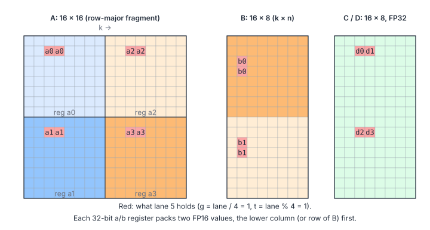
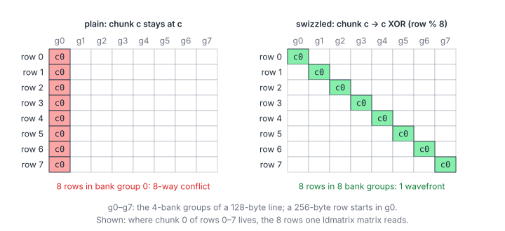
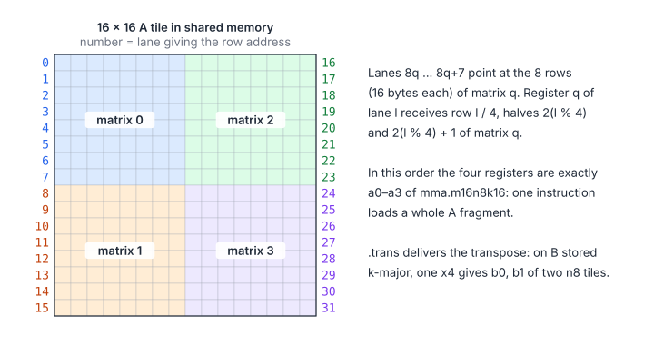
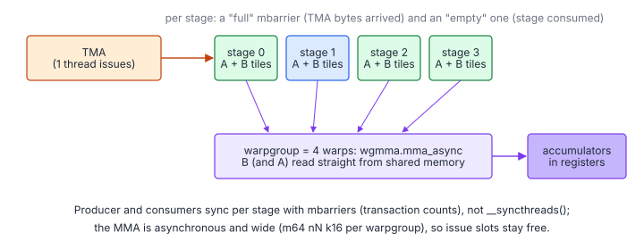

# 04.7 – Tensor Cores: WMMA, `mma.sync` and `wgmma`

> **Part II · Matrix Multiplication · 04.x GEMM Deep Dive** ·
> Programs: [`08-wmma.cu`](08-wmma.cu), [`09-mma-sync.cu`](09-mma-sync.cu) · Builds on: [04.3](03-async-copies.md), [04.4](04-warp-tiling.md) ·
> Next: [05 – AMD CDNA3 and MFMA](../05-amd-cdna3-mfma.md)

Tensor cores execute a small matrix multiply-accumulate per warp
instruction. For 16-bit inputs they deliver roughly 8–16× the FP32 FMA
throughput of the same GPU (A100: 312 TFLOP/s dense FP16/BF16 vs 19.5
TFLOP/s FP32). Everything from the previous pages still applies (block
tiles, pipelines, warp tiles); what changes is the innermost level: a
lane's $8\times8$ outer product becomes a warp's $16\times8\times16$ MMA.

**You will learn**

- the three tensor-core interfaces (WMMA, `mma.sync`, `wgmma`) and when to use each;
- a complete WMMA kernel and its alignment rules;
- the documented register layout of `mma.sync.m16n8k16`, and an epilogue that uses it;
- why tensor-core tiles conflict in shared memory, and how an XOR swizzle fixes it without padding;
- how `ldmatrix` loads whole fragments, including the transposed B operand;
- the structure of a Hopper kernel: TMA, `wgmma`, mbarriers and warp specialization.

## 1. Three Interfaces

| Interface | Architecture | Unit | Fragment layout | Used by |
|---|---|---|---|---|
| WMMA (`nvcuda::wmma`) | sm_70+ | Warp, $16\times16\times16$ (FP16) | Opaque | Portable CUDA C++ |
| `mma.sync` (PTX) | sm_80+ for m16n8k16 | Warp, $16\times8\times16$ | Documented | CUTLASS 2.x, FlashAttention 2 |
| `wgmma.mma_async` (PTX) | sm_90a | Warpgroup (4 warps), $64\times N\times16$, $N \le 256$ | Operands in shared memory | CUTLASS 3.x (Hopper) |

Chapter 05 showed AMD's equivalent, MFMA, whose register layout is also
documented.

## 2. WMMA: The Easy Entry

[`08-wmma.cu`](08-wmma.cu) keeps the block tile ($128\times128$, $B_K = 32$),
the 8 warps of 04.4 (each a $64\times32$ warp tile) and a double-buffered
`cp.async` pipeline. Each warp holds $4\times2$ accumulator fragments of
$16\times16$:

```cpp
wmma::fragment<wmma::accumulator, 16, 16, 16, float> acc[kFragsM][kFragsN];   // 4 x 2
...
for (int kk = 0; kk < kBlockK; kk += 16) {
    wmma::fragment<wmma::matrix_a, 16, 16, 16, half, wmma::row_major> a_frag[kFragsM];
    wmma::fragment<wmma::matrix_b, 16, 16, 16, half, wmma::row_major> b_frag[kFragsN];
    for (int i = 0; i < kFragsM; ++i)
        wmma::load_matrix_sync(a_frag[i], &a_s[buf][warp_m * kWarpTileM + 16 * i][kk], kStrideA);
    for (int j = 0; j < kFragsN; ++j)
        wmma::load_matrix_sync(b_frag[j], &b_s[buf][kk][warp_n * kWarpTileN + 16 * j], kStrideB);
    for (int i = 0; i < kFragsM; ++i)
        for (int j = 0; j < kFragsN; ++j) wmma::mma_sync(acc[i][j], a_frag[i], b_frag[j], acc[i][j]);
}
```

WMMA's constraints are about memory, not math:

- `load_matrix_sync` and `store_matrix_sync` need **32-byte-aligned
  pointers** and a leading dimension that is a **multiple of 16 bytes**.
  The shared tiles are padded by 8 halves (rows of 80 and 272 bytes), which
  satisfies both and also staggers the banks.
- The element-to-lane mapping of a fragment is unspecified, so the
  epilogue goes through a per-warp staging tile in shared memory before the
  bounds-checked stores to $C$.

## 3. `mma.sync.m16n8k16`: Documented Fragments

The PTX instruction takes its operands from registers in a fixed layout.
With $g = \ell / 4$ and $t = \ell \bmod 4$ for lane $\ell$:



$$
a_0 = A[g][2t{:}2t{+}1],\ \ a_1 = A[g{+}8][2t{:}2t{+}1],\ \ a_2 = A[g][2t{+}8{:}2t{+}9],\ \ a_3 = A[g{+}8][2t{+}8{:}2t{+}9]
$$

$$
b_0 = B[2t{:}2t{+}1][g],\ \ b_1 = B[2t{+}8{:}2t{+}9][g], \qquad
(d_0, d_1) = C[g][2t{:}2t{+}1],\ \ (d_2, d_3) = C[g{+}8][2t{:}2t{+}1]
$$

| Symbol | Meaning |
|---|---|
| $\ell$ | Lane, 0–31 |
| $g, t$ | Row group ($\ell / 4$, 0–7) and thread-in-group ($\ell \bmod 4$, 0–3) |
| $a_0 \dots a_3$ | Four 32-bit registers, each two FP16 values of $A$ (16 × 16) |
| $b_0, b_1$ | Two 32-bit registers, each two FP16 values of $B$ (16 × 8) |
| $d_0 \dots d_3$ | Four FP32 accumulators of $C$ (16 × 8) |

Because the layout is known, the epilogue of
[`09-mma-sync.cu`](09-mma-sync.cu) stores accumulators directly:

```cpp
const int g = lane / 4, t = lane % 4;
const int col = col0 + warp_col + 8 * j + 2 * t;
for (int h = 0; h < 2; ++h) {
    const int row = row0 + warp_row + 16 * i + g + 8 * h;
    if (row < m)
        *reinterpret_cast<float2*>(&c[row * n + col]) = make_float2(acc[i][j][2 * h], acc[i][j][2 * h + 1]);
}
```

The same knowledge enables fusions that WMMA makes awkward: per-row scaling,
bias, activation, softmax statistics in FlashAttention, all applied in
registers.

## 4. Swizzled Shared Memory

Fragments are read from shared memory in units of 8 rows × 16 bytes (see
`ldmatrix` below). In a plain row-major tile those 8 rows are a whole number
of 128-byte lines apart and land in the same banks:

$$
\operatorname{group}(r, c) = \left(\frac{r\cdot R}{16} + c\right) \bmod 8
$$

| Symbol | Meaning |
|---|---|
| $r$ | Row of the tile |
| $c$ | 16-byte chunk within the row |
| $R$ | Row length in bytes (64 for the $A$ slice, 256 for $B$) |
| group | Which of the 8 four-bank groups of a 128-byte line the chunk occupies |

For $B$ ($R = 256$), $rR/16 = 16r$ is a multiple of 8, so all 8 rows of a
fragment sit in the same bank group: an 8-way conflict. Padding (as in the
WMMA kernel) fixes it at the cost of memory and alignment headaches; the
standard alternative is to permute chunks within a row with an **XOR
swizzle**:



```cpp
// A slice: 4 chunks per row, two rows per 128-byte line.
__device__ int offsetA(int row, int col) { return row * 32 + (((col / 8) ^ ((row >> 1) & 3)) * 8) + col % 8; }
// B slice: 16 chunks per row.
__device__ int offsetB(int row, int col) { return row * 128 + (((col / 8) ^ (row & 7)) * 8) + col % 8; }
```

XOR with bits of the row is a permutation of the chunks of each row, so the
tile still occupies exactly $R$ bytes per row, every chunk stays 16-byte
aligned (so `cp.async` and `ldmatrix` work unchanged), and 8 consecutive
rows of the same logical chunk land in 8 different groups. The writer
(`issueSlice`) and the readers (`ldmatrix` addresses) just have to use the
same function. CuTe calls this `Swizzle<3, 3, 3>`-style layouts; Hopper's TMA
applies the same pattern in hardware (`CU_TENSOR_MAP_SWIZZLE_128B`).

## 5. `ldmatrix`: Fragments in One Instruction

Loading $a_0 \dots a_3$ with ordinary loads takes 4 `LDS.32` per lane with
awkward addressing. `ldmatrix.sync.aligned.m8n8.x4.shared.b16` loads four
$8\times8$ matrices of 16-bit values for the whole warp:



For an $A$ fragment, lane $\ell$ points at row
$(\ell \bmod 8) + 8\,(\lfloor \ell/8 \rfloor \bmod 2)$ and chunk
$\lfloor \ell / 16 \rfloor$ of the $16\times16$ tile; the four result
registers are exactly $a_0 \dots a_3$. For $B$, stored $k$-major, the
`.trans` variant delivers the transpose, and one `x4` covers two $n8$ tiles:

```cpp
// A: one ldmatrix.x4 per m16 tile
const int row = warp_row + 16 * i + lane % 8 + 8 * ((lane / 8) % 2);
const int col = kk + 8 * (lane / 16);
ldmatrixX4<false>(a_frag[i], as + offsetA(row, col));
// B: one ldmatrix.x4.trans per pair of n8 tiles
const int q = lane / 8;
ldmatrixX4<true>(r, bs + offsetB(kk + lane % 8 + 8 * (q % 2), warp_col + 16 * p + 8 * (q / 2)));
```

Per $k16$ step a warp issues 4 + 2 `ldmatrix` and 16 `mma.sync`
($4\times4$ tiles of $16\times8$ = its $64\times32$ warp tile). With a
3-stage `cp.async` pipeline of $128\times128\times32$ slices, the kernel uses
48 KiB of shared memory and 125 registers per thread.

**Checking it without a GPU.** Inline PTX cannot run on the CPU, so
`09-mma-sync.cu` routes both instructions through small wrappers that call
`cuemuLdmatrix` / `cuemuMmaM16N8K16` under `#ifdef __CUEMU__`. These
implement the PTX-documented layouts above (all 32 lanes rendezvous, exchange
registers, and compute), so a wrong lane mapping, a missing `.trans` or a
swizzle mismatch between writer and reader fails `--test`.

## 6. Hopper: `wgmma` and Warp Specialization

On sm_90 the best kernels change shape again:



- **`wgmma.mma_async`** is issued by a *warpgroup* (4 consecutive warps,
  128 threads) for a $64\times N\times16$ tile, $N$ up to 256. $B$ (and
  optionally $A$) is read directly from shared memory through a *matrix
  descriptor* (address, leading/stride byte offsets, swizzle mode); the
  accumulators stay in registers. It is asynchronous: `wgmma.fence`,
  `wgmma.commit_group` and `wgmma.wait_group` bracket it, much like
  `cp.async` groups.
- **TMA** ([04.3](03-async-copies.md#4-tma-on-hopper)) fills the stages; the
  shared-memory swizzle of the tensor map must match the descriptor's.
- **Warp specialization.** A producer warp (often with fewer registers,
  `setmaxnreg`) only issues TMA copies; one or two consumer warpgroups only
  issue `wgmma`s. They synchronize per stage with "full"/"empty" mbarriers
  rather than block-wide barriers.
- **Thread block clusters** can multicast a TMA load to the shared memory of
  several blocks that need the same $A$ or $B$ tile.

Writing this by hand is possible (the PTX ISA documents every piece) but
long; CUTLASS 3's `CollectiveMma` for sm90 and ThunderKittens are the
readable references. This repository does not include a Hopper program,
because none of its test infrastructure can run or emulate one.

## 7. Pitfalls

- **Accumulate in FP32.** FP16 accumulation overflows and loses precision for
  long $K$; every kernel here uses FP32 accumulators.
- **Alignment and shape restrictions.** The programs require $K$ and $N$ to
  be multiples of 8 (16-byte rows for `cp.async`). Libraries handle other
  shapes with padded copies or a slower fallback kernel.
- **Register order within a pair.** In each 32-bit register the element with
  the lower column (or $k$) index is in the low half.
- **`ldmatrix` addresses** must be 16-byte aligned and in shared memory
  (`__cvta_generic_to_shared`).

## Key Takeaways

1. Tensor cores replace a lane's outer product by a warp-wide MMA; the block and warp levels stay the same.
2. WMMA is portable but opaque; `mma.sync` fragment layouts are documented, so epilogues work in registers.
3. Shared-memory tiles for tensor cores are read 8 rows × 16 bytes at a time: swizzle 16-byte chunks with row bits.
4. `ldmatrix` turns 32 row addresses into ready-made fragments; `.trans` handles a $k$-major B.
5. Hopper moves the operands to shared memory (`wgmma`) and the copies to TMA, synchronized by mbarriers.

## Exercises

1. Switch `09-mma-sync.cu` to BF16 (`mma.sync...bf16.bf16.f32`,
   `__nv_bfloat16`). What else changes?

    <details markdown="1"><summary>Answer</summary>

    The harness types and conversions (`__float2bfloat16`), and the
    emulator: `cuemuMmaM16N8K16` decodes FP16, so a BF16 version needs a BF16
    decode. The fragment layout, `ldmatrix` and the swizzle stay the same:
    they move 16-bit values regardless of format.

    </details>
2. Remove the swizzle (use `row * 32 + col` and `row * 128 + col`) and
   measure the bank conflicts with Nsight Compute. Then fix them with
   padding instead; how much shared memory does that cost for 3 stages?

    <details markdown="1"><summary>Answer</summary>

    Padding rows by 8 halves (16 bytes) keeps 16-byte alignment: A becomes
    $128\times40\times2 = 10\,240$ bytes and B $32\times136\times2 = 8\,704$
    bytes per stage, $3\times18\,944 = 56\,832$ bytes in all. That exceeds the
    48 KB of static shared memory, so the kernel would need dynamic shared
    memory, where the swizzled version fits in exactly 48 KB.

    </details>
3. Replace `ldmatrix` for $A$ by four 32-bit loads per lane computed from
   the layout formulas. Verify with `--test`, then compare instruction counts.
