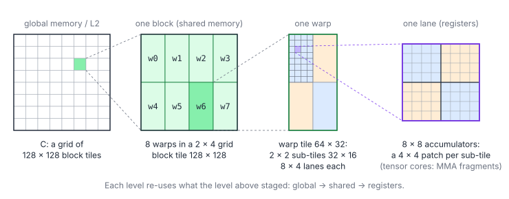

# 04.x – GEMM Deep Dive: The Rest of the Ladder

> **Part III · Matrix Multiplication** · Prerequisites: [04 – Tiled Matrix Multiplication](../04-tiled-matmul.md) ·
> Next: [04.1 – Vectorized Loads](01-vectorized-loads.md)

[Chapter 04](../04-tiled-matmul.md) ends with a table of techniques that take
a register-tiled SGEMM from about half of cuBLAS to within a few percent of
it, and then to tensor cores. The pages in this section explain each of those
techniques and implement it as a complete, tested program:

| Page | Technique | Program |
|---|---|---|
| [04.1](01-vectorized-loads.md) | 128-bit global and shared accesses, conflict-free fragment layout | [`01-vectorized.cu`](01-vectorized.cu) |
| [04.2](02-double-buffering.md) | Double buffering: overlap the next slice's loads with the math | [`02-double-buffering.cu`](02-double-buffering.cu) |
| [04.3](03-async-copies.md) | `cp.async` multi-stage pipelines, and TMA on Hopper | [`03-cp-async.cu`](03-cp-async.cu) |
| [04.4](04-warp-tiling.md) | Warp tiling: block → warp → lane | [`04-warp-tiling.cu`](04-warp-tiling.cu) |
| [04.5](05-tile-swizzling.md) | Swizzled ("grouped") tile order for L2 reuse | [`05-tile-swizzle.cu`](05-tile-swizzle.cu) |
| [04.6](06-split-k-stream-k.md) | Split-K and Stream-K for too few output tiles | [`06-split-k.cu`](06-split-k.cu), [`07-stream-k.cu`](07-stream-k.cu) |
| [04.7](07-tensor-cores.md) | Tensor cores: WMMA, then `ldmatrix` + `mma.sync` with swizzled shared memory; Hopper's `wgmma` | [`08-wmma.cu`](08-wmma.cu), [`09-mma-sync.cu`](09-mma-sync.cu) |

Read them in order: each program starts from the previous one and changes one
thing, so a diff between consecutive files shows exactly what the technique
costs in code.

Every page follows the same structure: what you will learn, the idea with a
figure, the cost model (formulas with symbol tables), the key code, pitfalls,
key takeaways and exercises with answers.

## The Hierarchy Every Page Refines



A fast GEMM is the same idea applied at every level of the memory
hierarchy: stage a tile of $A$ and a tile of $B$ in faster memory and reuse
each element as many times as the tile allows. With a
$T_M\times T_N$ output tile per unit (block, warp or lane) and a reduction
step of $T_K$:

$$
\frac{\text{FMAs}}{\text{elements loaded}} = \frac{T_M T_N T_K}{(T_M + T_N)\,T_K} = \frac{T_M T_N}{T_M + T_N}
$$

| Symbol | Meaning |
|---|---|
| $T_M, T_N$ | Output rows and columns owned by one unit at that level |
| $T_K$ | Reduction depth staged at once (cancels out) |

| Level | Staged in | Tile | Reuse $T_MT_N/(T_M+T_N)$ |
|---|---|---|---|
| Block | Shared memory | $128\times128$ | 64 FMAs per element loaded from L2 |
| Warp | (Warp's view of shared memory) | $64\times32$ | 21.3 FMAs per element read from shared memory |
| Lane | Registers | $8\times8$ | 4 FMAs per element read into registers |

Chapter 04 built the block and lane levels. The pages here make the loads
wide (04.1), hide their latency (04.2, 04.3), add the warp level (04.4),
make blocks cooperate through L2 (04.5), keep all SMs busy when there are few
tiles (04.6), and finally replace the lane-level FMAs by tensor-core
instructions (04.7).

## Running the Programs

Every program has the same command line, provided by
[`harness.cuh`](harness.cuh):

```bash
cd tutorials/gemm
nvcc -O3 -arch=sm_80 -std=c++17 04-warp-tiling.cu -o warp_tiling
./warp_tiling                # M = N = K = 4096: time, TFLOP/s, spot check of 256 entries
./warp_tiling 2048 512 8192  # any shape
./warp_tiling --test         # awkward shapes, every entry checked against a CPU reference
```

No GPU? The [cuemu](../../tools/cuemu/README.md) emulator runs every
program's `--test` mode on the CPU, including the `cp.async` pipelines,
`ldmatrix` and `mma.sync` (it implements their documented semantics, so a
wrong fragment index or a missing wait fails there too):

```bash
python3 tools/cuemu/cuemu.py run tutorials/gemm/09-mma-sync.cu -- --test
make gemm-test               # all of them, as CI does
```

The emulator checks correctness only. Timings need a GPU; the numbers quoted
on these pages are typical ranges from the literature, not measurements from
this repository.

## Further Reading

- Simon Boehm, *How to Optimize a CUDA Matmul Kernel for cuBLAS-like Performance* (2022).
- NVIDIA, [CUTLASS](https://github.com/NVIDIA/cutlass) and its
  `media/docs` (efficient GEMM, CuTe layouts, swizzles).
- NVIDIA, *PTX ISA*, sections on `cp.async`, `ldmatrix`, `mma` and `wgmma`.
- Osama et al., *Stream-K: Work-centric Parallel Decomposition for Dense
  Matrix-Matrix Multiplication on the GPU* (PPoPP 2023).
- Triton, *Matrix Multiplication* tutorial (grouped ordering).
